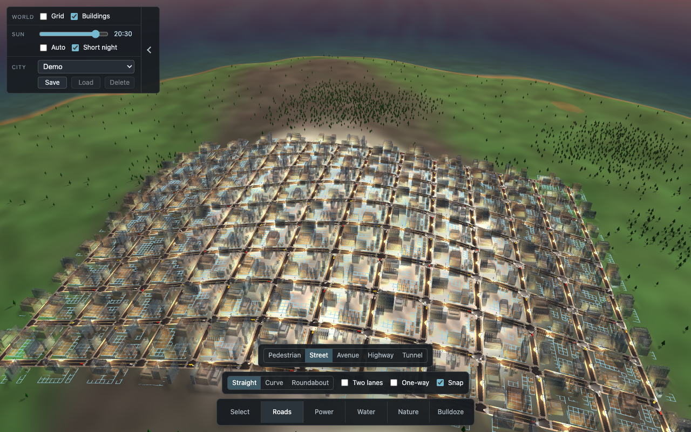
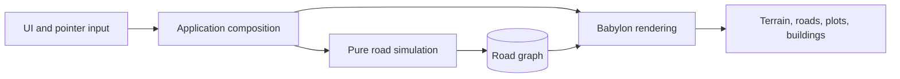

# city-jump


`city-jump` is a browser-based 3D city builder. Draw straight or curved roads across
terrain and the buildable plots, buildings, junctions, and shaped ground are derived
from that road network.





## Product Loop

1. Shape a road network with straight or curved segments.
2. Read the buildable grid generated along each road.
3. Let buildings occupy valid, non-overlapping plots.
4. Inspect the result under different terrain and daylight conditions.

The current prototype focuses on road construction, spatial legibility, terrain shaping,
traffic, persistence, pedestrian paths, and tunnel rendering. Services, economy,
progression, and bridges are not implemented.

## Current State

- Roads snap to the 2 m world grid, existing nodes, and existing segments.
- Hovered snap nodes are highlighted before placement.
- Buildable plots extend up to five 8 m cells perpendicular to a road and never overlap.
- Curved roads regroup nearby cells into usable blocks where geometry permits.
- Rolling and rugged terrain presets exercise road shaping and ground conformance.
- Tunnels pass under surface roads and render portals without growing buildings or traffic.
- A 24-hour sun control changes light direction, intensity, ambient light, and sky.
- A browser debug surface drives deterministic visual and interaction checks.

## Architecture



The road graph is the source of truth. Babylon meshes are derived views and are rebuilt
after an edit. Simulation modules contain no Babylon or DOM imports, so geometry and
rules run headless in Vitest.

| Path | Responsibility |
| --- | --- |
| `src/app/` | Composition and rebuild lifecycle. |
| `src/ui/` | Toolbar, HUD, and browser feedback. |
| `src/sim/` | Deterministic graph, road rules, terrain, and plot generation. |
| `src/render/` | Babylon scene, meshes, picking, and visual debug API. |
| `scripts/` | Browser interaction and visual checks. |
| `logics/` | Product, roadmap, decisions, specifications, and delivery corpus. |

## Quick Start

Requires Node.js 22.

```bash
npm ci
npm run dev
```

Open `http://localhost:5173`. Choose **Straight** for two clicks or **Curve** for three
clicks: start, bend, end. Right-click or `Esc` cancels.

## Validation

```bash
npm run typecheck
npm test
npm run test:architecture
npm run build
npm run test:e2e
npm run test:visual
npm run logics:validate
npm run ci
```

`ci` is the fast push gate. `test:e2e` and `test:visual` start or reuse the local Vite
server. GitHub Actions runs the browser interaction suite in the separate
`Browser Interaction` workflow, manually with `workflow_dispatch` or on its weekly
schedule. On 2026-08-29,
`node scripts/with-dev-server.mjs scripts/shot.mjs /tmp/city-jump-city.png city` rendered
237 roads, 126 junctions, 1,688 buildings, 237 cars, and 474 pedestrians at 50 fps on an
Apple M3 Pro using ANGLE Metal.

## Assets

Building GLBs live under `public/buildings/` and render as thin instances. Their
authoring contract is documented in [`docs/assets.md`](docs/assets.md).

## Project Documents

- [`CONTRIBUTING.md`](CONTRIBUTING.md) describes collaboration and validation.
- [`SECURITY.md`](SECURITY.md) describes the current local-client threat model.
- [`changelogs/`](changelogs/README.md) contains versioned release notes.
- [`LOGICS.md`](LOGICS.md) explains the repository-local product corpus.

Licensed under the [MIT License](LICENSE).
