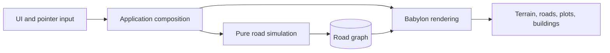

# city-jump

<br clear="left"/>


**Draw a road. Watch a city appear along it.**

### ▶ [Play it in your browser](https://city-jump.onrender.com/)

No install, no account, no download. It runs on the page.


---

## Every city starts with one line

You draw a street. Plots appear along both sides of it, sized to the space you left. Buildings
fill the ones that fit. Cars find their way onto the tarmac, people onto the pavement, and the
lights come on when the sun goes down.

Draw another street across the first and the two split into a proper junction — with signals,
crossings, and traffic that waits its turn. Drop a roundabout on it instead and the cars circle
it. Take a road under a hill and it becomes a tunnel, portals and all.

Nothing here is placed by hand except the roads. Everything else is what the roads imply.


## What you can do

**Build.** Straight roads, curves, avenues, one-ways, dual carriageways, highways, footpaths,
tunnels and roundabouts. Everything snaps to the grid, to existing junctions, and to roads
already drawn — so a network stays a network.

**Shape the ground.** Roads cut into the hills they cross and the terrain grades back around
them. Junctions flatten to their real footprint. A tunnel digs its approach trench and leaves
the hill whole over the middle.

**Plant.** Trees one at a time or by the spray, in any of four species, anywhere the ground is
above the waterline and clear of the road.

**Watch it run.** Cars queue behind each other, stop at red, change lane before their turn, and
take roundabouts properly. Pedestrians walk the pavements, go round corners rather than through
them, and cross at the crossings.

**Zone it.** Paint an area low or dense and what gets built there follows — different footprints,
different silhouettes, visible from a normal playing camera. Land you never zone keeps behaving
exactly as it always did.

**Read it.** Switch to Zones to see what you zoned, over the grid of which plots are taken and
which are open. Switch to Traffic to watch the lanes and turns from above, with the buildings out
of the way.

**Point at anything.** Click a road and it tells you its street name, its type and its length.
Click a building and it gives you a street address. Click a car and you get the street it is on.
Streets carry one name across every segment that continues them, and buildings are numbered along
their frontage.

**Watch it.** The camera has three modes: free, orbit — which turns slowly around whatever you
are looking at — and follow, which rides along with a car you picked. Any pan or arrow key hands
control straight back to you.

**Set the hour.** Drag through a full 24 hours and watch the light move: the sun's angle, the
colour of the sky, the streetlights, the headlights.

**Keep it, and hand it on.** Name your cities and load them back. An autosave catches what you
were doing even if you never pressed anything, and the view comes back where you left it. Share
copies the whole city into a link — no server, no upload, the city travels inside the URL.


## Where it's going

city-jump is a prototype, and an honest one. Everything above works today. What isn't there yet:
demand, an economy, services, progression, bridges. Zoning has landed, so a building can now
appear because someone asked for that kind of building there — but nothing yet decides whether a
plot fills at all, or changes what stands on it over time. That is the next real step, and it has
something to act on for the first time.

The plan lives in [`logics/roadmap/`](logics/roadmap/), as long-running strands rather than
dated releases.

## Get started

Open the [live demo](https://city-jump.onrender.com/) — a `Demo` city is already in the load
menu. **Straight** takes two clicks, **Curve** takes start, bend and end, **Roundabout** toggles
an existing junction. Right-click or `Esc` cancels.

The build tools are desktop-only for now. They need a mouse because hover previews show what
will be placed, right-click cancels, and drag already moves the camera. Touch visitors can still
open the city and look around.

To run it yourself (Node.js 22):

```bash
npm ci
npm run dev
```

## Under the hood

The road graph is the source of truth. Everything visible — terrain, road surfaces, plots,
buildings, traffic — is a derived view, rebuilt after an edit. The simulation imports neither
Babylon nor the DOM, so the geometry and rules run headless in Vitest, and a test enforces that
boundary rather than trusting it.



| Path | Responsibility |
| --- | --- |
| `src/app/` | Composition and rebuild lifecycle. |
| `src/ui/` | Toolbar, HUD, and browser feedback. |
| `src/sim/` | Deterministic graph, road rules, terrain, and plot generation. |
| `src/render/` | Babylon scene, meshes, picking, and visual debug API. |
| `scripts/` | Browser interaction and visual checks. |
| `logics/` | Product, roadmap, decisions, runbooks, and delivery corpus. |

A last measured run: 237 roads, 126 junctions, 1,688 buildings, 237 cars and 474 pedestrians at
50 fps on an Apple M3 Pro.

`npm run ci` is the push gate — types, unit tests, the architecture test, the build, and Logics
validation. The browser interaction and visual suites run on demand.
[`CONTRIBUTING.md`](CONTRIBUTING.md) has the full list and when to reach for each.

## More

- [`docs/assets.md`](docs/assets.md) — the building model authoring contract.
- [`docs/performance.md`](docs/performance.md) — how a city is measured, what costs, and what is left to do.
- [`logics/runbook/`](logics/runbook/) — how the hard parts actually work, and what went wrong first.
- [`SECURITY.md`](SECURITY.md) — the current static-client security model.
- [`docs/shared-link-threat-model.md`](docs/shared-link-threat-model.md) — the share-link review.
- [`changelogs/`](changelogs/README.md) — release notes.
- [`LOGICS.md`](LOGICS.md) — the repository-local product corpus.

Licensed under the [MIT License](LICENSE).
