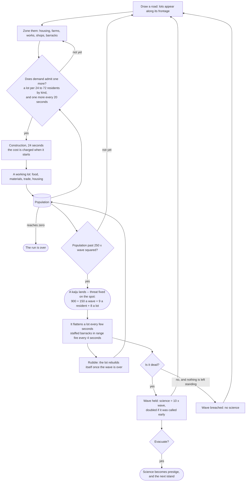
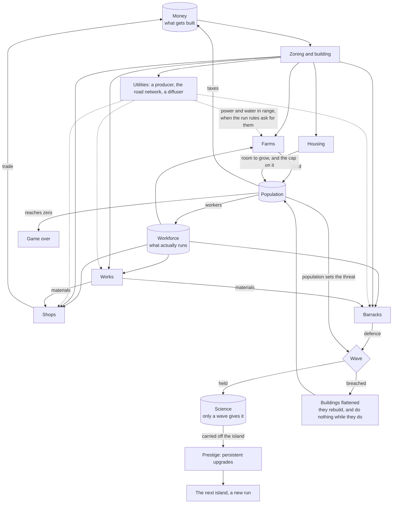
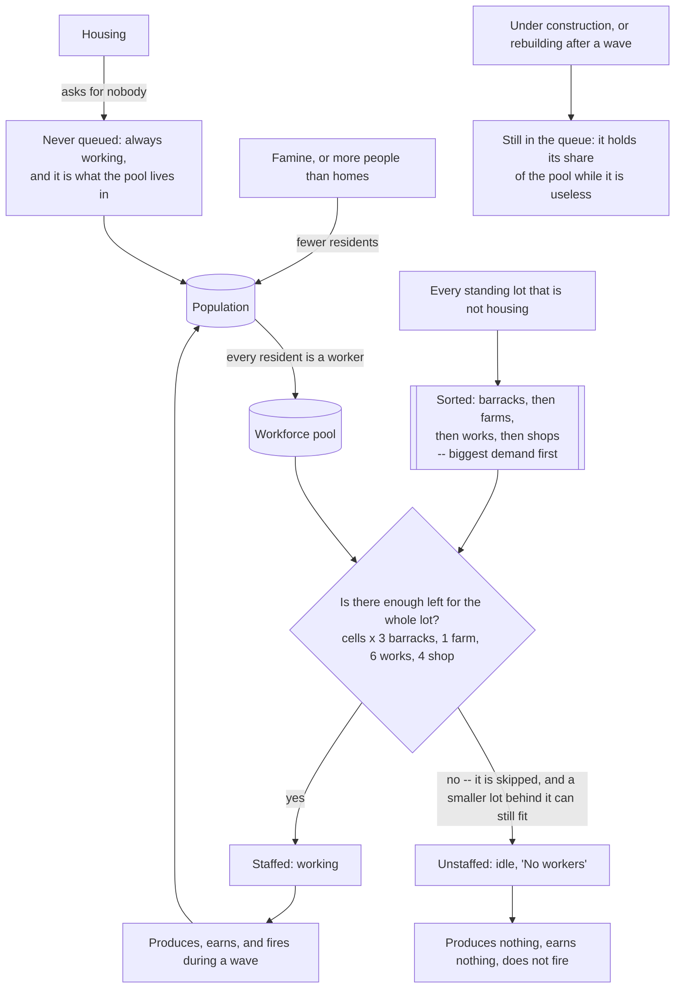

# city-jump

<br clear="left"/>


**Draw a road. Watch a city appear along it.**

### ▶ [Play it in your browser](https://city-jump.onrender.com/)

No install, no account, no download. It runs on the page.


---

## Every city starts with one line

You draw a street. Plots appear along both sides of it, sized to the space you left. Buildings
fill the ones that fit. Cars find their way onto the tarmac, people onto the pavement, and the
lights come on when the sun goes down.

Draw another street across the first and the two split into a proper junction — with signals,
crossings, and traffic that waits its turn. Drop a roundabout on it instead and the cars circle
it. Take a road under a hill and it becomes a tunnel, portals and all.

Nothing here is placed by hand except the roads. Everything else is what the roads imply.


## What you can do

**Build.** Eight kinds of road — footpath, street, avenue, industrial, dirt, military, highway,
tunnel — straight or curved, one-way or dual carriageway, with roundabouts on any junction.
Everything snaps to the grid, to existing junctions, and to roads already drawn, so a network
stays a network. Bulldoze takes any of it back out.

**Shape the ground.** Roads cut into the hills they cross and the terrain grades back around
them. Junctions flatten to their real footprint. A tunnel digs its approach trench and leaves
the hill whole over the middle.

**Plant.** Trees one at a time or by the spray, in any of four species, anywhere the ground is
above the waterline and clear of the road.

**Supply it.** Power and water each need a producer, a road network to travel along, and a
diffuser at the far end. A lot out of range of either does nothing, when the run rules ask for
them.

**Watch it run.** Cars queue behind each other, stop at red, change lane before their turn, and
take roundabouts properly. Pedestrians walk the pavements, go round corners rather than through
them, and cross at the crossings.

**Zone it.** Paint an area residential, commercial, industrial, agricultural or military, and
what gets built there follows — different footprints, different silhouettes, different work.
A lot has to be zoned before anything will stand on it: land you never paint stays empty.

**Read it.** Five ways to look at the same city: everything, the zoning over the grid of which
plots are taken, the traffic lanes and turns with the buildings out of the way, the utility
coverage, or the state of every lot — building, working, unstaffed, unsupplied, rubble.

**Point at anything.** Click a road and it tells you its street name, its type and its length.
Click a building and it gives you a street address. Click a car and you get the street it is on.
Streets carry one name across every segment that continues them, and buildings are numbered along
their frontage.

**Watch it.** The camera has three modes: free, orbit — which turns slowly around whatever you
are looking at — and follow, which rides along with a car you picked. Any pan or arrow key hands
control straight back to you.

**Set the hour.** Drag through a full 24 hours and watch the light move: the sun's angle, the
colour of the sky, the streetlights, the headlights.

**Keep it, and hand it on.** Name your cities and load them back. An autosave catches what you
were doing even if you never pressed anything, and the view comes back where you left it. Share
copies the whole city into a link — no server, no upload, the city travels inside the URL.


## Where it's going

city-jump is a prototype, and an honest one. Everything above works today, and so does the loop
below it: demand decides whether a lot fills, money and a workforce decide what gets built and
what actually runs, waves come for the city on their own, and science carried off the island
becomes prestige on the next one.

What still isn't there: **services** — no police, fire, health or schooling of any kind — and
**redevelopment**, because nothing yet changes what stands on a plot once it is built. A lot
fills, works, and stays whatever it first became until a kaiju flattens it. That is the next real
step.

Finished strands are recorded in [`logics/roadmap/`](logics/roadmap/); all three are settled or
superseded, so there is no active roadmap to read. The next one gets written when the strand above
is chosen.

## Get started

Open the [live demo](https://city-jump.onrender.com/). A `Demo` city is already in the load
menu — the one in the screenshots above: 13,000 residents on day 41, on its seventeenth wave,
framed where it was left. Load it to walk around a city that has been played, or press **New** to start
your own on an empty island.

Drawing: **Straight** takes two clicks, **Curve** takes start, bend and end, **Roundabout**
toggles an existing junction. Right-click or `Esc` cancels.

The build tools are desktop-only for now. They need a mouse because hover previews show what
will be placed, right-click cancels, and drag already moves the camera. Touch visitors can still
open the city and look around.

To run it yourself (Node.js 22):

```bash
npm ci
npm run dev
```

## Under the hood

The road graph is the source of truth. Everything visible — terrain, road surfaces, plots,
buildings, traffic — is a derived view, rebuilt after an edit. The simulation imports neither
Babylon nor the DOM, so the geometry and rules run headless in Vitest, and a test enforces that
boundary rather than trusting it.

### The loop

Roads make lots, lots make people, people bring the kaiju. Nothing is on a schedule: the next wave
waits on the city being worth attacking.



### What feeds what

Two meters, two pressures: money decides how much can be **built** before the next wave, the
workforce decides how much of it **runs**. Neither substitutes for the other.



Food shortage costs the city twice what it is short. Losing homes costs it 40% of the homeless a
day, not all of them at once. Shops and barracks stop when the works cannot supply them, and only
restart on a real buffer rather than on the first material back in stock.

### How the workers are dispatched

One global stock, re-dealt from scratch every tick. Nobody is assigned to a building: the whole
allocation is recomputed from the population of the moment, so a city that loses people does not
lay anyone off, it simply comes out of the deal differently.



A flattened lot is not deleted: it keeps its place, is paid for again on the spot, and its rebuild
is held until the wave is over — so the hole in the economy is exactly where the kaiju walked, and
it lasts a stage rather than for ever.

### The code behind it

| Path | Responsibility |
| --- | --- |
| `src/app/` | Composition and rebuild lifecycle. |
| `src/ui/` | Toolbar, HUD, and browser feedback. |
| `src/sim/` | Deterministic graph, road rules, terrain, and plot generation. |
| `src/render/` | Babylon scene, meshes, picking, and visual debug API. |
| `scripts/` | Browser interaction and visual checks. |
| `logics/` | Product, roadmap, decisions, runbooks, and delivery corpus. |

The largest city measured so far: 132 roads, 1,287 buildings, 2,528 trees, 166 cars and 311
pedestrians, drawing 1,819 meshes a frame. Every run in
[`perf/history.jsonl`](perf/history.jsonl) was taken on a software rasteriser, so it records what
the city costs to build and draw, not what a real GPU does with it — no device frame rate is
claimed here, because none has been measured.

`npm run ci` is the push gate — the version check, the linter, the unit tests with a coverage
floor on `src/sim/`, the architecture and asset tests, the scenario harness, the build with
types, and Logics validation. The browser interaction and visual suites run on demand, because
GitHub's runners have no GPU.
[`CONTRIBUTING.md`](CONTRIBUTING.md) has the full list and when to reach for each.

## More

- [`docs/assets.md`](docs/assets.md) — the building model authoring contract.
- [`docs/performance.md`](docs/performance.md) — how a city is measured, what costs, and what is left to do.
- [`logics/runbook/`](logics/runbook/) — how the hard parts actually work, and what went wrong first.
- [`SECURITY.md`](SECURITY.md) — the current static-client security model.
- [`docs/shared-link-threat-model.md`](docs/shared-link-threat-model.md) — the share-link review.
- [`changelogs/`](changelogs/README.md) — release notes.
- [`LOGICS.md`](LOGICS.md) — the repository-local product corpus.

Licensed under the [MIT License](LICENSE).
