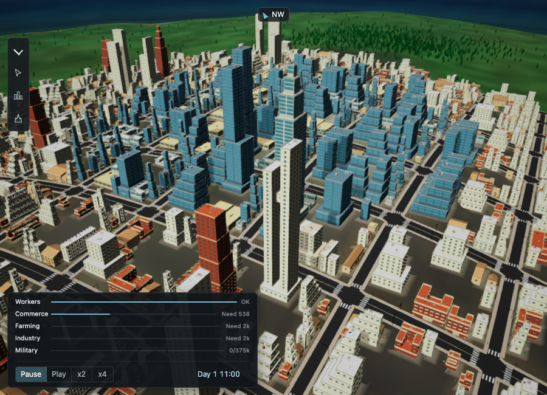

# Building asset convention

Vehicle GLBs have their own centred, four-part contract: see [vehicle models](vehicles.md).

Anything that authors a building model for city-jump — MeshAnvil, Blender by hand, or
whatever comes next — obeys this. It is fixed now on purpose: correcting it once two
hundred models exist is a two-hundred-model correction.

## Format

- **glTF binary (`.glb`)**, one file per building, in `public/buildings/`.
  Babylon's loader reads it with no conversion step.
- The filename without its extension is the model's id.
- One material per model is enough. Textures are allowed but must be embedded in the
  `.glb`, not referenced as sibling files.

## Units and orientation

glTF is Y-up. In the exported file:

- **Scale is metres.** A three-storey building is about 9 units tall, not 0.09 and not 900.
- **Origin** sits at the **front-left corner of the footprint, at ground level** — so the
  model occupies `x ∈ [0, width]`, `y ∈ [0, height]`, `z ∈ [-depth, 0]`.
- **The facade faces `+Z`.** The plane `z = 0` is the front of the building, the side that
  meets the street.
- No transform on the root node: the geometry is baked, not posed.

The renderer reads each model's bounding box after loading and centres it on the slot's
frontage, so footprint dimensions come from the mesh. Roof facts that the bounding box
cannot say honestly are declared in `public/buildings/manifest.json`: flat deck height,
pitched ridge height, setback deck bounds, or a list of rectangular terrace decks. If a model has no manifest entry, it still
loads; roof props use the mesh's top as a flat fallback. Today `block.glb`, `house.glb`,
`shop.glb`, and `tower.glb` use that fallback; architecture tests still check that each
one has usable GLB height.

## Fitting a slot

Buildable cells are 8 m square. The generated `lot_<frontage>x<depth>.glb` library covers
every rectangular footprint from 1x1 through 4x4 cells, with a small gap inside each
parcel. `buildingParcels` packs the free cells and the renderer loads the matching model.
Residential and commercial parcels now select their own
`<kind>_<frontage>x<depth>_<a|b|court|terraces>.glb` libraries. Twenty tower assets (`_tower`, `_tower_steps`, `_tower_offset`, `_tower_crown`, `_tower_split` per footprint) cover
residential 3x3/4x4 and commercial 3x4/4x3. Variant choice is deterministic from parcel
position and size; any pedestrian cell restricts selection to low `a` and `court` variants.

Urban `terraced` manifest entries contain the footprint `width` and `decks`, each with
`minX`, `maxX`, `minZ`, `maxZ`, `deckY` in exported coordinates. The highest deck containing
a point supports its roof prop. These facts come from the same volumes as the meshes;
their overall bounds also drive construction and the optional distant boxes.

## Authoring with Blender

`scripts/gen_buildings.py` generates the building library and is the reference for the
coordinate mapping. It writes both the `.glb` files and `public/buildings/manifest.json`:

```bash
/Applications/Blender.app/Contents/MacOS/Blender -b -P scripts/gen_buildings.py
```

Blender is Z-up. Its glTF exporter maps Blender `+Z` to glTF `+Y` and Blender `+Y` to
glTF `-Z`, so a box built in Blender from `(0, 0, 0)` to `(w, d, h)` lands exactly on the
convention above. Build with the footprint in `+X`/`+Y` and the height in `+Z`, with the
front edge on `y = 0`, and the export takes care of the rest.

## Improving and verifying models

For the authoring procedure, runtime material overrides, cache behaviour, partial
regeneration and visual checks, see
[the model authoring runbook](../logics/runbook/run_001_author_a_building_model_that_lands_on_its_parcel.md).
Change the generator and ship its regenerated GLBs together. `-- --lots-only` refreshes
the 48 lot models and their variant manifest entries. The GLB tests bound footprint, transforms, roof heights and geometry cost.

`-- --industrial-only` regenerates the twelve deep industrial works and three residual
1x1 variants, updating the small variants' manifest entries. `-- --industrial-small-only`
refreshes just `industrial_1x1_a`, `_b` and `_c`. See the runbook for their layouts and browser checks.

`-- --farms-only` refreshes the twelve farm layouts. Their authoring traps and
repeatable visual checks are also documented in the model authoring runbook.

The articulated kaiju has a different transform contract: retain its eight named
pivot groups and embedded PBR textures. The runbook's kaiju section covers generation,
height normalisation, animation ownership and desktop/mobile inspection.

`-- --urban-only` regenerates the 128 residential/commercial variants and twenty towers,
and updates their manifest entries while preserving the other asset families.

`-- --towers-only` regenerates just the twenty towers and their roof metadata.

The `court` family adds brick residential courtyard blocks and masonry commercial patios;
narrow parcels use a compact street wing and a lower rear wing. `terraces` adds cream
residential balconies and horizontal office glazing on four receding levels. Crown towers
have Art Deco shoulders and a lantern; split towers have unequal shafts and a raised bridge.
Each footprint now has four ordinary silhouettes and each eligible tower footprint has five.
Selection is stable across reloads; the expanded palette can change an existing parcel's
appearance when upgrading. Pedestrian parcels select between `a` and `court`; both remain below 14 m.

The 148 urban assets total 13,842,880 bytes (13.20 MiB) after the facade pass. The family budget is 24 MiB for
the expanded catalog; per-model ceilings remain 750 kB, 14,000 triangles and six primitives.
The extra assets increase initial model download and memory use; geometry checks do not
establish unchanged frame rate. Browser fixtures cover actual city selection and isolated
small/large models, including the new crowns and bridges.

## Compound, generic and pedestrian variety

The runtime catalog now contains **235 models**. Farms, military compounds and deep
industrial works each have three layouts on each of four widths (12 models per family).
The original unsuffixed model is retained; `_b` and `_c` are the new alternatives.

- Farms change their crops (greenhouses, grain, orchard, paddocks), barn width/depth and
  roof pitch. Every option fits even the narrow 1x4 holding.
- Industrial `_b` has a multi-gabled production hall and rear freight warehouse;
  `_c` has a flat-roof office, two tanks and a taller silo.
- Military `_b` has a rear hangar, six inclined launch tubes and a roof-mounted radar;
  `_c` has a bunker, vertical tubes and a circular radar. The launcher remains at the
  parcel centre used by salvos. These are visual alternatives with identical gameplay.
- Generic lots add `_gable` (pitched roof) and `_slab` (flat roof, setbacks on large
  footprints), giving 48 models across 16 footprints. Roof facts share `lot_roof()`
  with the original lots, and residual non-urban parcels use the expanded palette.
- Pedestrian residential/commercial parcels have two low alternatives per footprint,
  reusing `a` and `court`. A single pedestrian cell excludes every taller variant.

`-- --variants-only` regenerates the 56 added compound/generic models and their manifest
entries. Full generation and each family-specific command include these variants too.
Per-model geometry limits remain unchanged; the 56 additions have a combined 10 MiB
budget (8,668,964 bytes measured, about 8.27 MiB of added downloads). Selection uses the
existing stable parcel seed, with no simulation/save changes.

Inspect the full fixture with:
`node scripts/with-dev-server.mjs scripts/buildings-shot.mjs /tmp/city-jump-compounds variety`.
It validates zoned districts, generic leftovers and pedestrian selection, then captures
all 56 additions and representative low-rise models through the actual game renderer.

Pedestrian profiles and animation are documented in [pedestrians.md](pedestrians.md).

## Residential and commercial facade identity

The 148 urban GLBs now distinguish usage through facade rhythm, material palettes
and street-level details. The existing footprint and variant selection remains in use.

| Usage | Family | Visible features |
|---|---|---|
| Residential | Low pitched apartments (`a`) | Warm plaster, timber shutters, small windows, planted entrances |
| Residential | Brick blocks (`court`, stepped/crowned towers) | Brick-coloured masonry, pale individual balconies, cornices |
| Residential | Pale residences (other variants) | Projecting loggia sides, small domestic openings, pale balcony rails |
| Commercial | Local shops (`a`) | Wide storefronts, coloured awnings, sign panels and outdoor tables |
| Commercial | Low commercial buildings (`court`, `terraces`) | Broad glazing, courtyard/setback forms and shopfronts |
| Commercial | Offices (`b`, towers) | Wide glazed bays, metal fins, marked lobby and rooftop equipment |

Flat residential roofs have timber pergolas and planted containers; commercial
roofs group ventilation units. All residential `a` footprints now have pitched
roofs, with corresponding roof metadata. Every low pedestrian-safe variant remains
below 14 m. Loggias use projecting sides rather than interior rooms; window panes
are opaque exterior surfaces with reflections. Signs carry colour, not generated text.

Runtime material conversion preserves authored urban colours, including glass,
trim, awnings and wood. Existing reflection and depth-offset handling remains in
place. Lighter, facade-specific trim replaces the uniform almost-black outlines.
The browser fixture compares converted colours against the source GLBs to prevent
future palette overrides from making the families look alike again.

The library ranges from 230 to 5,284 triangles per model. Exterior window planes
omit buried faces, keeping the existing 24 MiB family budget and per-model limits.
These geometry savings are not a frame-rate benchmark.



Regenerate with `-- --urban-only` and inspect with
`node scripts/with-dev-server.mjs scripts/buildings-shot.mjs /tmp/city-jump-urban urban`.
The fixture covers mixed districts, distant and mobile views, all twenty towers,
and representative small/large facades through the actual game renderer.
