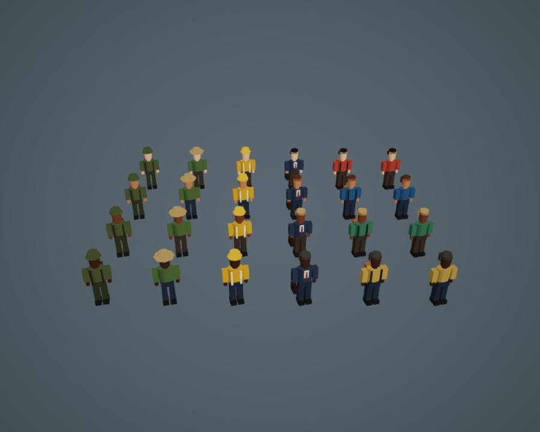

# Pedestrians

Traffic uses six local low-poly profiles: casual, backpacker, office worker,
construction worker, farmer and soldier. Each has four skin, hair and clothing
palettes, with 288–388 triangles per character and no textures or downloads.

Commercial, industrial, agricultural and military road frontages favour the
matching profile for three out of four selections; the remaining selections and
ordinary streets use civilians. Selection is deterministic.

Each variant shares five prototype meshes (body, two arms and two legs) and one
vertex-colour material across all characters. Arms and legs swing in opposite
pairs according to walking speed. A waiting pedestrian returns to a standing
pose; pausing the simulation freezes movement and animation together. Feet start
at ground level, using the existing road and sidewalk lifts.

The models are authored in `src/render/pedestrianModels.ts` and instantiated by
the existing traffic mover system. There is no skeleton, animation asset or new
dependency. The torso and head remain rigid; elbows and knees do not bend.



```sh
npx vitest run src/render/pedestrianModels.test.ts src/render/trafficMovers.test.ts
node scripts/with-dev-server.mjs scripts/pedestrians-shot.mjs /tmp/city-jump-pedestrians
npm run ci
npm run test:e2e
```

The browser check verifies moving, articulated pedestrians and pause behaviour,
then captures all 24 variants from the front and rear plus a mobile close-up.
