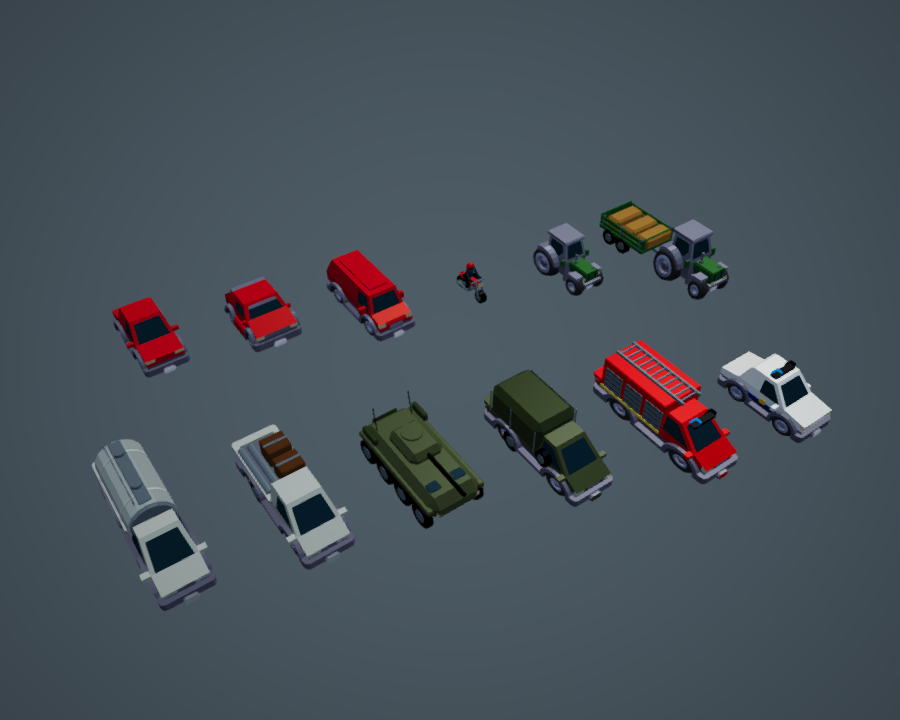
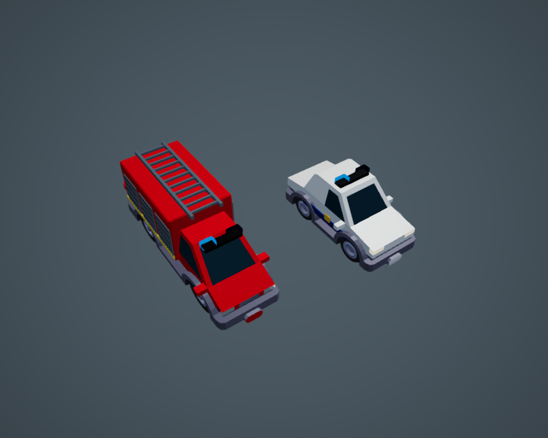

# Vehicle models

The twelve traffic silhouettes use local GLBs in `public/vehicles/`. The generated
`manifest.json` supplies their dimensions, frontage themes and triangle counts.
Civilian colours and agricultural, industrial and military palettes remain owned
by `src/render/vehicleModels.ts`.

| Traffic name | Source / adaptation |
| --- | --- |
| saloon | Kenney sedan |
| hatchback | Kenney hatchback-sports |
| van | Kenney van |
| motorcycle | Project model: tank, fork, exhaust, seated rider and helmet |
| tractor | Kenney tractor, with front and rear lamps |
| farm trailer | Kenney tractor pulling a project open trailer with hay and tandem wheels |
| tanker | Kenney truck-flat with a project tank, end caps, bands, hatches and walkway |
| flatbed | Kenney truck-flat with an extra axle, crates and pipes |
| apc | Project model: chamfered hull, eight wheels, turret, hatches, stowage and antennae |
| troop truck | Kenney truck-flat with an extra axle, canvas cover, open rear and spare wheel |
| fire engine | Kenney truck-flat with red equipment body, roller shutters and roof ladder |
| police car | Kenney sedan with white paint, blue stripes and door badges |

## Sources and regeneration

Kenney's [Car Kit](https://kenney.nl/assets/car-kit), version 3.1, is CC0.
The five original GLBs, palette texture and unmodified license are retained in
`assets/vehicles/kenney/`. The game serves only the adapted assets; it does not
download anything from Kenney at runtime. Project additions follow this repo's MIT
license. No paid assets are required.

```sh
/Applications/Blender.app/Contents/MacOS/Blender -b -P scripts/gen_vehicles.py
```

Commit the generator, regenerated GLBs and manifest together. Every file has four
named meshes: `body`, `trim`, `head`, `tail`; emergency vehicles also have
`beacon_left` and `beacon_right`. Paint vertices are white for runtime
recolouring; trim retains baked palette colours, including glass and wheel hubs.
No textures, external buffers, rig or animation are required. Geometry stays under
4,000 triangles per vehicle; the complete shipped fleet is approximately 3.2 MiB.

Models use metres, Y-up, centred X/Z bounds, tyres at Y=0 and the nose toward glTF
+Z. The generator authors in Blender Z-up and rotates for that export convention.
The loader bakes the glTF root transform and retains its face winding when copying
geometry into Babylon's left-handed scene.

## Runtime and verification

There are four shared prototype parts per ordinary shape and six per emergency
shape, regardless of the number of moving vehicles. Body colour variants share geometry after loading. The renderer
starts with simple boxes and streams each GLB once. Arrival replaces prototype
geometry in place, preserving existing instances, movement, selection and lamps.
An asset failure reports a warning and keeps the corresponding fallback. Late
responses are disposed if the renderer or scene has already been destroyed.

Head/tail surfaces still use the existing day/night lamp materials. Traffic rules,
frontage selection and the headlight beam system are unchanged. Wheels and riders
are static geometry, suitable for the city camera.

```sh
npx vitest run src/render/vehicleModels.test.js
node scripts/with-dev-server.mjs scripts/vehicles-shot.mjs /tmp/city-jump-vehicles
npm run test:e2e
npm run ci
```

The model test loads every shipped GLB through Babylon and checks dimensions,
ground contact, face winding, lamp direction, colours, triangle budgets, shared
geometry, complete draw ranges for every colour and existing instance, failed loads
and disposal during loading. The browser check exercises moving traffic and captures
every colour palette, the complete catalogue and mobile view.



The catalogue places saloon, hatchback, van, motorcycle, tractor and farm trailer
in the back row; tanker, flatbed, APC, troop truck, fire engine and police car
in the front row.

The browser script also writes night, mobile close-up and live traffic captures to
the chosen output directory. Only the fleet overview is retained in this repository.

## Emergency traffic

Fire engines and police cars each replace about 2% of ordinary traffic slots,
using a stable per-road seed. Counts vary in small cities; they do not increase
traffic density. Red and white/blue liveries remain fixed across palette variants.
Both obey the same traffic rules and support selection and Follow.

Two shared emissive blue materials alternate at six half-cycles per simulation
second, in daylight and at night. Pausing freezes their phase. The lightbar parts
follow each vehicle and are disposed with it; no extra point lights are allocated.
The generator, asset tests and browser catalogue include all six emergency parts.
The browser check verifies rare live spawns, motion and both beacon states.


