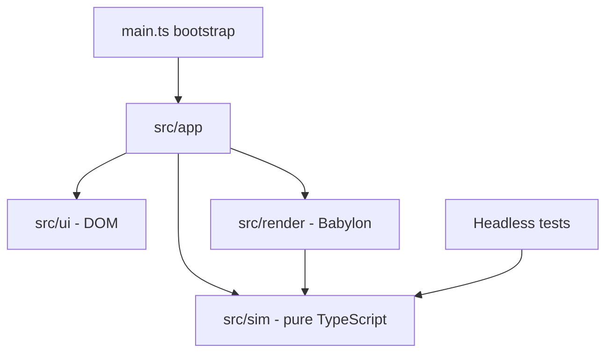

## adr_002_keep_simulation_independent_from_babylon_and_the_browser - Keep simulation independent from Babylon and the browser
> Date: 2026-08-27
> Status: Settled
> Related request: `req_002_establish_modular_repository_foundations`
> Related backlog: item_008_establish_modular_repository_foundations
> Related task: task_002_establish_modular_repository_foundations
> Drivers: (drivers to document)
> Reminder: Update status, linked refs, decision rationale, consequences, and follow-up work when you edit this doc.
> Indicators reviewed: 2026-08-27 11:17:09

# Overview
Simulation rules use plain TypeScript values and run without a browser, GPU, or Babylon
runtime.

# Context
Graph mutations, snapping, validation, arc-length lookup, terrain sampling, junction
geometry, and plot allocation contain the rules most likely to regress. They need fast,
deterministic tests and must not require scene setup to execute.

# Decision
- `src/sim/` may import only simulation modules and platform-neutral TypeScript.
- `src/render/` may depend on simulation modules and Babylon, but not on `src/app/` or
  `src/ui/`.
- `src/ui/` owns DOM controls and feedback. `src/app/` is the composition root and the
  only layer expected to connect simulation, rendering, and UI callbacks.
- Convert between simulation vectors and Babylon vectors at the rendering boundary.
- Enforce these directions with the native Node architecture test in `tests/`.

# Consequences
- Simulation tests stay small and run under Vitest with no browser or GPU.
- Rendering code receives callbacks for UI effects instead of importing DOM modules.
- Babylon remains directly usable inside the rendering layer; no engine facade or generic
  dependency-injection framework is introduced.
- A feature that genuinely spans layers is coordinated in `src/app/` rather than hidden
  behind a speculative abstraction.

# References
- Related request: `req_002_establish_modular_repository_foundations`
- Related backlog: (none yet)
- Related task: (none yet)
