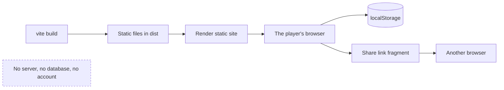

## adr_004_stay_a_static_client_with_no_server_of_its_own - Stay a static client with no server of its own
> Date: 2026-08-30
> Status: Settled
> Related request: `req_011_share_a_city_as_a_link_that_needs_no_server`
> Related backlog: `item_039_turn_a_city_into_a_link_sized_payload_and_read_one_back_safely`
> Related task: `task_013_implement_sharing_a_city_by_link`
> Drivers: cost of operation, privacy of a player's work, keeping the deployment reviewable by one person
> Reminder: Update status, linked refs, decision rationale, consequences, and follow-up work when you edit this doc.

# Overview
city-jump ships as files on a CDN. Features are designed to fit that, rather than the deployment
being changed to fit a feature.

# Context
`render.yaml` declares `runtime: static` with `staticPublishPath: dist`: the whole application is
`index.html`, hashed assets and the building GLBs. There is no backend, no database, no account
system, no telemetry and no upload path. A player's cities live in their own `localStorage` and
nowhere else.

This has not been written down as a decision, only observed as a fact, and the difference matters
now that features are being designed against it. Sharing a city by link
(`req_011_share_a_city_as_a_link_that_needs_no_server`) is the first feature where the obvious
implementation -- store the city somewhere, hand out a short link -- would have quietly introduced
a server, user data at rest, and an operational surface nobody has agreed to run.

# Decision
- The application stays a static client. No backend, no database, no account system, no telemetry,
  no server-side storage of player data.
- A feature that appears to need a server is redesigned to fit the client, or it is not built. The
  share link carries the city in the URL fragment for exactly this reason, which is also why it can
  never be a short link.
- Player data stays in the player's browser. Anything leaving it does so because the player
  deliberately handed it to someone, in a form that never touches this project's infrastructure --
  a fragment is not sent to the server, so a shared city appears in no log.
- Overturning this is a deliberate act with its own decision record and, per `SECURITY.md`, its own
  threat-model review. Galleries, cloud saves, remixing, multiplayer and user-generated asset
  hosting all sit on the far side of it.

# Consequences
- Sharing is a snapshot in a link, not a live document, and the link is long because the city is
  in it. That is a consequence of this decision, not a defect of the share feature.
- There is a size ceiling on what can be shared, and cities beyond it cannot be shared by link at
  all without overturning this decision or finding a smaller encoding.
- Untrusted input arrives directly in the client with nothing in front of it, so validation and
  resource caps are the client's own job -- there is no server-side filter to fall back on.
- Hosting stays free or near-free and the deployment stays reviewable by one person.
- Features that would be natural with a server -- discovering other people's cities, resuming on
  another device -- are simply absent, and should be declined as out of scope rather than
  half-built.

# References
- Related request: `req_011_share_a_city_as_a_link_that_needs_no_server`
- Related backlog: `item_039_turn_a_city_into_a_link_sized_payload_and_read_one_back_safely`
- Related task: `task_013_implement_sharing_a_city_by_link`
- `render.yaml` -- the static site blueprint this records.
- `SECURITY.md` -- the threat-model review this decision defers to.
