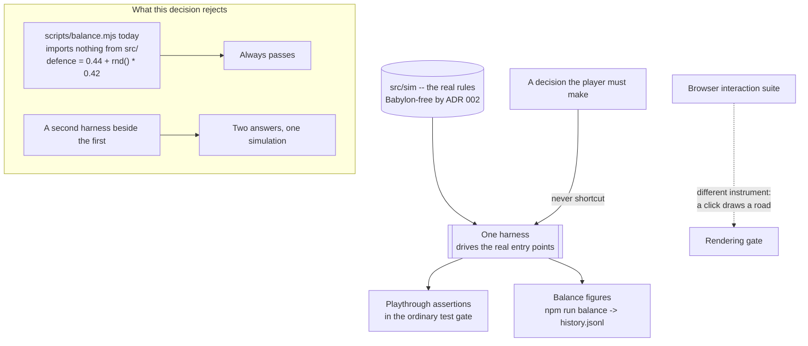

## adr_005_one_harness_drives_the_real_simulation_and_no_test_shortcuts_a_player_decision - One harness drives the real simulation, and no test shortcuts a player decision
> Date: 2026-09-01
> Status: Proposed
> Related request: `req_032_a_run_played_end_to_end_a_headless_playthrough_a_threat_the_city_generates_and_the_gameplay_switches_that_make_both_testable`
> Related backlog: (none yet)
> Related task: (none yet)
> Drivers: `scripts/balance.mjs` proved nothing for a whole delivery; two requests now need a harness over the same simulation
> Reminder: Update status, linked refs, decision rationale, consequences, and follow-up work when you edit this doc.
> Indicators reviewed: 2026-09-01 16:05:18

# Overview
There is one harness that plays this game, it drives the real simulation modules through the same
entry points the player drives, and it lives in the ordinary test gate. A second harness, or a
harness with its own copy of a rule, is the defect this decision exists to prevent -- not a
shortcut to it.

# Context
- `scripts/balance.mjs` was delivered as the evidence for a request's acceptance criterion about the
  distribution of runs. It imports nothing from `src/`: it invents a defence score as
  `0.44 + rnd() * 0.42` and writes the distribution of that to `balance/history.jsonl`. The
  criterion was satisfied by a random number generator, and nothing in the closeout noticed, because
  a harness that has its own copy of the rules always passes.
- Every defect found in the seven slices of the survival direction -- a wave that ends on the first
  building, a starting city that starves in one simulated day, nine upgrades that change nothing --
  is invisible to a unit test of the part it lives in and obvious to anything that plays a run.
- Two requests now need to play a run over the real simulation: one to check combat duration, one to
  check the whole playthrough and the threat-versus-military balance. Both are written on the
  assumption the other might build the harness first.
- The simulation is already independent of Babylon and the browser, so a playthrough can be
  headless, deterministic and fast. There is no technical obstacle; there was only never a slice
  whose acceptance criteria asked for one.
- The browser interaction suite is a different instrument and stays: it checks that a click draws a
  road. It is the rendering gate, not the rules gate.

# Decision
- There is exactly **one** harness that plays this game. `scripts/balance.mjs` becomes a consumer of
  it rather than a parallel implementation. Whichever request lands first builds it; the other
  extends it and says so in its closeout.
- The harness drives the **real** simulation modules, through the same entry points the game uses.
  It draws roads through the graph rules a click uses, paints zones through the zone rules, advances
  the same clock.
- **No test-only shortcut past a decision the player has to make.** If the harness needs a city with
  four farms, it builds four farms the way a player would; it does not construct the parcel list
  directly. This is the clause that would have prevented the current harness from existing.
- The harness runs in the ordinary test gate -- `npm test` -- rather than only behind
  `npm run balance`, because a check that is not in the gate is a check that runs when someone
  remembers.
- Balance *figures* stay in `balance/history.jsonl` behind `npm run balance`; the *playthrough
  assertions* are ordinary tests. Measuring and gating are separate concerns on one harness.
- **Extending the harness means keeping the measurements it already takes.** Added after this
  decision was applied once and read the other way: task 031 wrote a fight harness reporting combat
  duration and salvo count, and task 034 extended the harness by replacing the file, taking those
  figures with it. One harness is not one measurement. A figure that a closeout has already cited as
  evidence is part of the harness's contract, and removing one requires the same deliberation as
  removing the acceptance criterion it proves.

# Consequences
- The harness becomes a real artefact with a maintenance cost: a rule change that breaks a
  playthrough breaks the gate, which is the point and will occasionally be inconvenient.
- Building it before the known defects are fixed means it fails immediately, on each of them in
  turn. That is the preferred order: a harness written after the fixes proves the fixes, a harness
  written before them proves the harness.
- A test asserting a list's labels rather than its effects is the same defect in miniature and is
  replaced, not supplemented, wherever it is found -- a check that cannot fail reports coverage that
  is not there.
- **A figure a closeout quotes comes from a command, and a figure that is not from the run that was
  played is labelled as a fixture wherever it is printed.** Added after `npm run balance` reported a
  synthetic single-battery scenario's 25.5 seconds and 7.0 salvos while the city the harness played
  measured 90 seconds and 0 salvos -- both in the same record, only one printed. One harness is not
  one scenario, and the scenario a number came from is part of the number.
- **An assertion is proven by removing the behaviour it names and watching it fail.** Added after
  four assertions that cannot fail were written under a criterion forbidding exactly that. Writing
  an assertion is not testing it, and the difference is one deletion and one test run.
- The rule has already failed once in the direction of deletion rather than duplication, which is
  why the clause above exists. The failure mode to watch is not two harnesses; it is one harness
  that measures less than it did.
- The ordering advice scattered across the four orchestration tasks reduces to this document plus
  the roadmap milestone: what must not be duplicated is here, what should be built in which order is
  there.

# References
- Related request: `req_032_a_run_played_end_to_end_a_headless_playthrough_a_threat_the_city_generates_and_the_gameplay_switches_that_make_both_testable`
- Related backlog: (none yet)
- Related task: (none yet)
