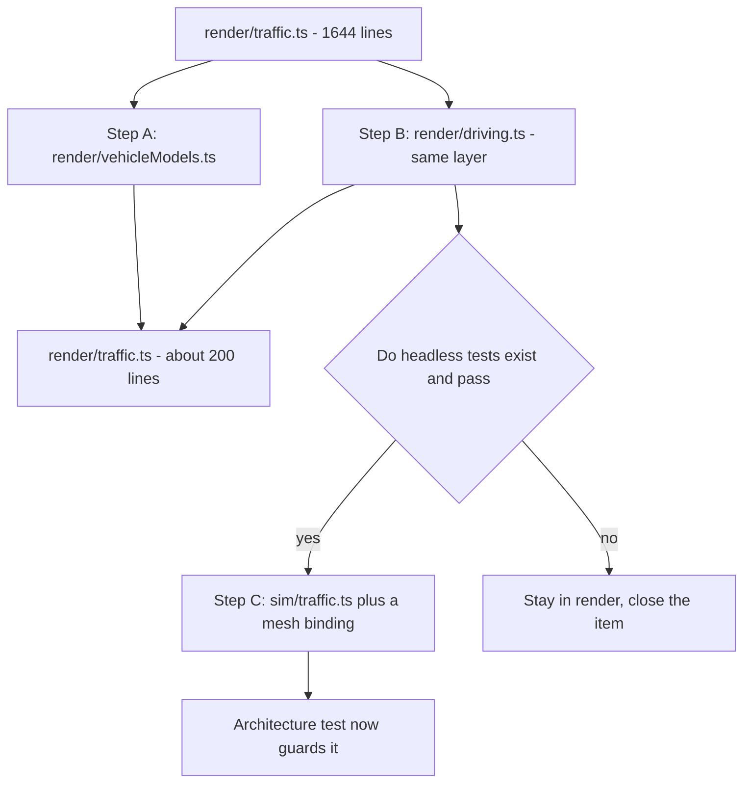

## adr_006_move_the_driving_logic_to_sim_when_its_tests_exist_not_before - Move the driving logic to sim when its tests exist, not before
> Date: 2026-09-03
> Status: Accepted
> Related request: `req_039_give_the_code_its_seams_back`
> Related backlog: `item_125_move_the_driving_logic_where_a_test_can_reach_it`
> Related task: `task_041_orchestrate_the_structural_work`
> Drivers: (drivers to document)
> Reminder: Update status, linked refs, decision rationale, consequences, and follow-up work when you edit this doc.

# Overview
The traffic driving logic moves to `src/sim/` in three steps, and the third step is gated on an
observable condition rather than on a fresh judgement: it happens when the tests exist, and not
otherwise.

# Context
`src/render/traffic.ts` holds three unrelated things: a vehicle catalogue and prototype mesh
assembly at lines 268-853, the driving simulation at 855-1568, and the renderer proper. The
driving half is where the project's most intricate rules live -- right-of-way, lane changes,
per-lane queueing, roundabout yielding -- and it has no unit tests beyond the eleven pure helpers
already exported at 155-259. Its only coverage is the browser interaction suite, which by a
deliberate decision recorded in CONTRIBUTING.md runs on a developer's machine and not in CI.

The seam is unusually clean, and this was verified rather than assumed:

- `Mover` carries exactly one Babylon field, `readonly mesh: Mesh | InstancedMesh`. Every other
  field is a number, a project type, or a graph reference. `heading` and `pitch` are already
  computed as plain numbers and only written to the mesh at the end of the frame.
- `Ride`, the path through a junction, is entirely platform-neutral: `Vec3` is the project's own
  interface from `src/sim/vec.ts`, not Babylon's.
- The file already imports nine `src/sim/` modules.
- Its only two `src/render/` imports are `ROAD_LIFT`, `SIDEWALK_LIFT`, `SIDEWALK_WIDTH` -- three
  numeric constants -- and `streetlightsOnAt(hour)`, a pure predicate. None is Babylon-bound, so
  none blocks the move; they are misfiled and move with it.

ADR 002 already decides the principle: simulation rules run without a browser, and conversion
between simulation and Babylon vectors happens at the rendering boundary. The driving logic is a
standing exception to that principle which the import-direction test cannot see, because its
imports point the right way. This ADR does not decide something new; it records how and when the
exception ends.

The reason step C was originally left to an owner is that moving code does not test it. The move
unlocks testability and delivers no tests. Paying a migration cost in the hottest render path to
rename a folder is a real risk, and it is the only real risk here.

# Decision
- Step A -- extract `render/vehicleModels.ts` (traffic.ts:268-853). Unconditional. No behavioural
  surface, no decision, no dependency on anything else in this ADR.
- Step B -- extract the driving logic to `render/driving.ts`. Same layer, so no architecture rule
  changes, no import direction changes, and the step is reversible by moving one file back. This
  is what makes the logic addressable; tests may be written against it immediately even though it
  still sits in `src/render/`.
- Step C -- move `driving.ts` to `src/sim/traffic.ts`, splitting `Mover` into platform-neutral
  state plus a render-side `Map<Mover, Mesh>` binding that owns `position`, `rotation` and
  `dispose`. **Gated: proceed if and only if headless unit tests for the driving logic exist and
  pass. Otherwise leave it in `src/render/` and close the item as no-change, recording that the tests
  were not written.**
- The gate is the whole decision. An implementer may act on it without asking, because it is an
  observable condition and not a matter of taste. What it may not do is move the code and then
  report the move as the value delivered.
- Move `ROAD_LIFT`, `SIDEWALK_LIFT`, `SIDEWALK_WIDTH` and `streetlightsOnAt` out of `src/render/`
  along with step C. They are platform-neutral and belong with the rules that read them.
- A `Map<Mover, Mesh>` binding is not an engine facade, an ECS, a state framework, or a
  dependency-injection layer, and so does not require the separate decision LOGICS.md demands for
  those. It is one map.
- Behaviour does not change in any step. An existing test needing an edit is a signal to stop and
  reconsider the seam, not to edit the test.

# Consequences
- Step A can ship on its own and takes about 580 lines out of a 1644-line file, whatever happens
  to steps B and C.
- After step B, `render/traffic.ts` is roughly 200 lines and the driving rules are in a file that
  can be opened, read and tested without scrolling past a mesh catalogue.
- If the tests are written, step C is a change of import path plus the `mesh` field split, decided
  with the file already in front of the implementer instead of buried in 1644 lines.
- After step C the architecture test in `tests/` guards the driving logic the way it guards the
  rest of `src/sim/`: no browser globals, no Babylon imports, so it cannot silently re-couple.
- The two traffic defects this review found -- ring lanes blocking each other (item_116) and a
  stale `Segment` kept across a rebuild (item_117) -- become ordinary unit tests rather than
  browser-driven ones.
- The driving loop is frame-driven through `scene.registerBeforeRender`. Step C moves the rules,
  not the loop: the loop stays in `src/render/` and calls a stepping function with its delta, the way
  `CityEconomy.advance(parcels, seconds)` is already called.
- Sequencing risk is the cost. Steps B and C touch the same hot path req_037 optimises, so they
  follow it rather than racing it.

# References
- Related request: `req_039_give_the_code_its_seams_back`
- Related backlog: `item_125_move_the_driving_logic_where_a_test_can_reach_it`
- Related task: `task_041_orchestrate_the_structural_work`
- Precedent: `adr_002_keep_simulation_independent_from_babylon_and_the_browser`
