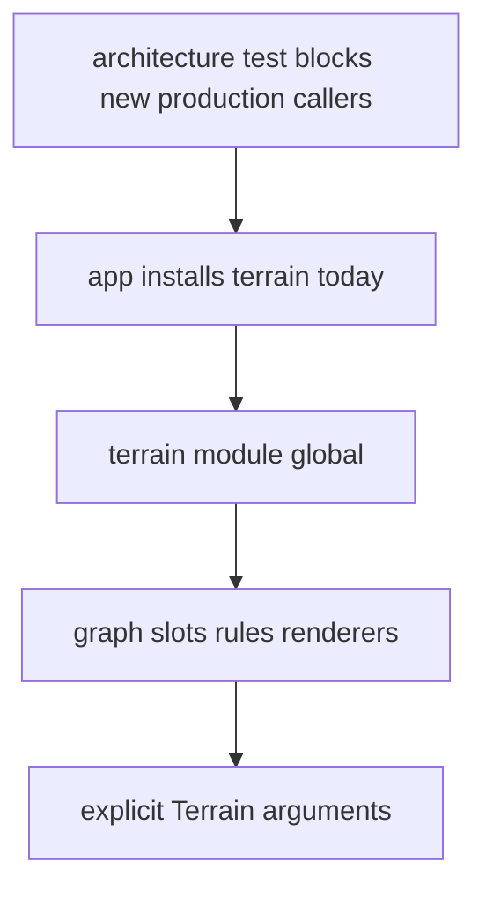

## adr_007_make_terrain_an_explicit_dependency - Make terrain an explicit dependency
> Date: 2026-09-03
> Status: Settled
> Related request: `req_039_give_the_code_its_seams_back`
> Related backlog: `item_126_make_the_terrain_dependency_visible`
> Related task: `task_041_orchestrate_the_structural_work`
> Drivers: Tests should see terrain dependencies; two cities should eventually be able to coexist in one process.
> Reminder: Update status, linked refs, decision rationale, consequences, and follow-up work when you edit this doc.

# Context
`src/sim/terrain.ts` still exposes a mutable active terrain. That made the first heightmap pass
cheap, but it also means graph, slot, rule, and renderer code can depend on terrain without making
that dependency visible to a caller or a test.

# Decision
- No production code outside `src/app/` may call `setTerrain`.
- Existing consumers move from the module-global `terrainHeight` path to explicit terrain
  parameters one at a time, using the same plain `Terrain` interface.
- Tests may still install terrain directly until the consumer they cover has been migrated.
- No dependency-injection framework is introduced for this. The dependency is one argument.

# Consequences
- `tests/architecture.mjs` guards new production calls to `setTerrain` immediately.
- The current app remains single-city until the remaining consumers are migrated.
- The migration is complete only when tests no longer need to install global terrain.
