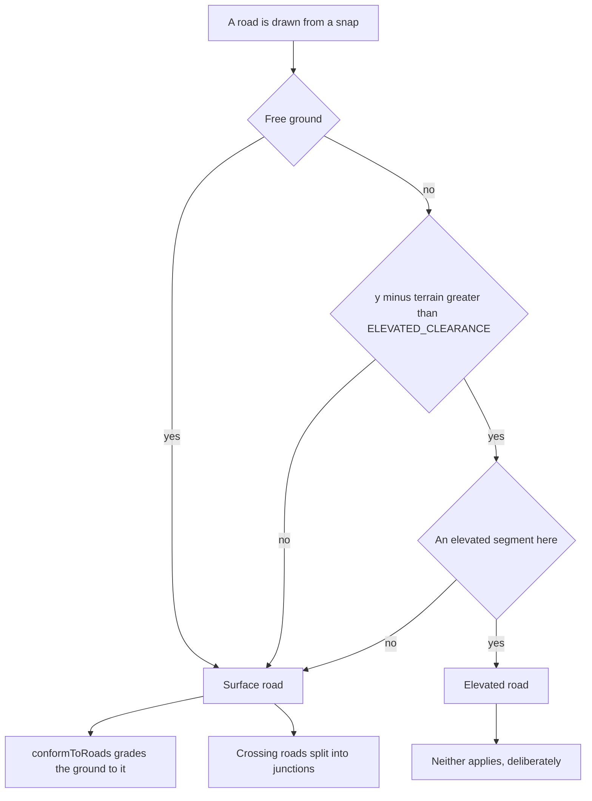

## adr_008_decide_elevation_by_height_above_ground_not_by_what_a_node_touches - Decide elevation by height above ground, not by what a node touches
> Date: 2026-09-04
> Status: Settled
> Related request: `req_044_land_the_bridge_open_a_run_on_a_designed_island_and_stop_the_elevation_where_a_bridge_lands`
> Related backlog: `item_164_stop_the_elevation_where_a_bridge_lands`
> Related task: `task_046_record_the_bridge_landing_the_starter_island_and_the_elevation_rule`
> Drivers: a road drawn off a landed bridge deck became a bridge and cascaded; an elevated segment is invisible to terrain conforming and to crossing splits, so the failure was silent
> Reminder: Update status, linked refs, decision rationale, consequences, and follow-up work when you edit this doc.

# Overview
A drawn road inherits the elevation only when the point it starts from is still in the air. A
bridge stops being a bridge where it comes down.

# Context
- `commitSegment` decided elevation with `touchesElevated`, which was true whenever any segment at
  the snapped node was elevated. The offshore bridge's landward node is a node like any other, so a
  street drawn from it became a bridge; that street's far node then carried an elevated arm, and
  the next road drawn from it became a bridge too, without limit.
- Measured on a city the operator built outward from that landfall: all sixteen of its roads
  elevated, with four nodes sitting at +2.00, +1.99, +2.00 and +2.96 m -- the signature of
  `ELEVATED_CLEARANCE`, which is the floor `buildSamples` holds an elevated deck at.
- The failure was silent in both directions that matter. `conformToRoads` skips an elevated segment
  (src/sim/heightmap.ts:168), so the ground was never cut or graded for the town; and
  `commitSegment` skips the crossing split for elevated roads, so roads laid across each other
  would never have met in a junction. At two metres over gently rolling ground it looks like a road,
  which is why it survived a play session unnoticed.
- The rule also existed twice, verbatim: `src/sim/rules.ts` decided the commit and
  `src/app/drawController.ts` decided the preview's colour. Two copies that had to agree, or the
  preview told the player something the commit would contradict.
- Extending a bridge onward is a real feature and is tested (`extends an elevated bridge with
  another elevated road`), so the answer could not be to stop propagating elevation altogether.

# Decision
- The question is not "does an elevated road end here" but "is this point still in the air".
  `touchesElevated` refuses when `snap.position.y - graph.heightAt(snap.position.x, snap.position.z)
  <= ELEVATED_CLEARANCE`, and only then asks whether an elevated segment meets the point.
- The threshold is the clearance itself, not a margin of its own. `ELEVATED_CLEARANCE` is the height
  an elevated deck is held above whatever it passes over, so at that height there is nothing left to
  pass under: grazing the ground counts as landed. One constant, exported from `src/sim/graph.ts`,
  rather than a second number to keep in step with it.
- The predicate is exported from `src/sim/rules.ts` and imported by `src/app/drawController.ts`. The
  commit and the preview share one implementation, so the preview cannot promise a road the commit
  will make a bridge.
- This governs drawing only. A save that records `elevated` is replayed as written, because a file
  is a record of what was built and not a request to re-derive it.

# Consequences
- A road drawn from the bridge's landfall is a surface road, the ground grades to it, and roads
  drawn across it split into junctions. Verified in the running game: clearance -0.59 m at the
  landfall, two roads drawn from it in succession both surface, one elevated segment left on the map.
- Extending a deck that is genuinely aloft still yields a bridge, and the test that says so still
  passes -- its nodes sit at y=50 over flat terrain, far above the clearance.
- A road drawn from a landed deck is now subject to the gradient guard, because `commitSegment`
  passes `elevated` as `allowSteep`. A steep road off the landfall is refused where it used to be
  accepted. That is the correct behaviour for a surface road, and it is a visible change.
- A deck that dips to exactly the clearance somewhere mid-span is treated as landed for the purpose
  of drawing from that point. Deliberate, and the same sentence that sets the threshold says so.
- Cities exported before this decision record `elevated` on roads that were never meant to be
  bridges. They are honoured as written, so such a file needs its flag cleared to behave as drawn --
  which is what `public/starter-kit.json` required. A city exported afterwards does not.
- The gradient guard still samples the terrain along a curve and never compares a start node against
  the ground beneath it, so a node raised by some other means would still produce a step no rule
  refuses. Not opened here; recorded so it is not mistaken for covered.

# References
- Related request: `req_044_land_the_bridge_open_a_run_on_a_designed_island_and_stop_the_elevation_where_a_bridge_lands`
- Related backlog: `item_164_stop_the_elevation_where_a_bridge_lands`
- Related task: `task_046_record_the_bridge_landing_the_starter_island_and_the_elevation_rule`
