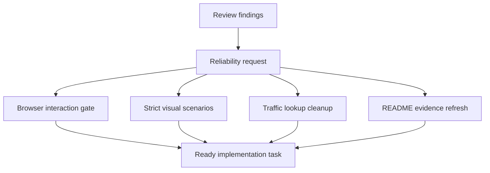

## prod_002_reliable_prototype_validation_and_evidence - Reliable prototype validation and evidence
> Date: 2026-08-28
> Status: Settled
> Related request: `req_004_harden_project_reliability_gates_and_demo_evidence`
> Related backlog: `item_009_include_browser_interaction_in_the_normal_validation_gate`
> Related task: `task_003_implement_project_reliability_hardening`
> Related architecture: (none yet)
> Reminder: Update status, linked refs, scope, decisions, success signals, and open questions when you edit this doc.
> Indicators reviewed: 2026-08-29 10:25:30

# Overview
The city-jump prototype already has useful unit, architecture, browser, and visual checks, but the authoritative gate and docs do not yet make browser behavior and demo evidence hard to accidentally break. This product slice makes the existing checks stricter and cheaper to trust without changing gameplay scope.

# Goals
- One local validation path proves pure logic, browser interaction, and visual demo generation.
- Screenshots fail when their required scenario was not actually built.
- Runtime traffic cost stays proportional to the cars being updated, not to cars times road count.
- README status and performance numbers remain tied to current behavior.

# Non-goals
- Changing road crossing behavior; that belongs to the existing crossing request.
- Adding a new test framework, browser runner, or performance harness.
- Reworking rendering architecture or replacing Babylon APIs.
- Changing gameplay features beyond reliability, evidence, and documentation.

# Scope and guardrails
- In: scaffolded request, product, backlog, orchestration task, validation, and handoff context.
- Out: unrelated workflow docs and implementation of generated tasks.

# Key product decisions
- Use structured input as the source of truth for generated docs.
- Keep generated write paths local and repo-bounded.

# Success signals
- Generated docs pass lint and audit without broad manual rewrites.
- Context-pack output can be handed to an implementation agent directly.

# References
- Product back-reference: `item_009_include_browser_interaction_in_the_normal_validation_gate`
- Task back-reference: `task_003_implement_project_reliability_hardening`
