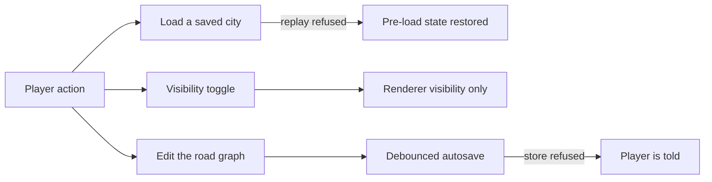

## prod_004_a_city_builder_that_never_loses_the_city_on_screen - A city builder that never loses the city on screen
> Date: 2026-08-30
> Status: Settled
> Related request: `req_007_review_findings_half_destroyed_city_on_a_failed_load_and_rebuild_config_test_hygiene`
> Related backlog: `item_020_make_a_failed_city_load_a_no_op_instead_of_a_destructive_one`
> Related task: `task_009_implement_the_load_rollback_and_rendering_hygiene_review_findings`
> Related architecture: (none yet)
> Reminder: Update status, linked refs, scope, decisions, success signals, and open questions when you edit this doc.
> Indicators reviewed: 2026-08-30 12:28:32

# Overview
city-jump keeps a player's work in three places: the live graph, the autosave, and the named saves. This slice closes the paths where that work can quietly disappear -- a refused load that empties the graph it was supposed to replace, and a refused storage write nobody is told about -- and pays down the hygiene around them: no full city resolve for a visibility checkbox, unit coverage on the rendering geometry that only an expensive browser suite currently touches, and one Node version instead of two that have already drifted.

# Goals
- A failed load is a no-op, not a destructive one.
- A storage failure is visible to the player at the moment it happens.
- Toggling what is visible costs what a visibility toggle should cost.
- The largest rendering files have unit coverage that runs on every push, not only in the on-demand browser suite.
- One Node version, resolved identically by CI and by the deploy.

# Non-goals
- Reopening the redundant-rebuild-internals scope already delivered by req_005.
- Rewriting the save format or adding a save migration.
- Introducing a headless WebGL/Babylon harness into the unit test run.
- Replacing localStorage with IndexedDB.
- Changing gameplay features, visuals, or the road rules themselves.

# Scope and guardrails
- In: scaffolded request, product, backlog, orchestration task, validation, and handoff context.
- Out: unrelated workflow docs and implementation of generated tasks.

# Key product decisions
- Use structured input as the source of truth for generated docs.
- Keep generated write paths local and repo-bounded.

# Success signals
- Generated docs pass lint and audit without broad manual rewrites.
- Context-pack output can be handed to an implementation agent directly.

# References
- Product back-reference: `item_020_make_a_failed_city_load_a_no_op_instead_of_a_destructive_one`
- Task back-reference: `task_009_implement_the_load_rollback_and_rendering_hygiene_review_findings`
