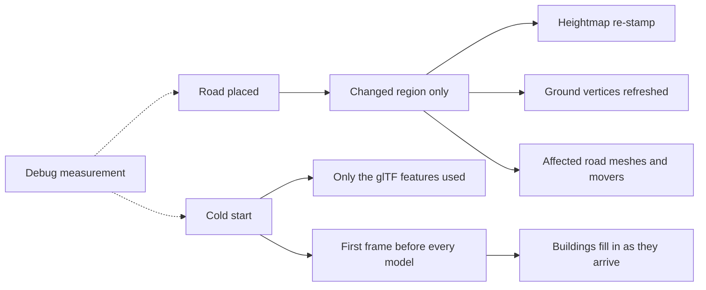

## prod_005_a_city_builder_that_stays_responsive_as_the_city_grows - A city builder that stays responsive as the city grows
> Date: 2026-08-30
> Status: Proposed
> Related request: `req_008_performance_every_road_placed_rebuilds_the_whole_city_and_the_first_load_ships_what_it_never_uses`
> Related backlog: `item_024_stop_the_ground_refresh_allocating_per_vertex_and_per_rebuild`, `item_025_bound_the_terrain_re_stamp_and_ground_refresh_to_the_region_a_placement_changed`, `item_026_rebuild_only_the_road_meshes_and_movers_a_placement_touched`, `item_027_ship_only_the_gltf_loader_features_the_models_actually_use`, `item_028_draw_the_first_frame_without_waiting_on_all_20_building_models`, `item_029_stop_rebuilding_the_traffic_queue_bookkeeping_every_frame`, `item_030_make_rebuild_and_startup_cost_measurable_against_a_known_city`
> Related task: `task_010_implement_the_rebuild_granularity_and_startup_payload_performance_work`
> Related architecture: (none yet)
> Reminder: Update status, linked refs, scope, decisions, success signals, and open questions when you edit this doc.

# Overview
city-jump is fast on an empty map and gets slower with every road placed, because each placement re-solves and re-uploads the entire world: a 457k-vertex terrain, every road mesh, every car. The first load has the mirror problem -- it ships and post-processes everything the engine could ever need before drawing a single frame. This slice makes the cost of an action proportional to what the action changed, and the cost of starting proportional to what the player actually sees.

# Goals
- Placing a road costs what that road changed, not what the whole city contains.
- The terrain refresh stops allocating millions of throwaway objects per rebuild.
- The first load ships only the engine features the game actually uses.
- The first frame arrives without waiting on every building model in the catalogue.
- The traffic loop runs at 60 fps without rebuilding its bookkeeping every frame.
- Rebuild and startup cost are measurable, so a regression is visible.

# Non-goals
- Changing how the city looks: terrain, roads, traffic and buildings must render identically.
- Reopening req_005's work inside `rebuild()`, or req_007's visibility-toggle and load-rollback scope.
- Lowering terrain resolution, shadow quality, traffic density or model detail to buy speed.
- Introducing a web worker, a new rendering engine, or a level-of-detail system.
- Chasing a benchmark number for its own sake beyond the regression signal in AC6.

# Scope and guardrails
- In: scaffolded request, product, backlog, orchestration task, validation, and handoff context.
- Out: unrelated workflow docs and implementation of generated tasks.

# Key product decisions
- Use structured input as the source of truth for generated docs.
- Keep generated write paths local and repo-bounded.

# Success signals
- Generated docs pass lint and audit without broad manual rewrites.
- Context-pack output can be handed to an implementation agent directly.

# References
- Product back-reference: `req_008_performance_every_road_placed_rebuilds_the_whole_city_and_the_first_load_ships_what_it_never_uses`
- Task back-reference: `task_010_implement_the_rebuild_granularity_and_startup_payload_performance_work`
