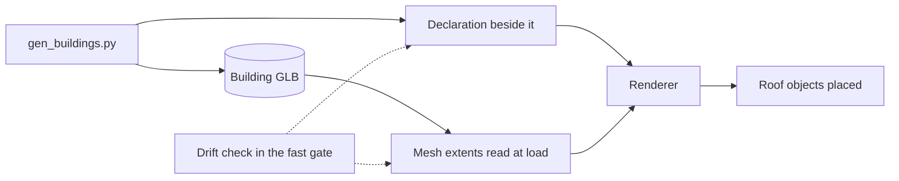

## prod_006_one_source_of_truth_for_what_a_building_model_is - One source of truth for what a building model is
> Date: 2026-08-30
> Status: Proposed
> Related request: `req_009_building_geometry_facts_are_written_twice_in_two_languages_with_nothing_tying_them_together`
> Related backlog: `item_031_give_the_renderer_one_place_to_learn_a_model_s_geometry`, `item_032_fail_the_build_when_the_generator_and_the_renderer_disagree`, `item_033_make_docs_assets_md_and_the_authoring_runbook_describe_what_the_code_actually_does`
> Related task: `task_011_implement_one_source_of_truth_for_building_model_geometry`
> Related architecture: (none yet)
> Reminder: Update status, linked refs, scope, decisions, success signals, and open questions when you edit this doc.

# Overview
city-jump generates its building library in Python and renders it in TypeScript, and both sides independently decide how tall a building is, where its setback starts and how its roof is shaped. The numbers agree today because someone typed them twice correctly. This slice makes the model itself, or one declaration beside it, the single answer -- and puts a check behind it so the next edit to either side cannot quietly move every roof object in the city.

# Goals
- The renderer asks the model what it is, instead of guessing from its filename.
- A disagreement between generator and renderer fails a check, not a screenshot.
- The authoring contract in docs/assets.md matches what the code actually does.
- Hand-authored models remain possible under the same contract as generated ones.

# Non-goals
- Changing how any building looks, or regenerating the model library for its own sake.
- Replacing Blender or the generation script.
- Adding a runtime schema validation framework or a new dependency.
- Reworking parcel packing, `slots.ts`, or how models are matched to parcels.
- Performance work on model loading, which belongs to req_008_performance_every_road_placed_rebuilds_the_whole_city_and_the_first_load_ships_what_it_never_uses.

# Scope and guardrails
- In: scaffolded request, product, backlog, orchestration task, validation, and handoff context.
- Out: unrelated workflow docs and implementation of generated tasks.

# Key product decisions
- Use structured input as the source of truth for generated docs.
- Keep generated write paths local and repo-bounded.

# Success signals
- Generated docs pass lint and audit without broad manual rewrites.
- Context-pack output can be handed to an implementation agent directly.

# References
- Product back-reference: `req_009_building_geometry_facts_are_written_twice_in_two_languages_with_nothing_tying_them_together`
- Task back-reference: `task_011_implement_one_source_of_truth_for_building_model_geometry`
