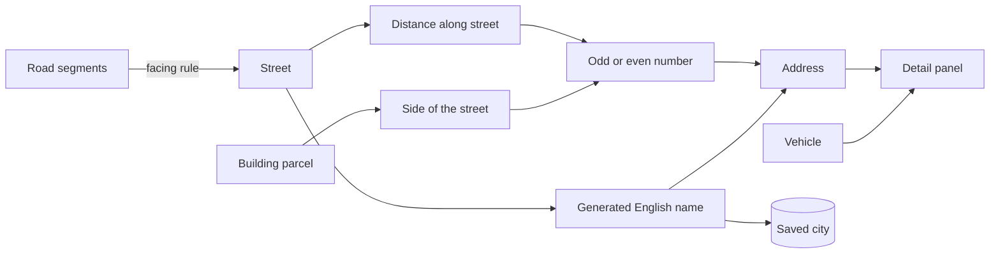

## prod_007_a_city_you_can_point_at_and_name - A city you can point at and name
> Date: 2026-08-30
> Status: Proposed
> Related request: `req_010_name_the_streets_number_the_buildings_and_open_a_detail_panel_on_anything_you_click`
> Related backlog: `item_034_chain_road_segments_into_streets_that_survive_a_split`, `item_035_generate_english_street_names_that_cannot_run_out`, `item_036_give_every_building_an_odd_or_even_address_number`, `item_037_persist_street_names_and_name_the_cities_saved_before_this_existed`, `item_038_open_the_detail_panel_on_a_building_or_a_car`
> Related task: `task_012_implement_street_names_building_addresses_and_the_extended_detail_panel`
> Related architecture: (none yet)
> Reminder: Update status, linked refs, scope, decisions, success signals, and open questions when you edit this doc.

# Overview
city-jump renders a city nobody can refer to. Roads are anonymous geometry, buildings are unaddressed boxes, and clicking either tells the player nothing. This slice gives the city the vocabulary a city has: streets that are streets rather than loose curves, names that do not run out, addresses that follow the real odd-and-even convention, and a detail panel that answers what did I just click on for every visible thing.

# Goals
- A road drawn through several junctions is one named street, not three anonymous curves.
- Every building has an address a player can read and repeat.
- Clicking anything visible -- road, roundabout, tree, building, car -- opens the same panel and answers the question.
- Names never run out, and never change under the player.
- Cities saved before any of this existed keep loading, and get names.

# Non-goals
- Renaming a street by hand, or any name-editing UI.
- Labels floating in the 3D scene, street signs, or a map view.
- Districts, neighbourhoods, postcodes, or any spatial grouping above the street.
- Making the address mean anything to simulation -- no routing by address, no deliveries, no residents.
- Changing how roads are drawn, split, or rendered.

# Scope and guardrails
- In: scaffolded request, product, backlog, orchestration task, validation, and handoff context.
- Out: unrelated workflow docs and implementation of generated tasks.

# Key product decisions
- Use structured input as the source of truth for generated docs.
- Keep generated write paths local and repo-bounded.

# Success signals
- Generated docs pass lint and audit without broad manual rewrites.
- Context-pack output can be handed to an implementation agent directly.

# References
- Product back-reference: `req_010_name_the_streets_number_the_buildings_and_open_a_detail_panel_on_anything_you_click`
- Task back-reference: `task_012_implement_street_names_building_addresses_and_the_extended_detail_panel`
