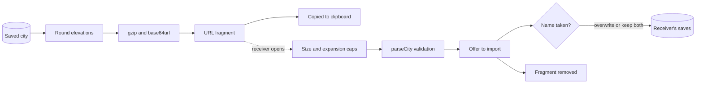

## prod_008_a_city_you_can_hand_to_someone_else - A city you can hand to someone else
> Date: 2026-08-30
> Status: Proposed
> Related request: `req_011_share_a_city_as_a_link_that_needs_no_server`
> Related backlog: `item_039_turn_a_city_into_a_link_sized_payload_and_read_one_back_safely`, `item_040_add_the_share_button_to_the_saves_panel`, `item_041_offer_to_import_the_city_when_someone_arrives_on_a_share_link`
> Related task: `task_013_implement_sharing_a_city_by_link`
> Related architecture: (none yet)
> Reminder: Update status, linked refs, scope, decisions, success signals, and open questions when you edit this doc.

# Overview
Every city built in city-jump is trapped in the browser that made it. This slice lets a player hand one to somebody with a link and nothing else -- no account, no upload, no server, because the game is a static site and should stay one. The city rides in the URL fragment, compressed and coarsened just enough to fit, and arrives as an offer to import rather than something that overwrites what the receiver already has.

# Goals
- A player can give their city to someone with one button and a paste.
- No city is ever uploaded anywhere, and none appears in any server log.
- A city the size of the bundled Demo fits in a link people can actually send.
- Receiving a city is an offer, never a surprise overwrite.
- A malicious link cannot do more than be refused.

# Non-goals
- A server, a database, a paste service, or a link shortener.
- Accounts, galleries, browsing other people's cities, or any social feature.
- Live or collaborative editing: a link is a snapshot.
- Changing the on-disk save format or the local save flow.
- Exporting a city as a downloadable file, which is a different answer to a different question.

# Scope and guardrails
- In: scaffolded request, product, backlog, orchestration task, validation, and handoff context.
- Out: unrelated workflow docs and implementation of generated tasks.

# Key product decisions
- Use structured input as the source of truth for generated docs.
- Keep generated write paths local and repo-bounded.

# Success signals
- Generated docs pass lint and audit without broad manual rewrites.
- Context-pack output can be handed to an implementation agent directly.

# References
- Product back-reference: `req_011_share_a_city_as_a_link_that_needs_no_server`
- Task back-reference: `task_013_implement_sharing_a_city_by_link`
