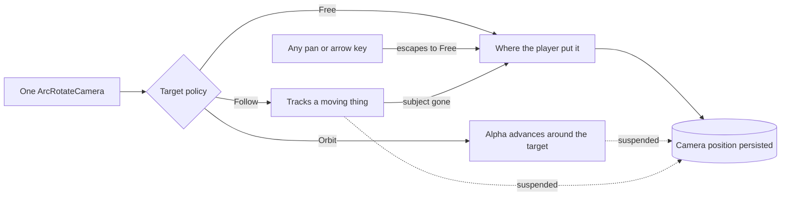

## prod_009_a_camera_that_can_watch_not_only_be_aimed - A camera that can watch, not only be aimed
> Date: 2026-08-30
> Status: Settled
> Related request: `req_012_give_the_camera_three_target_policies_free_orbit_and_follow`
> Related backlog: `item_042_make_the_camera_s_target_policy_switchable_with_free_unchanged`
> Related task: `task_014_implement_the_camera_target_policies_and_the_camera_settings_section`
> Related architecture: (none yet)
> Reminder: Update status, linked refs, scope, decisions, success signals, and open questions when you edit this doc.
> Indicators reviewed: 2026-08-30 13:07:22

# Overview
city-jump's camera is a tool for operating the city: the player points it and it stays pointed. That is right for building, and wrong for everything else -- seeing a junction from all sides, sitting with the light as it changes, or watching one car actually take a roundabout. This slice keeps that camera exactly as it is and adds two more things it can do with its target: turn around it, or let it move. One camera, three policies, and touching the controls always gives the player back the one they already know.

# Goals
- The player can watch the city instead of only aiming at it.
- Following a car is possible without losing zoom and angle control.
- The mode is always escapable: touch the camera and you are back to Free.
- Nothing about the existing camera changes for a player who never opens the section.

# Non-goals
- A second camera type, a cinematic path editor, or recorded fly-throughs.
- First-person or driver's-seat views.
- Changing the existing pan, zoom, drag or limit behaviour.
- Selecting cars, which the detail-panel work delivers.
- Making a followed vehicle survive a city edit, which the rebuild-granularity work delivers.

# Scope and guardrails
- In: scaffolded request, product, backlog, orchestration task, validation, and handoff context.
- Out: unrelated workflow docs and implementation of generated tasks.

# Key product decisions
- Use structured input as the source of truth for generated docs.
- Keep generated write paths local and repo-bounded.

# Success signals
- Generated docs pass lint and audit without broad manual rewrites.
- Context-pack output can be handed to an implementation agent directly.

# References
- Product back-reference: `item_042_make_the_camera_s_target_policy_switchable_with_free_unchanged`
- Task back-reference: `task_014_implement_the_camera_target_policies_and_the_camera_settings_section`
