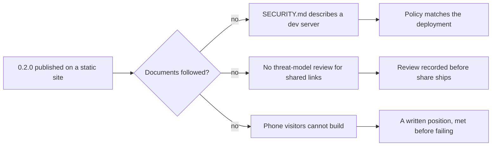

## prod_010_a_published_game_whose_documents_tell_the_truth - A published game whose documents tell the truth
> Date: 2026-08-30
> Status: Proposed
> Related request: `req_013_the_game_is_deployed_in_public_while_its_documents_and_its_input_model_still_describe_a_local_dev_toy`
> Related backlog: `item_046_make_security_md_describe_the_deployment_that_exists`, `item_047_record_the_threat_model_review_that_shared_links_require`, `item_048_take_a_position_on_the_visitors_arriving_with_a_touchscreen`
> Related task: `task_015_make_the_project_s_documents_and_input_model_match_the_public_deployment`
> Related architecture: (none yet)
> Reminder: Update status, linked refs, scope, decisions, success signals, and open questions when you edit this doc.

# Overview
city-jump stopped being a thing on one machine and became a link anyone can open, and its documents did not notice. The security policy describes a dev server, the supported-versions table names a version that is no longer current, and the game itself cannot be played by anyone who arrives on a phone. None of this is a bug in the game; all of it is the gap between what the project is and what it says about itself. This slice closes that gap and makes the project take a written position on the visitors it currently ignores.

# Goals
- A reader of SECURITY.md learns about the deployment that actually exists.
- The threat-model review the policy demands is done before the feature that triggers it ships.
- A visitor on a phone is either able to play or told plainly that they cannot, before they try.
- The project's documents stay honest as the deployment changes again.

# Non-goals
- Adding a backend, an account system, or telemetry, which adr_004_stay_a_static_client_with_no_server_of_its_own rules out.
- A full accessibility audit or a WCAG conformance claim.
- A mobile-specific UI, a responsive redesign, or a separate touch build.
- Rewriting the README, which was rewritten for players in this same period.
- Changing the desktop input model that works today.

# Scope and guardrails
- In: scaffolded request, product, backlog, orchestration task, validation, and handoff context.
- Out: unrelated workflow docs and implementation of generated tasks.

# Key product decisions
- Use structured input as the source of truth for generated docs.
- Keep generated write paths local and repo-bounded.

# Success signals
- Generated docs pass lint and audit without broad manual rewrites.
- Context-pack output can be handed to an implementation agent directly.

# References
- Product back-reference: `req_013_the_game_is_deployed_in_public_while_its_documents_and_its_input_model_still_describe_a_local_dev_toy`
- Task back-reference: `task_015_make_the_project_s_documents_and_input_model_match_the_public_deployment`
