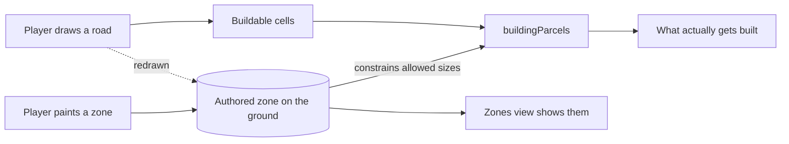

## prod_011_a_city_that_is_built_on_purpose - A city that is built on purpose
> Date: 2026-08-30
> Status: Proposed
> Related request: `req_014_let_the_player_decide_what_gets_built_instead_of_the_geometry_deciding_for_them`
> Related backlog: `item_049_model_a_zone_as_authored_land_that_survives_the_roads_changing`, `item_050_let_the_zone_decide_what_is_built_using_the_models_already_shipped`, `item_051_paint_zones_and_make_the_zones_view_show_them`
> Related task: `task_016_implement_zoning_as_the_player_s_second_decision`
> Related architecture: (none yet)
> Reminder: Update status, linked refs, scope, decisions, success signals, and open questions when you edit this doc.

# Overview
city-jump lets a player draw roads beautifully and then watches buildings appear on their own, sized by whatever rectangle happened to fit. The city is a consequence, not a plan. This slice gives the player the second decision the game has been missing: not only where the road goes, but what belongs beside it. It stops deliberately short of demand, growth and economy -- those need something to act on, and this is that something.

# Goals
- The player decides what kind of place they are building, not only where the roads run.
- The difference between two zones is visible while playing, not only in a debug view.
- An existing city is untouched until its owner chooses to zone it.
- The Zones view finally shows zones.
- Demand, growth and economy become possible later without redoing this.

# Non-goals
- Demand, growth over time, population, jobs, an economy, or progression.
- Buildings being replaced or upgraded as conditions change.
- Services, utilities, or coverage models.
- New building assets, unless the work proves they are unavoidable and records that separately.
- Land value, taxes, or any number the player has to manage.

# Scope and guardrails
- In: scaffolded request, product, backlog, orchestration task, validation, and handoff context.
- Out: unrelated workflow docs and implementation of generated tasks.

# Key product decisions
- Use structured input as the source of truth for generated docs.
- Keep generated write paths local and repo-bounded.

# Success signals
- Generated docs pass lint and audit without broad manual rewrites.
- Context-pack output can be handed to an implementation agent directly.

# References
- Product back-reference: `req_014_let_the_player_decide_what_gets_built_instead_of_the_geometry_deciding_for_them`
- Task back-reference: `task_016_implement_zoning_as_the_player_s_second_decision`
