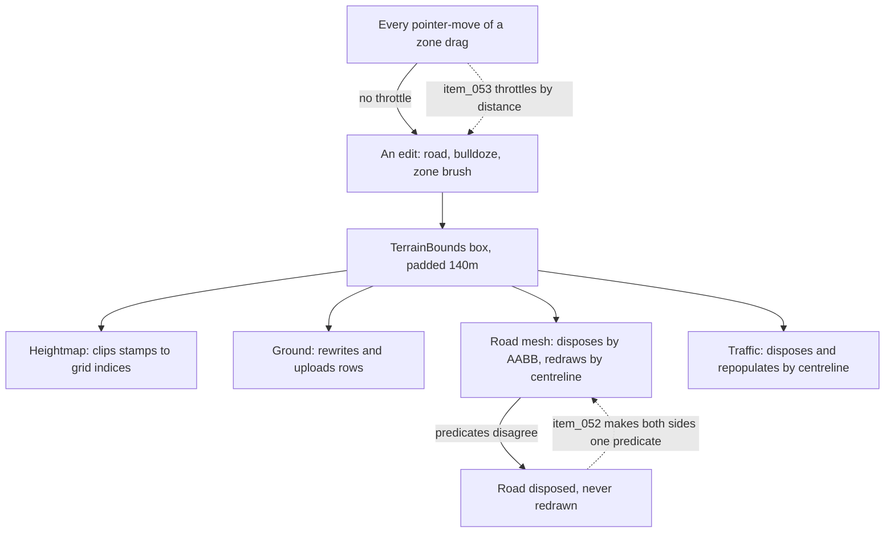

## prod_012_a_city_that_keeps_drawing_itself_correctly - A city that keeps drawing itself correctly
> Date: 2026-08-30
> Status: Settled
> Related request: `req_015_close_the_ten_defects_the_review_found_in_the_dirty_region_rebuild_zoning_and_sharing_work`
> Related backlog: `item_052_make_a_partial_rebuild_unable_to_lose_geometry`
> Related task: `task_017_close_the_ten_review_findings_from_the_dirty_region_rebuild_and_zoning_work`
> Related architecture: (none yet)
> Reminder: Update status, linked refs, scope, decisions, success signals, and open questions when you edit this doc.
> Indicators reviewed: 2026-08-30 14:54:21

# Overview
The performance work that made editing a city cheap did so by teaching every renderer to repaint only the part of the world an edit touched. That is the right trade, but it moved correctness out of one place and into four, and the review found where they disagree. This slice pays that back: the region-based rebuild becomes something that cannot lose geometry, the zoning brush becomes as cheap to drag as the tree brush it was copied from, and the smaller defects around it stop being the baseline.

# Goals
- A partial rebuild is indistinguishable from a full one, except in cost.
- Painting zones feels like painting trees, because it does the same amount of work.
- The debug statistics can be trusted as evidence in the next performance investigation.
- The invariants the fast paths depend on are asserted, not commented.
- Nothing in the renderers holds a disposed object or grows without bound.

# Non-goals
- Widening the dirty-region optimisation to the renderers that still rebuild in full -- trees, world grid, streetlights and signals.
- New gameplay, new zone kinds, or new building assets.
- Reworking the share-link format, the camera modes, or the street-naming scheme.
- A general performance push beyond restoring the throttling the zone brush was supposed to have.
- Refactoring the renderers into a shared dirty-region framework.

# Scope and guardrails
- In: the four renderers already bounded by a dirty region -- heightmap, ground, road meshes, traffic -- and the defects the review found in them.
- In: the zoning brush's per-event cost, the overlay and statistics that report something untrue, and the small debris around the traffic queues.
- Out: new gameplay, new zone kinds, new assets, or the renderers that still rebuild in full.
- Out: a general dirty-region framework; each renderer keeps its own answer.

# Key product decisions
- Fix the predicate, not the symptom: disposal and recreation get one test, so the class of bug cannot recur in that renderer.
- Two player-visible defects each leave a check behind; the eight smaller ones do not each need one.
- Where a helper can be extracted and unit-tested without a scene, prefer that to a browser check.

# Success signals
- A partial rebuild and a full rebuild produce the same scene, and a test says so.
- Dragging the zoning brush costs work proportional to distance, not to pointer events.
- Every number the debug statistics report is the current one.

# References
- Product back-reference: `item_052_make_a_partial_rebuild_unable_to_lose_geometry`
- Task back-reference: `task_017_close_the_ten_review_findings_from_the_dirty_region_rebuild_and_zoning_work`
