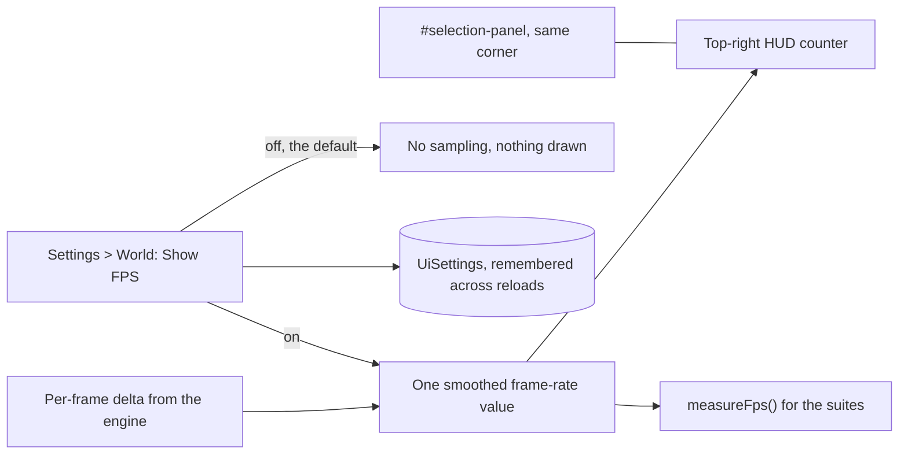

## prod_013_a_city_that_tells_you_what_it_costs_to_draw - A city that tells you what it costs to draw
> Date: 2026-08-30
> Status: Proposed
> Related request: `req_016_show_the_frame_rate_on_screen_and_let_the_player_turn_it_off`
> Related backlog: `item_056_measure_the_frame_rate_once_and_only_while_someone_is_watching`, `item_057_put_the_counter_in_the_top_right_without_evicting_the_selection_panel`, `item_058_add_show_fps_to_settings_world_and_remember_it`
> Related task: `task_018_show_the_frame_rate_on_screen_and_let_the_player_turn_it_off`
> Related architecture: (none yet)
> Reminder: Update status, linked refs, scope, decisions, success signals, and open questions when you edit this doc.

# Overview
city-jump has always measured its own frame rate and has never shown it to anyone playing. The number lives in a debug hook that a test script calls from outside the page, quoted in the README and asserted in CI, while the player who can actually feel the city slow down has nothing to look at. This slice puts the figure on screen, behind a setting that is off by default, so the cost of a city is something its builder can watch rather than something only the suite knows.

# Goals
- The player can see what the city costs to draw, while they are drawing it.
- The figure on screen is the same one the test suite argues with.
- Someone who does not want a number in the corner never sees one.
- Nothing measures when nobody is looking.

# Non-goals
- A profiler, a frame-time graph, a memory readout, or per-renderer timings.
- Exposing the rest of the debug statistics to the player.
- Any performance optimisation -- this slice measures, it does not improve.
- Warnings, thresholds, or the game reacting to a low frame rate.
- A quality or detail setting the counter would feed.

# Scope and guardrails
- In: scaffolded request, product, backlog, orchestration task, validation, and handoff context.
- Out: unrelated workflow docs and implementation of generated tasks.

# Key product decisions
- Use structured input as the source of truth for generated docs.
- Keep generated write paths local and repo-bounded.

# Success signals
- Generated docs pass lint and audit without broad manual rewrites.
- Context-pack output can be handed to an implementation agent directly.

# References
- Product back-reference: `req_016_show_the_frame_rate_on_screen_and_let_the_player_turn_it_off`
- Task back-reference: `task_018_show_the_frame_rate_on_screen_and_let_the_player_turn_it_off`
