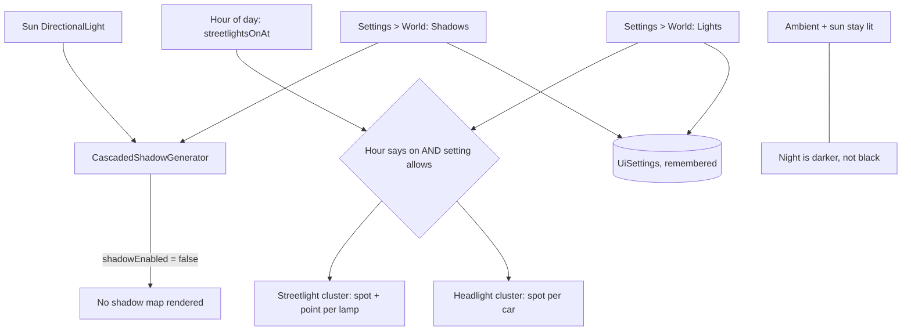

## prod_014_a_city_that_can_be_made_to_run_on_a_weaker_machine - A city that can be made to run on a weaker machine
> Date: 2026-08-30
> Status: Proposed
> Related request: `req_017_let_the_player_turn_shadows_and_the_city_s_own_lights_off`
> Related backlog: `item_059_make_shadows_a_switch_on_the_light_rather_than_on_every_mesh`, `item_060_make_the_city_s_own_lights_a_switch_without_turning_the_night_black`
> Related task: `task_019_let_the_player_turn_shadows_and_the_city_s_own_lights_off`
> Related architecture: (none yet)
> Reminder: Update status, linked refs, scope, decisions, success signals, and open questions when you edit this doc.

# Overview
city-jump renders a cascaded shadow map every frame and lights the night with a clustered spotlight per streetlight and per headlight. Both are why it looks the way it does, and both are why it can crawl on hardware that is not an M3 Pro. A visitor whose machine cannot keep up currently has one option, which is to stop building. This slice gives them the ordinary bargain every 3D application offers -- two switches that trade fidelity for speed -- using seams the renderers already have. It is the companion to showing the frame rate: one slice tells the player what the city costs, this one lets them pay less.

# Goals
- A player on weaker hardware can keep building instead of giving up.
- The two most expensive things in the scene are the two the player can switch off.
- Turning a setting off actually stops the work, rather than hiding its result.
- The default is exactly what the game looks like today.
- The switches use the seams the renderers already have, not new machinery.

# Non-goals
- A quality preset, a detail slider, or graphics tiers.
- Automatic degradation when the frame rate drops.
- Turning off the sun or the ambient light, which would leave a black screen rather than a fast one.
- Shadow map resolution, filtering quality, cascade counts, or any other shadow tuning.
- Reducing what is drawn -- fewer buildings, fewer cars, less terrain -- which is a different bargain with a different cost.
- Any change to how streetlights and headlights are decided by the hour of day.

# Scope and guardrails
- In: scaffolded request, product, backlog, orchestration task, validation, and handoff context.
- Out: unrelated workflow docs and implementation of generated tasks.

# Key product decisions
- Use structured input as the source of truth for generated docs.
- Keep generated write paths local and repo-bounded.

# Success signals
- Generated docs pass lint and audit without broad manual rewrites.
- Context-pack output can be handed to an implementation agent directly.

# References
- Product back-reference: `req_017_let_the_player_turn_shadows_and_the_city_s_own_lights_off`
- Task back-reference: `task_019_let_the_player_turn_shadows_and_the_city_s_own_lights_off`
