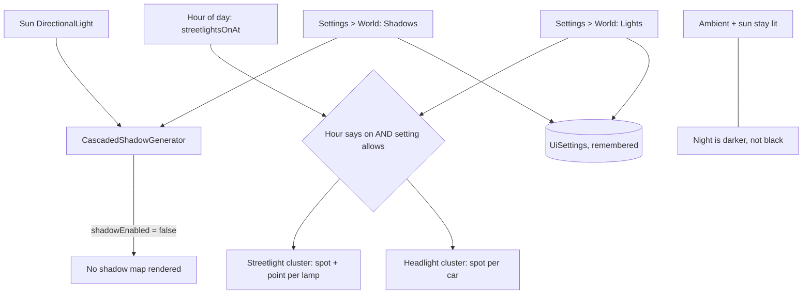

## prod_014_a_city_that_can_be_made_to_run_on_a_weaker_machine - A city that can be made to run on a weaker machine
> Date: 2026-08-30
> Status: Proposed
> Related request: `req_017_let_the_player_turn_shadows_and_the_city_s_own_lights_off`
> Related backlog: `item_059_make_shadows_a_switch_on_the_light_rather_than_on_every_mesh`, `item_060_make_the_city_s_own_lights_a_switch_without_turning_the_night_black`
> Related task: `task_019_let_the_player_turn_shadows_and_the_city_s_own_lights_off`
> Related architecture: (none yet)
> Reminder: Update status, linked refs, scope, decisions, success signals, and open questions when you edit this doc.
> Indicators reviewed: 2026-08-30 14:37:54

# Overview
city-jump renders a cascaded shadow map every frame and lights the night with a clustered spotlight per streetlight and per headlight. Both are why it looks the way it does, and both are why it can crawl on hardware that is not an M3 Pro. A visitor whose machine cannot keep up currently has one option, which is to stop building. This slice gives them the ordinary bargain every 3D application offers -- two switches that trade fidelity for speed -- using seams the renderers already have. It is the companion to showing the frame rate: one slice tells the player what the city costs, this one lets them pay less.

# Goals
- A player on weaker hardware can keep building instead of giving up.
- The two most expensive things in the scene are the two the player can switch off.
- Turning a setting off actually stops the work, rather than hiding its result.
- The default is exactly what the game looks like today.
- The switches use the seams the renderers already have, not new machinery.

# Non-goals
- A quality preset, a detail slider, or graphics tiers.
- Automatic degradation when the frame rate drops.
- Turning off the sun or the ambient light, which would leave a black screen rather than a fast one.
- Shadow map resolution, filtering quality, cascade counts, or any other shadow tuning.
- Reducing what is drawn -- fewer buildings, fewer cars, less terrain -- which is a different bargain with a different cost.
- Any change to how streetlights and headlights are decided by the hour of day.

# Scope and guardrails
- In: two World toggles -- shadows, and the lights the city itself emits -- both on by default.
- In: the seams the renderers already have: `shadowEnabled` on the sun, and `setEnabled` on the two light clusters.
- Out: quality presets, detail tiers, automatic degradation, and shadow tuning of any kind.
- Out: the sun and ambient lights, and reducing what is drawn.

# Key product decisions
- Switch at the source, not at every consumer: on the light, not on every mesh -- otherwise every rebuild undoes the setting.
- Off must stop the work. A setting that hides a result and keeps its cost is worse than no setting.
- The default is exactly today's appearance, so an existing city is untouched until its owner chooses.

# Success signals
- A visitor whose machine cannot keep up has something to turn off besides the game.
- Turning a setting off moves the frame-rate counter, measurably.
- Turning both back on restores the Demo city exactly.

# References
- Product back-reference: `req_017_let_the_player_turn_shadows_and_the_city_s_own_lights_off`
- Task back-reference: `task_019_let_the_player_turn_shadows_and_the_city_s_own_lights_off`
