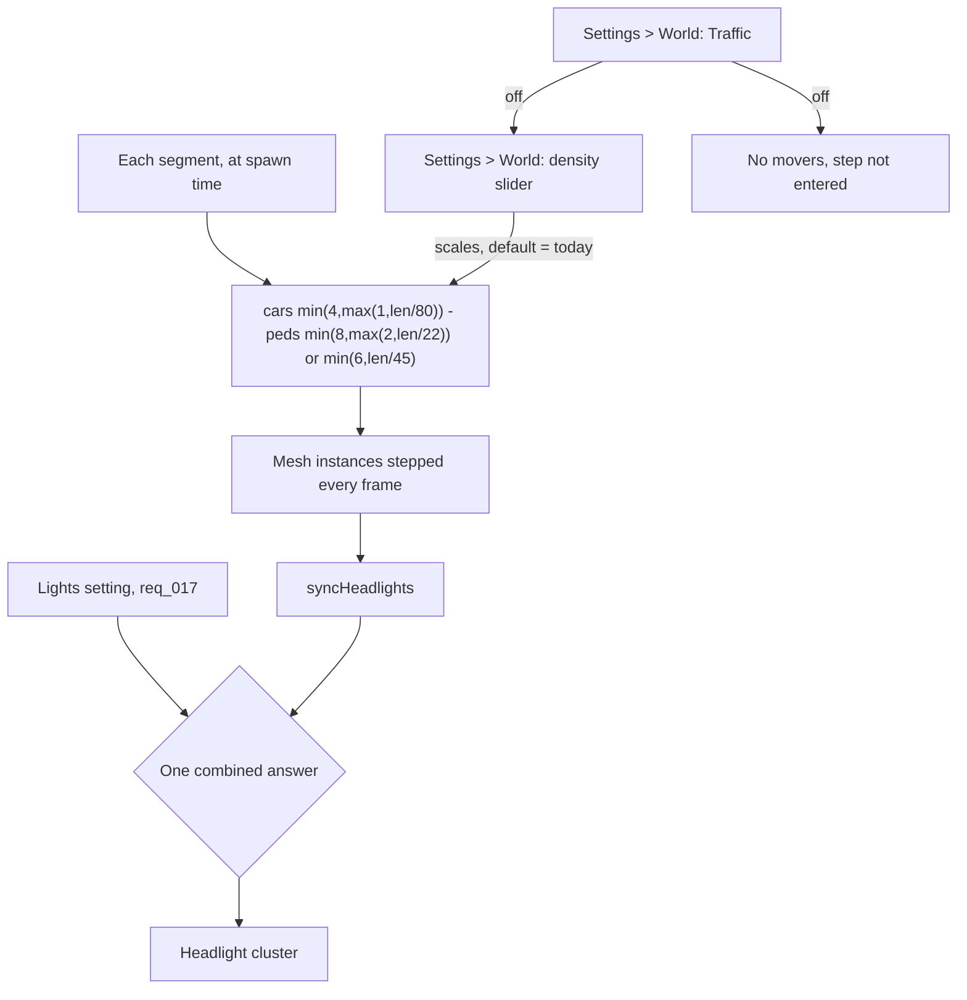

## prod_015_a_city_whose_traffic_is_the_player_s_to_dial - A city whose traffic is the player's to dial
> Date: 2026-08-30
> Status: Proposed
> Related request: `req_018_let_the_player_turn_the_traffic_simulation_off_and_set_how_busy_the_city_is`
> Related backlog: `item_061_make_traffic_a_switch_that_stops_the_simulation_rather_than_hiding_it`, `item_062_let_the_player_set_how_busy_the_city_is_without_respawning_on_every_pixel`
> Related task: `task_020_let_the_player_turn_the_traffic_simulation_off_and_set_how_busy_the_city_is`
> Related architecture: (none yet)
> Reminder: Update status, linked refs, scope, decisions, success signals, and open questions when you edit this doc.

# Overview
city-jump decides how busy a city is with three integer expressions nobody has revisited since they were written, and it runs that simulation whether the machine can afford it or not. This slice hands both ends of that to the player: a switch that stops the simulation outright for someone whose hardware cannot carry it, and a slider that lets someone whose hardware can turn a quiet town into rush hour. It is the largest of the three performance switches and the only one a player would also want for its own sake.

# Goals
- The biggest single cost in a busy city is something the player can switch off.
- How busy the city is stops being a constant in the source and becomes a choice.
- Off means the simulation is not running, not that the cars are hidden.
- The default is exactly the city that exists today.
- A preference about display never travels inside a city.

# Non-goals
- Changing how traffic behaves -- following, lane changes, signals, transfers, roundabout slots all stay as they are.
- Trips that mean something: origins, destinations, routing, or demand deciding where cars go.
- Separate controls for cars and pedestrians, or per-road-type density.
- Traffic density as city data that a save or a share link carries.
- Automatic density that reacts to the frame rate.
- Any change to how vehicles or pedestrians are modelled or drawn.

# Scope and guardrails
- In: scaffolded request, product, backlog, orchestration task, validation, and handoff context.
- Out: unrelated workflow docs and implementation of generated tasks.

# Key product decisions
- Use structured input as the source of truth for generated docs.
- Keep generated write paths local and repo-bounded.

# Success signals
- Generated docs pass lint and audit without broad manual rewrites.
- Context-pack output can be handed to an implementation agent directly.

# References
- Product back-reference: `req_018_let_the_player_turn_the_traffic_simulation_off_and_set_how_busy_the_city_is`
- Task back-reference: `task_020_let_the_player_turn_the_traffic_simulation_off_and_set_how_busy_the_city_is`
