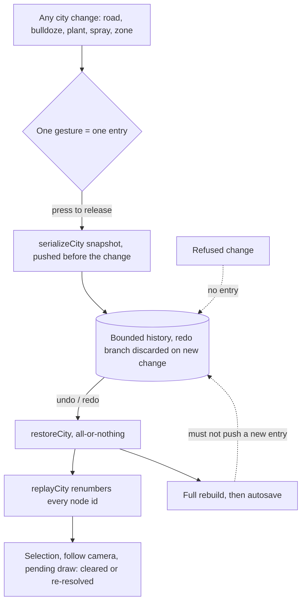

## prod_016_a_city_you_can_change_your_mind_about - A city you can change your mind about
> Date: 2026-08-30
> Status: Proposed
> Related request: `req_019_let_the_player_take_back_the_last_thing_they_did`
> Related backlog: `item_063_snapshot_the_city_s_model_into_a_bounded_history`, `item_064_make_one_gesture_one_step_and_leave_nothing_pointing_at_what_is_gone`, `item_065_put_undo_and_redo_where_the_player_will_reach_for_them`
> Related task: `task_021_let_the_player_take_back_the_last_thing_they_did`
> Related architecture: (none yet)
> Reminder: Update status, linked refs, scope, decisions, success signals, and open questions when you edit this doc.

# Overview
city-jump is careful, hand-shaped work -- a curve takes three considered clicks -- and it has no undo. One misplaced bulldoze and the only recovery is to redraw from memory or reload and lose everything since the last autosave. The model already knows how to snapshot and restore itself all-or-nothing, so the machinery is nearly free; the work is deciding what one step is, and making sure nothing in the program is still pointing at a road that stopped existing.

# Goals
- A mistake costs one keystroke, not five minutes of redrawing.
- One gesture undoes in one press, whatever that gesture planted or painted.
- Nothing in the program survives an undo still pointing at something that is gone.
- The simplest thing that works ships first, with its ceiling written down.
- Undo touches the city and leaves the view alone.

# Non-goals
- A named or browsable history, a timeline, or restore points.
- Undoing settings, camera moves, the sun hour, or view switches.
- Undo across a page reload, or history carried in a save or a share link.
- Collaborative or multi-user editing history.
- An operation log with per-edit inverses, unless snapshots are measured and found wanting.
- Changing what any of the build tools do.

# Scope and guardrails
- In: scaffolded request, product, backlog, orchestration task, validation, and handoff context.
- Out: unrelated workflow docs and implementation of generated tasks.

# Key product decisions
- Use structured input as the source of truth for generated docs.
- Keep generated write paths local and repo-bounded.

# Success signals
- Generated docs pass lint and audit without broad manual rewrites.
- Context-pack output can be handed to an implementation agent directly.

# References
- Product back-reference: `req_019_let_the_player_take_back_the_last_thing_they_did`
- Task back-reference: `task_021_let_the_player_take_back_the_last_thing_they_did`
