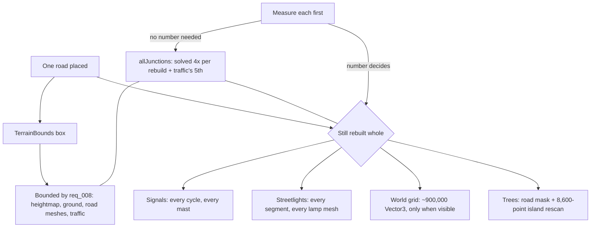

## prod_017_an_edit_that_costs_what_it_changed_everywhere - An edit that costs what it changed, everywhere
> Date: 2026-08-30
> Status: Proposed
> Related request: `req_020_four_renderers_still_rebuild_the_whole_world_on_every_edit`
> Related backlog: `item_066_measure_what_each_full_rebuild_renderer_actually_costs`, `item_067_solve_the_junction_geometry_once_per_rebuild_instead_of_five_times`, `item_068_stop_rescanning_the_whole_island_for_trees_that_cannot_have_changed`, `item_069_decide_the_world_grid_the_streetlights_and_the_signals_on_their_numbers`
> Related task: `task_022_finish_bounding_the_renderers_that_still_rebuild_the_whole_world`
> Related architecture: (none yet)
> Reminder: Update status, linked refs, scope, decisions, success signals, and open questions when you edit this doc.
> Indicators reviewed: 2026-08-30 14:37:54

# Overview
The performance work taught half the renderers to repaint only what an edit touched, and left four behind. Every road placed still rebuilds a road mask, rescans 5,400 metres of island for scenery on a 58-metre step, re-solves every junction in the city four separate times, and -- if the grid is showing -- allocates the better part of a million vectors to draw it again. This slice finishes the job, but starts by measuring rather than assuming: the honest outcome for at least one of these four is a number and no code.

# Goals
- The decision about each renderer rests on its measured cost, not on its position in a list.
- The same city geometry stops being solved five times to draw one frame.
- An edit stops rescanning the whole island for trees that cannot have changed.
- Every renderer this touches disposes and recreates on one predicate.
- A renderer left rebuilding whole is left there on purpose, with the measurement written down.

# Non-goals
- Changing what any of these renderers draw -- the scene after this is pixel-identical to the scene before it.
- Reworking the tree scenery rules, the lamp spacing, or the signal cycle model.
- A general dirty-region framework the renderers all implement.
- Extending region-based rebuilds to anything outside these four.
- Reducing detail, density or counts to go faster -- that bargain belongs to the player's settings, not to this chain.
- Startup or bundle cost, which is a different question.

# Scope and guardrails
- In: the four renderers left out of the region-based rebuild -- trees, world grid, streetlights, signals -- and the junction geometry solved five times per rebuild.
- In: a per-renderer measurement, taken first, that every decision in the chain then cites.
- Out: what any of these renderers draw; the scene after this is pixel-identical to the scene before.
- Out: a general dirty-region framework, anything outside these four, and going faster by drawing less.

# Key product decisions
- Measure before deciding. "Leave it whole, here is the number" is a valid outcome and the chain is written to allow it.
- The duplicated junction geometry needs no measurement: it is the same work solved five times, and the parcel layout one line away already got the fix.
- Every renderer bounded disposes and recreates on one predicate -- this chain is positioned to repeat that mistake four more times.

# Success signals
- The placement cost falls slice by slice, with a recorded figure behind each.
- A partial rebuild matches a full one for every renderer changed.
- Anything left rebuilding whole is left there on purpose, with its measurement where the next reader meets it.

# References
- Product back-reference: `req_020_four_renderers_still_rebuild_the_whole_world_on_every_edit`
- Task back-reference: `task_022_finish_bounding_the_renderers_that_still_rebuild_the_whole_world`
