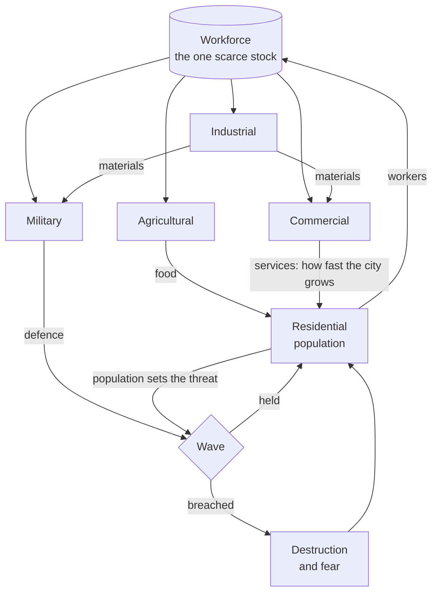

## prod_018_a_city_that_has_to_survive_what_comes_out_of_the_sea - A city that has to survive what comes out of the sea
> Date: 2026-08-31
> Status: Proposed
> Related request: (none yet)
> Related backlog: (none yet)
> Related task: (none yet)
> Related architecture: (none yet)
> Reminder: Update status, linked refs, scope, decisions, success signals, and open questions when you edit this doc.

# Overview
city-jump can draw a city and cannot lose one. Every zoned parcel fills the instant it is drawn,
every building works without anyone in it, and the needs panel shows four gauges that gate
nothing. This brief is the direction that makes the city matter: a **city builder whose city is
attacked**, at intervals, by a kaiju that comes out of the sea, and whose defence is the military
district the player chose to build instead of another farm.

The genre is a city builder first. Defence is not a second game bolted to the side: the military
buildings that already grow along a military road **are** the towers, so the player defends the
city by urbanising it -- by deciding where a military road runs, and how much of the workforce
stands behind a gun instead of a plough. Placeable turrets would make this a tower defence with a
city painted on it, and the two halves would stop speaking to each other.

Nothing here needs a new representation. A kaiju walks a path the way a car does, destroys the
way the bulldozer does, and the destruction repaints the region it touched through the dirty-box
rebuild that already exists. What is missing is not geometry: it is **scarcity**.

# Goals
- A building standing empty is a building that does nothing: every non-residential parcel needs
  workers to operate, and the workforce is one shared stock every district competes for.
- Proportion is the game. The player is always tempted to under-build the military, because every
  barracks is a farm or a works not built -- and the wave is what prices that choice.
- The threat scales with the city, so growing is a decision rather than a free good, and it is
  fixed at the start of a wave so the player can choose to consolidate instead of expand.
- A wave is legible before it lands: the player sees the threat and their own defence as two
  numbers, and loses to arithmetic they could have read, never to a surprise.
- Defence is bought by urbanism -- where a military road runs, and what the workforce is doing --
  not by placing turrets on a map.
- The city survives its own destruction: the graph, the saves and the undo history stay coherent
  when a wave removes roads and buildings.

# Non-goals
- Money. Workers, food and materials are three constraints and they are enough; a currency would
  only add indirection over the same decisions.
- Special buildings of any kind, military included. They come once the ordinary districts carry
  the loop.
- Building upgrades, tiers, or levels.
- Permanent progression between runs -- unlocks, meta-currency, a seed. Whether this game is one
  city that lasts or a series of runs is an open question below, and the answer decides whether
  any of that is ever built.
- Placeable turrets, walls, or any defensive object the player positions directly.
- Multiple simultaneous threats, or a threat that is not the kaiju.
- Workforce allocation by proximity. The first version draws from one global stock; recruiting
  along the road network is a much better rule and it makes roads an economic variable, which is
  worth having once the loop stands up.

# Scope and guardrails
- In: the workforce constraint, the four resources (workers, food, materials, services), a
  population that grows over time within what the city can feed and staff, parcels that wait for
  demand instead of filling on sight, a wave clock, a kaiju that lands and destroys, military
  parcels that defend within a range, and the readouts that make all of it legible.
- The road graph stays the only authored state (`adr_001`). Population, stocks and staffing are
  derived simulation state, saved alongside it, never a second source of truth for the city.
- Simulation rules stay deterministic and free of Babylon and browser APIs, testable without a
  renderer -- the same seam that lets `buildingNeeds` be a pure function today.
- The player's history covers the player's actions. A wave's destruction is the world acting, and
  undo does not take it back.
- Out: everything in the non-goals, and any server-side anything (`adr_004` stays settled).

# Key product decisions
- **Military buildings are the defence.** They already grow along a military road; they gain a
  range and a rate of damage rather than being replaced by a placed object.
- **Workers are the keystone, and staffing is binary.** A parcel is staffed and works, or it is
  not and does nothing. Partial output would be more realistic and less readable, and readability
  is what lets a player act on a proportion.
- **Each district has one job in the loop.** Agriculture decides whether the population *exists*
  (food), commerce decides how fast it *grows* (services), industry supplies the military and the
  shops (materials), and the military produces nothing the economy can use -- it is a pure cost,
  which is precisely what makes under-building it tempting.
- **The threat is indexed on population**, fixed at the start of each wave, and grows more slowly
  than the city does, so a well-run city gets ahead instead of running on a treadmill.
- **Destruction is real.** A wave removes roads and buildings; rebuilding is the player's problem
  and the next wave's context.

# Success signals
- A city can be lost, and the loss is explicable: the player can point at the number that was too
  small before the wave landed.
- Turning half a district off by over-staffing another is visible in the city itself, not only in
  a panel.
- A player who zones nothing but housing stalls, and can say why.
- A wave that destroys a quarter of the city leaves a graph, a save and an undo history that all
  still work, and a rebuild that repaints the region it touched rather than the world.
- The simulation runs in a test with no renderer, from a fixed seed, and produces the same city.
- The frame rate through a wave stays inside the budget `docs/performance.md` records for the
  reference city.

# Open questions
- **One city that lasts, or runs?** Everything above assumes a single city and waves that escalate.
  Real runs -- a seed, a defeat that ends something, unlocks that persist -- use the same loop but
  need what survives a defeat to be decided before the first line is written, not after.
- What a wave leaves behind: permanent ruins the player clears, or damage that repairs itself over
  time. This changes whether a bad wave is a setback or a scar.
- Where the kaiju lands: the same shore every time, or a coast point chosen per wave. The second
  makes coastal geography a defensive decision and is the reason to have an island at all.
- Whether the population should ever fall to zero, and what that means if the answer is yes.

# References
- Product back-reference: (none yet)
- Task back-reference: (none yet)
- Roadmap: `road_001_city_jump_playable_city` -- strands E2 (what grows on the land) and E3 (life
  on the network) are the ones this direction bends.
- Related product: `prod_011_a_city_that_is_built_on_purpose` -- zoning by business, which this
  brief turns from a preference into a constraint.
- Architecture: `adr_001_keep_the_road_graph_as_the_source_of_truth`,
  `adr_004_stay_a_static_client_with_no_server_of_its_own`.
