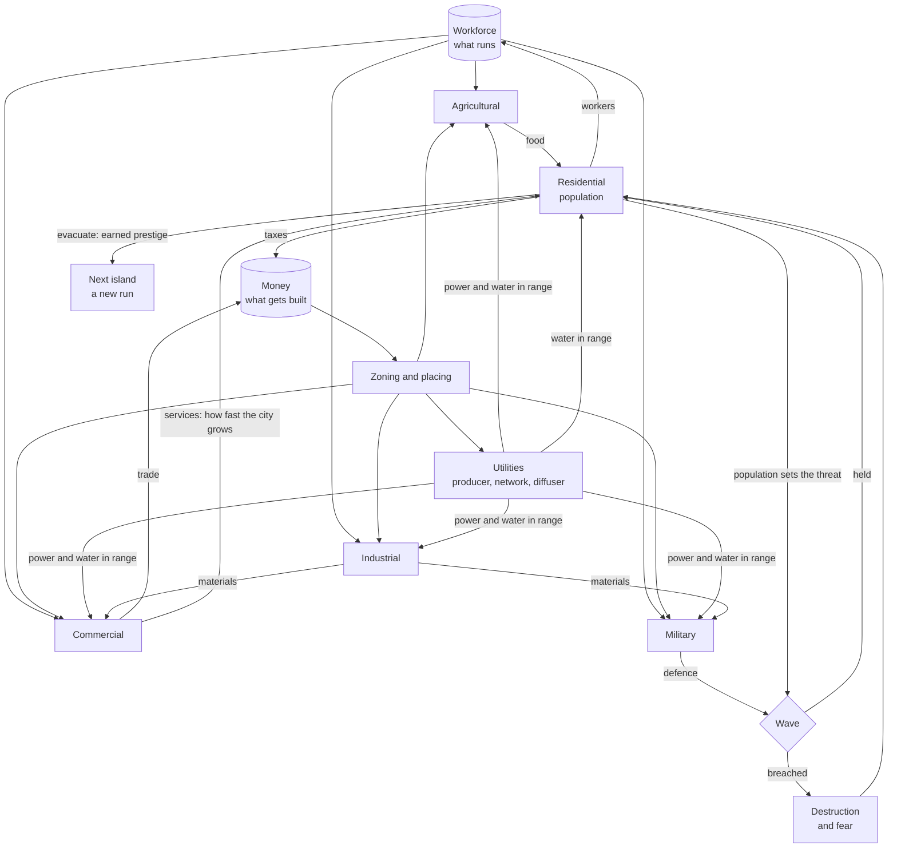

## prod_018_a_city_that_has_to_survive_what_comes_out_of_the_sea - A city that has to survive what comes out of the sea
> Date: 2026-08-31
> Status: Proposed
> Related request: (none yet)
> Related backlog: (none yet)
> Related task: (none yet)
> Related architecture: (none yet)
> Reminder: Update status, linked refs, scope, decisions, success signals, and open questions when you edit this doc.
> Indicators reviewed: 2026-08-31 20:39:23

# Overview
city-jump can draw a city and cannot lose one. Every zoned parcel fills the instant it is drawn,
every building works without anyone in it, and the needs panel shows four gauges that gate
nothing. This brief is the direction that makes the city matter: a **city builder whose city is
attacked**, at intervals, by a kaiju that comes out of the sea, and whose defence is the military
district the player chose to build instead of another farm.

The genre is a city builder first. Defence is not a second game bolted to the side: the military
buildings that already grow along a military road **are** the towers, so the player defends the
city by urbanising it -- by deciding where a military road runs, and how much of the workforce
stands behind a gun instead of a plough. Placeable turrets would make this a tower defence with a
city painted on it, and the two halves would stop speaking to each other.

An island is a run. The city grows, holds its waves, and at some point cannot hold another: the
player evacuates to the next island and starts again with what they earned. Leaving is a decision
rather than a defeat screen -- leave early and the island is wasted, leave late and it is lost with
you -- and the coastline is the natural ceiling on how big a city can get before that choice
arrives, so no artificial cap is needed.

Nothing in the attack needs a new representation. A kaiju walks a path the way a car does, destroys
the way the bulldozer does, and the destruction repaints the region it touched through the
dirty-box rebuild that already exists. What is missing is not geometry: it is **scarcity**, and two
things that meter it -- money, which decides what can be built, and the workforce, which decides
what actually runs.

# Goals
- A building standing empty is a building that does nothing: every non-residential parcel needs
  workers to operate, and the workforce is one shared stock every district competes for.
- Proportion is the game. The player is always tempted to under-build the military, because every
  barracks is a farm or a works not built -- and the wave is what prices that choice.
- The threat scales with the city, so growing is a decision rather than a free good, and it is
  fixed at the start of a wave so the player can choose to consolidate instead of expand.
- A wave is legible before it lands: the player sees the threat and their own defence as two
  numbers, and loses to arithmetic they could have read, never to a surprise.
- Defence is bought by urbanism -- where a military road runs, and what the workforce is doing --
  not by placing turrets on a map.
- The city survives its own destruction: the graph, the saves and the undo history stay coherent
  when a wave removes roads and buildings.
- Two meters, two different pressures: money decides how much can be **built** before the next
  wave, the workforce decides how much of it **runs**. Neither substitutes for the other.
- Leaving is played, not suffered. Evacuating to the next island is a choice with a price on both
  sides of it, and what the player carries over is what they earned by staying as long as they did.
- Utilities are a second thing to plan, not a second tax: power and water reach what a diffuser
  covers, and what needs them differs by district.

# Non-goals
- Anything money is not: wages, prices that move, a market, a budget the player balances. Money
  here is one number that says how much more can be built before the next wave, and nothing else.
- Special buildings of any kind, military included. They come once the ordinary districts carry
  the loop.
- Building upgrades, tiers, or levels.
- A prestige tree, a shop, or anything else that spends what a run earns. Runs and their carried
  bonuses are the direction; what the bonuses are, and how they are chosen, is a slice of its own
  and none of it is scoped here.
- A free-form buried utility network with its own graph, its own drawing tool and its own view.
  Option B below is kept, deliberately, and is not the first version.
- Placeable turrets, walls, or any defensive object the player positions directly.
- Multiple simultaneous threats, or a threat that is not the kaiju.
- Workforce allocation by proximity. The first version draws from one global stock; recruiting
  along the road network is a much better rule and it makes roads an economic variable, which is
  worth having once the loop stands up.

# Scope and guardrails
- In: the workforce constraint, money as the build meter, the resources (food, materials, services,
  power, water), a population that grows over time within what the city can feed and staff, parcels
  that wait for demand instead of filling on sight, a wave clock, a kaiju that lands and destroys,
  military parcels that defend within a range, an evacuation that ends a run, and the readouts that
  make all of it legible.
- The road graph stays the only authored state (`adr_001`). Population, stocks and staffing are
  derived simulation state, saved alongside it, never a second source of truth for the city.
- Simulation rules stay deterministic and free of Babylon and browser APIs, testable without a
  renderer -- the same seam that lets `buildingNeeds` be a pure function today.
- The player's history covers the player's actions. A wave's destruction is the world acting, and
  undo does not take it back.
- A run's city and the profile that outlives it are separate saves. The city keeps being the road
  graph and its derived state; what carries to the next island never lives inside it.
- Out: everything in the non-goals, and any server-side anything (`adr_004` stays settled).

# Key product decisions
- **Military buildings are the defence.** They already grow along a military road; they gain a
  range and a rate of damage rather than being replaced by a placed object.
- **Workers are the keystone, and staffing is binary.** A parcel is staffed and works, or it is
  not and does nothing. Partial output would be more realistic and less readable, and readability
  is what lets a player act on a proportion.
- **Each district has one job in the loop.** Agriculture decides whether the population *exists*
  (food), commerce decides how fast it *grows* (services), industry supplies the military and the
  shops (materials), and the military produces nothing the economy can use -- it is a pure cost,
  which is precisely what makes under-building it tempting.
- **The threat is indexed on population**, fixed at the start of each wave, and grows more slowly
  than the city does, so a well-run city gets ahead instead of running on a treadmill.
- **Destruction is real.** A wave removes roads and buildings; rebuilding is the player's problem
  and the next wave's context.
- **An island is a run, and the coast is the cap.** There is no rule limiting how big a city may
  get: the buildable land runs out, the waves keep growing, and evacuating to the next island is
  how a run ends and the next one starts richer.
- **Money gates building, workers gate running.** Money comes from taxes on the population and
  from trade in the commercial district -- which is what finally makes commerce a job rather than
  an abstract growth multiplier.
- **Utilities are placed, defence is not.** A producer and a diffuser are buildings the player
  positions; the diffuser covers a radius, and a building inside it is supplied. This is the
  second placement verb in the game, and the only one -- turrets remain out.
- **The utility network follows the roads (option A).** Carrying power or water is a property of
  a road segment, not a second graph: it saves with the city, it needs no new drawing tool, and it
  makes the road network the thing that structures the city twice over. Option B -- a free-form
  buried network with its own graph -- is kept in reserve for when running along roads proves too
  constraining in play, and is a slice of its own if it ever arrives.
- **The road proposes, the brush disposes.** Land use has two mechanisms today -- a road type
  decides the working districts, a brush decides housing and shops -- and the player has to guess
  which one applies where. One rule replaces both: a road type gives its frontage a **default**
  business, and the brush can **override** any cell, for any of the five. Painted wins where it is
  painted; the road decides everywhere else.

  The obvious objection is that painting military anywhere makes defence cheap to place, which is
  what turrets were rejected for. It does not, because the cost moved: a barracks needs money to
  build, and workers and power to *work*. Painting is easy; running is not. What this buys is both
  halves -- a dirt track through the fields still grows farms on its own, and a player watching a
  kaiju come in from the north-east can zone that coast without first routing a military road to
  it.
- **Not every district needs every utility.** Housing and farms want water, industry and the
  military want power, commerce wants both. Four ways to be switched off is tedious; a district
  that needs two of them is a planning puzzle.

# How this gets balanced
Numbers are outputs, not inventions. The simulation is deterministic and runs without a renderer,
so the way to balance it is to run it -- the same discipline as `docs/performance.md`, applied to
play instead of frames.

- **One anchor: the interval between waves.** Everything else is quoted against it. An income is
  credits per interval; a cost is intervals of income *at the city's current size*; a wave is the
  share of the city that has to have gone to the military. Change the interval and nothing else
  needs retuning.
- **The pacing number is how many buildings fit between two waves.** One is suffocating, ten makes
  the wave stop being a deadline; three to five is the target, and it is what sets the costs once
  the interval is chosen -- not the other way round.
- **Money has two sources.** The population pays tax and the commercial district trades. Commerce
  alone would mean a city that loses its shops in a wave loses its income exactly when it has to
  rebuild: a death spiral, not a decision.
- **The threat grows geometrically, the city grows linearly** -- the island is finite and so is the
  workforce. The military share needed therefore climbs until it passes what the city can feed and
  staff. The end of a run is a consequence rather than a rule, which is what makes evacuation
  arrive on its own and at the right moment.
- **A balance harness, beside the performance one.** It runs the simulation headless over many
  seeds against scripted player policies -- economy only, always 20% military, one wave late -- and
  reports the distribution: waves held, population at evacuation, when defence falls behind. The
  constants are tuned until:
  - the policy that ignores the military dies at wave 3 or 4, early and legibly;
  - the policy that builds nothing but military starves by about wave 6;
  - a balanced policy holds 12 to 15 waves and is then overtaken;
  - the median run ends in evacuation rather than destruction -- if it does not, leaving is not
    priced right.
- **None of this applies to the first slice.** The vertical slice of an attack keeps hardcoded
  numbers chosen to make one wave playable in a minute. Balancing an engine before it has been run
  is tuning to taste; the harness comes once the loop exists and is known to be worth playing.

# Success signals
- A city can be lost, and the loss is explicable: the player can point at the number that was too
  small before the wave landed.
- Turning half a district off by over-staffing another is visible in the city itself, not only in
  a panel.
- A player who zones nothing but housing stalls, and can say why.
- A wave that destroys a quarter of the city leaves a graph, a save and an undo history that all
  still work, and a rebuild that repaints the region it touched rather than the world.
- The simulation runs in a test with no renderer, from a fixed seed, and produces the same city.
- A player can say why they cannot build the thing they want: no money, or nowhere left to put it.
- A district goes dark when its diffuser is destroyed, and the player can see which one it was.
- A run ends by evacuation at least as often as by defeat -- if nobody ever chooses to leave, the
  choice is not priced right.
- Every balance constant in the game can be traced to a harness run rather than to someone's
  judgement on the day.
- The frame rate through a wave stays inside the budget `docs/performance.md` records for the
  reference city.

# Open questions
- What prestige is earned from, and what it buys. Population reached, waves held, and what was
  standing at evacuation are the obvious candidates; the danger is a bonus that removes the
  scarcity the whole loop is made of.
- What being destroyed costs compared with evacuating. If a defeat carries as much as a departure,
  leaving is never worth choosing.
- What a wave leaves behind: permanent ruins the player clears, or damage that repairs itself over
  time. This changes whether a bad wave is a setback or a scar.
- Where the kaiju lands: the same shore every time, or a coast point chosen per wave. The second
  makes coastal geography a defensive decision and is the reason to have an island at all.
- Whether the population should ever fall to zero, and what that means if the answer is yes.

# References
- Product back-reference: (none yet)
- Task back-reference: (none yet)
- Roadmap: `road_001_city_jump_playable_city` -- strands E2 (what grows on the land) and E3 (life
  on the network) are the ones this direction bends.
- Related product: `prod_011_a_city_that_is_built_on_purpose` -- zoning by business, which this
  brief turns from a preference into a constraint.
- Architecture: `adr_001_keep_the_road_graph_as_the_source_of_truth`,
  `adr_004_stay_a_static_client_with_no_server_of_its_own`.
