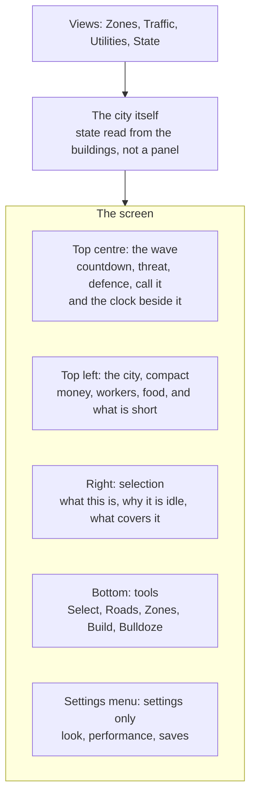

## prod_019_an_interface_for_a_city_you_can_lose - An interface for a city you can lose
> Date: 2026-08-31
> Status: Proposed
> Related request: (none yet)
> Related backlog: (none yet)
> Related task: (none yet)
> Related architecture: (none yet)
> Reminder: Update status, linked refs, scope, decisions, success signals, and open questions when you edit this doc.
> Indicators reviewed: 2026-08-31 22:22:41

# Overview
The interface city-jump has is the interface of a drawing tool: a collapsible settings menu top
left, a tool dock along the bottom, a compass and a population count in the middle, a detail panel
on whatever was clicked. It is well suited to a game where nothing is at stake.

`prod_018_a_city_that_has_to_survive_what_comes_out_of_the_sea` puts something at stake, and three
things follow that the current shape cannot carry: the player owns the clock, a wave is coming and
its arithmetic has to be readable before it lands, and every building is now in one of several
states the player has to be able to see without clicking. The needs panel already sits inside the
settings menu -- fine while it was decoration, wrong now that it is the thing being played against.

This is a move, not an addition. **Game state leaves the settings menu; settings keep the menu.**

# Goals
- The three numbers that decide a run -- when the wave comes, how strong it is, how strong the
  city is -- are on screen at all times, and never behind a fold.
- Time is one click away, always: pause, play, x2, x4, with the date and hour beside them. It is
  the most frequent action in the game and it is currently a setting.
- The city is legible from the city. A building under construction, idle for want of workers,
  power or water, or being rebuilt after a wave, reads as such on the map before anything is
  clicked.
- Nothing is refused silently. A thing that cannot be afforded or placed says so before the click,
  not after it.
- The whole game can be played paused. The player owns the clock, so every decision must be
  available while nothing is moving.
- Eight meters do not become eight gauges. What can kill you is permanent and compact; the rest is
  a panel away.

# Non-goals
- A new scene, a main menu, or anything that takes the map off screen. The start of a run and its
  end are panels over the city, not places the player travels to.
- A skinned or themed UI pass. This is about what is on screen and where, not what it looks like.
- Tutorialisation, tooltips as a system, or an onboarding flow. The first minutes matter, and they
  are `prod_018`'s problem to specify before they are this brief's to lay out.
- Touch and small-screen layouts. The game states a desktop input model and keeps it.
- Rebuilding the tool dock's interaction model. It works; it gains one tool.

# Scope and guardrails
- In: where things live on screen, what is permanent and what is on demand, the visual states a
  building can be in, the views that colour the map by a question, the time controls, the wave
  banner, the price and refusal rules, and the panels that open a run and close it.
- The map is the primary readout. A panel explains what the map has already shown; it does not
  replace it.
- The settings menu keeps only settings: look, performance, saves, and the sun -- which becomes a
  way to set the hour while paused rather than a control used while the city runs.
- Out: everything in the non-goals, and any simulation rule -- what a gauge means belongs to
  `prod_018`, only how it is read belongs here.

# Key product decisions
- **Game state moves out of the settings menu.** The needs panel is the first to go; anything the
  player consults during play follows it. This is a move rather than an addition, and it is worth
  doing before three more things attach themselves to a menu that folds away.
- **Top centre is the wave.** Countdown, threat, the city's defence, and the button that calls the
  kaiju early -- with the clock next to it, because the two are used together: see the wave
  coming, decide whether to speed the day up or stop it.
- **Top left is the city, compact.** Money and its rate, workers assigned against available, food,
  and whatever is currently short. Four things, not eight; the rest opens on click.
- **A building's state is shown by the building.** Scaffolding while it goes up, unlit and without
  its usual signs of life while it is idle, rubble and works while it is rebuilt. A panel that has
  to be opened to discover a district has been dark for a minute is a panel that failed.
- **A fourth view, beside Zones and Traffic: Utilities.** Diffuser coverage, and which roads carry
  power and water. A fifth, State, colours every building by why it is not working.
- **Prices are shown before the click, and what cannot be afforded looks unavailable.** The
  existing refusal toast stays for what can only be known on release -- too steep, too short --
  but money is knowable in advance and must be shown in advance.
- **Undo never looks like it can take back a wave.** It covers the player's own actions; the
  interface has to make that obvious rather than let a player discover it by pressing it after a
  disaster.
- **A run opens and closes in panels over the map**, not in screens: the island and the prestige
  to spend at the start, the summary and the science earned at the end.
- **Nothing opens itself.** The selection panel stays where it is, on the right, and is opened by
  the player and closed with Escape -- the game never opens it. A wave is exactly when the map
  must not be covered by something nobody asked for, and the rule that guarantees it is simpler
  than any layout: panels are answers to clicks.
- **The camera is never taken.** When a wave lands the game points rather than moves: a marker on
  the edge of the screen for the direction the kaiju is in, and a button in the wave banner that
  looks at it in one click. Snapping the camera to the coast would be the same theft as taking the
  clock, and the clock is the player's by decision already.
- **The fight is read in the two numbers the player was promised.** Before a wave the banner says
  threat against defence; during it, the same two move -- the threat bar drains as the kaiju takes
  damage. Nothing else is added: no damage numbers, no health bars over buildings. What happens on
  the map -- a barracks firing, a building coming apart -- is the map's job. The banner's job is to
  make the arithmetic the player planned against turn out to have been true.
- **What is about to die is marked, not mapped.** The question a player has during a wave is not
  where the kaiju is on the island, it is what it is about to reach -- and that is known, because
  it walks at whatever building is nearest. So the map highlights its current target, and the edge
  marker carries the distance. Two pieces of information and no new surface. A minimap is held in
  reserve, with the sign that would call for it: players sweeping the camera around hunting for a
  kaiju they cannot find.
- **Between waves the banner shows the next one.** The estimated threat of the wave to come, the
  city's defence as it stands, the countdown, and the call button. It is full at all times and it
  serves the only thing that matters between two waves, which is preparing for the next -- and an
  estimate that climbs as the population does *is* the game's message: growing makes what is
  coming worse. The banner is where a player watches their own success turn against them.
- **A meter shows a value, and shouts a direction -- but colour never speaks about the future.**
  The number is there to be read, the arrow to be noticed. Amber is falling, red is *empty* -- a
  fact, not a forecast. A projection would flip a meter between red and green on every building
  placed, and a light that changes its mind is a light players stop looking at; worse, it would
  cost the one thing worth protecting here, which is that the numbers on screen can be trusted. If
  play shows people being surprised by a famine, the answer is one line of warning -- "food runs
  out in two days" -- not another colour.
- **The wave banner becomes the wave's report.** When an attack ends, the thing the player was
  already watching says how it went -- held or breached, what it cost, what science it left, and
  how close the two numbers came. It stays until the next countdown replaces it, and clicking it
  opens the detail: what was destroyed, where, and how long it will be down. Nothing new opens and
  nothing covers the map, because the map is already showing the answer in rubble.
- **Undo stops at the wave.** Once an attack begins the player cannot take back what they did
  before it: undo covers the player's actions, and a wave has made those actions part of a world
  that has moved on. The button says so rather than silently doing nothing.
- **A wave announces itself with light.** Until there is sound, the screen's edge carries a slow,
  unaggressive glow when a wave is coming and while one is landing -- the one alert that works
  whatever the camera is pointed at, and the one thing an edge marker cannot do.
- **Colour is never the only difference.** Any two colours that carry meaning have to differ in
  lightness as well as hue, so they survive being read by an eye that does not separate them --
  and so they survive a screenshot in greyscale, which is the cheap test. Agriculture is brown
  rather than orange for this reason -- orange put it within 0.012 relative luminance of
  residential green, the same brightness and so the same colour to a good share of players -- and
  commerce moved a little to keep its distance from military purple. The five now run 0.31, 0.44,
  0.55, 0.66, 0.80, no two closer than a tenth.
- **The rule the three of them share: the map answers *what*, the banner answers *when*, and
  colour never talks about the future.**

# What the screen ends up holding
Fifteen or so pieces, four of them permanent. The brief says where things live; this says what
exists, so the screen's budget can be argued about with a list rather than a feeling.

**Permanent, and new**
- **The wave banner**: countdown, estimated threat of the next wave, the city's defence, the call
  button and what calling multiplies by -- and during an attack, the threat bar draining.
- **The time controls**: pause, play, x2, x4, with the date and the hour, which leaves the settings
  menu to sit here.
- **The city strip**: money and its rate, workers assigned against available, food, the run's
  science, and one slot for whatever is currently short.
- **The edge marker**: the kaiju's direction and distance, with the button that looks at it.

**On demand**
- The full gauge panel -- today's needs panel, extended with materials, services, power and water
  -- opened from the city strip.
- The selection panel, richer: for a building its state and *why*, its staffing, what supplies it,
  what it produces; for a diffuser its coverage and what it feeds; for the kaiju its target.
- The panel that opens a run: the island, and the prestige to spend.
- The panel that closes one: evacuation or defeat, and the science earned.
- The upgrade web itself.
- Alerts: one line each, carrying the predictions colour is not allowed to make.

**On the map, which is UI even though it is not a panel**
- Scaffolding while a building goes up, an unlit and lifeless one while it is idle, rubble and
  works while it is rebuilt.
- The kaiju's current target, highlighted.
- A diffuser's coverage circle, previewed while placing it.
- Military range, shown when it is the subject.

**Changed**
- The tool dock gains **Build** -- producers and diffusers, with a catalogue and prices. Power and
  Water already sit there, greyed.
- The zone brush goes from three buttons to six: the five businesses and Clear.
- The views go from three to five: All, Zones, Traffic, **Utilities**, **State**.
- Every placement shows its price, and what cannot be afforded looks unavailable.

**Shrunk**
- The settings menu keeps look, performance, saves, and a sun reduced to a paused-only control. It
  loses the needs panel, which is the move this brief turns on.

# Success signals
- A player who has not touched the game for a minute can tell, without clicking, whether a wave is
  near and whether they are ready for it.
- A district that stops working is noticed on the map, not in a panel.
- Every decision a player makes can be made with the game paused, and the interface does not push
  them to unpause to do it.
- No permanent readout is added without something being removed or folded: the screen has a budget.
- The settings menu contains nothing a player needs during a wave.

# Open questions
- Whether the estimated threat shown between waves should move continuously as the population
  grows, or settle at intervals. A number that ticks upward while nothing is happening may read as
  pressure rather than information.
- What the target highlight does when the kaiju is between two buildings, or when its target is
  behind the camera.

# References
- Product back-reference: (none yet)
- Task back-reference: (none yet)
- Source brief: `prod_018_a_city_that_has_to_survive_what_comes_out_of_the_sea` -- every rule this
  interface has to make readable.
- Related product: `prod_007_a_city_you_can_point_at_and_name` (the selection panel this extends),
  `prod_013_a_city_that_tells_you_what_it_costs_to_draw` (the readout budget this inherits).
