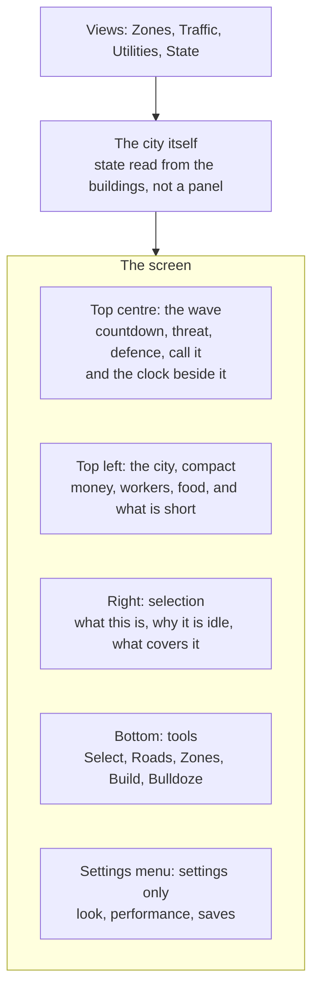

## prod_019_an_interface_for_a_city_you_can_lose - An interface for a city you can lose
> Date: 2026-08-31
> Status: Proposed
> Related request: (none yet)
> Related backlog: (none yet)
> Related task: (none yet)
> Related architecture: (none yet)
> Reminder: Update status, linked refs, scope, decisions, success signals, and open questions when you edit this doc.

# Overview
The interface city-jump has is the interface of a drawing tool: a collapsible settings menu top
left, a tool dock along the bottom, a compass and a population count in the middle, a detail panel
on whatever was clicked. It is well suited to a game where nothing is at stake.

`prod_018_a_city_that_has_to_survive_what_comes_out_of_the_sea` puts something at stake, and three
things follow that the current shape cannot carry: the player owns the clock, a wave is coming and
its arithmetic has to be readable before it lands, and every building is now in one of several
states the player has to be able to see without clicking. The needs panel already sits inside the
settings menu -- fine while it was decoration, wrong now that it is the thing being played against.

This is a move, not an addition. **Game state leaves the settings menu; settings keep the menu.**

# Goals
- The three numbers that decide a run -- when the wave comes, how strong it is, how strong the
  city is -- are on screen at all times, and never behind a fold.
- Time is one click away, always: pause, play, x2, x4, with the date and hour beside them. It is
  the most frequent action in the game and it is currently a setting.
- The city is legible from the city. A building under construction, idle for want of workers,
  power or water, or being rebuilt after a wave, reads as such on the map before anything is
  clicked.
- Nothing is refused silently. A thing that cannot be afforded or placed says so before the click,
  not after it.
- The whole game can be played paused. The player owns the clock, so every decision must be
  available while nothing is moving.
- Eight meters do not become eight gauges. What can kill you is permanent and compact; the rest is
  a panel away.

# Non-goals
- A new scene, a main menu, or anything that takes the map off screen. The start of a run and its
  end are panels over the city, not places the player travels to.
- A skinned or themed UI pass. This is about what is on screen and where, not what it looks like.
- Tutorialisation, tooltips as a system, or an onboarding flow. The first minutes matter, and they
  are `prod_018`'s problem to specify before they are this brief's to lay out.
- Touch and small-screen layouts. The game states a desktop input model and keeps it.
- Rebuilding the tool dock's interaction model. It works; it gains one tool.

# Scope and guardrails
- In: where things live on screen, what is permanent and what is on demand, the visual states a
  building can be in, the views that colour the map by a question, the time controls, the wave
  banner, the price and refusal rules, and the panels that open a run and close it.
- The map is the primary readout. A panel explains what the map has already shown; it does not
  replace it.
- The settings menu keeps only settings: look, performance, saves, and the sun -- which becomes a
  way to set the hour while paused rather than a control used while the city runs.
- Out: everything in the non-goals, and any simulation rule -- what a gauge means belongs to
  `prod_018`, only how it is read belongs here.

# Key product decisions
- **Game state moves out of the settings menu.** The needs panel is the first to go; anything the
  player consults during play follows it. This is a move rather than an addition, and it is worth
  doing before three more things attach themselves to a menu that folds away.
- **Top centre is the wave.** Countdown, threat, the city's defence, and the button that calls the
  kaiju early -- with the clock next to it, because the two are used together: see the wave
  coming, decide whether to speed the day up or stop it.
- **Top left is the city, compact.** Money and its rate, workers assigned against available, food,
  and whatever is currently short. Four things, not eight; the rest opens on click.
- **A building's state is shown by the building.** Scaffolding while it goes up, unlit and without
  its usual signs of life while it is idle, rubble and works while it is rebuilt. A panel that has
  to be opened to discover a district has been dark for a minute is a panel that failed.
- **A fourth view, beside Zones and Traffic: Utilities.** Diffuser coverage, and which roads carry
  power and water. A fifth, State, colours every building by why it is not working.
- **Prices are shown before the click, and what cannot be afforded looks unavailable.** The
  existing refusal toast stays for what can only be known on release -- too steep, too short --
  but money is knowable in advance and must be shown in advance.
- **Undo never looks like it can take back a wave.** It covers the player's own actions; the
  interface has to make that obvious rather than let a player discover it by pressing it after a
  disaster.
- **A run opens and closes in panels over the map**, not in screens: the island and the prestige
  to spend at the start, the summary and the science earned at the end.

# Success signals
- A player who has not touched the game for a minute can tell, without clicking, whether a wave is
  near and whether they are ready for it.
- A district that stops working is noticed on the map, not in a panel.
- Every decision a player makes can be made with the game paused, and the interface does not push
  them to unpause to do it.
- No permanent readout is added without something being removed or folded: the screen has a budget.
- The settings menu contains nothing a player needs during a wave.

# Open questions
- Where the selection panel lives once the right side carries diagnostics: it currently opens over
  the map, and a wave is exactly when the map should not be covered.
- Whether the camera does anything of its own when a wave lands -- pulls back, marks the landing
  point, or stays entirely under the player's hand.
- How much of the wave's own fight needs reading: a depleting threat bar may be enough, or the
  player may need to see which buildings are firing and what is being hit.
- Whether the compact city strip should show trends rather than values -- an arrow that says the
  population is falling is worth more than the number it is falling from.

# References
- Product back-reference: (none yet)
- Task back-reference: (none yet)
- Source brief: `prod_018_a_city_that_has_to_survive_what_comes_out_of_the_sea` -- every rule this
  interface has to make readable.
- Related product: `prod_007_a_city_you_can_point_at_and_name` (the selection panel this extends),
  `prod_013_a_city_that_tells_you_what_it_costs_to_draw` (the readout budget this inherits).
