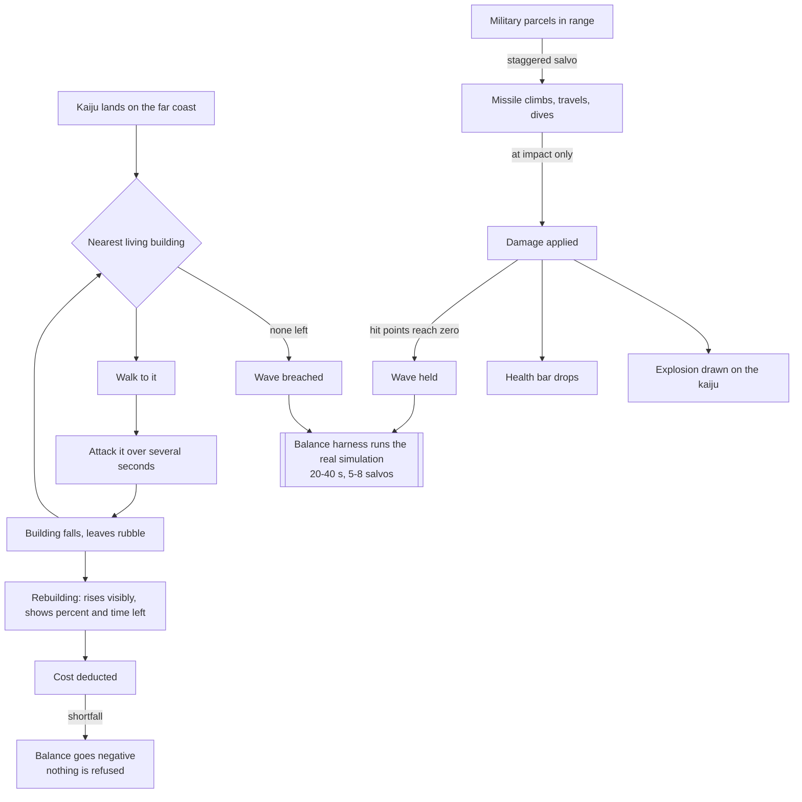

## prod_020_a_wave_the_player_can_actually_watch - A wave the player can actually watch
> Date: 2026-09-01
> Status: Settled
> Related request: `req_029_a_wave_you_can_read_a_kaiju_that_crosses_the_city_missiles_you_can_watch_and_spending_that_never_blocks`
> Related backlog: `item_078_a_kaiju_that_crosses_the_city_instead_of_stopping_on_the_first_building`
> Related task: `task_031_make_the_wave_readable_a_kaiju_that_crosses_the_city_missiles_you_can_watch_and_spending_that_never_blocks`
> Related architecture: (none yet)
> Reminder: Update status, linked refs, scope, decisions, success signals, and open questions when you edit this doc.
> Indicators reviewed: 2026-09-01 11:47:26

# Overview
The attack slice shipped every part it promised and none of them are legible. The kaiju lands and the wave ends on the first building it touches, so nothing is crossed and nothing is chosen. The batteries answer with a yellow wire that points at where the monster used to be. A well-defended first wave is over in ten seconds, and the harness that is supposed to prove the balance never runs the game. Meanwhile a building goes up as a stub at a fixed height for a minute, and costs nothing, because the price was removed along with the queue that refused to build. This brief is the pass that turns those mechanisms into something a player can read: a monster that crosses the city building by building, missiles that leave the ground and come down, a fight long enough to have a shape, and money that records what the city spent instead of stopping it from playing.

# Goals
- A wave lasts long enough, and moves far enough, to be watched and reacted to.
- The kaiju chooses again after every kill, which is what makes bait a strategy rather than a note in a brief.
- What the player sees and what the simulation does are the same event: the explosion is where the damage is.
- The balance target is a measured number from the real simulation, not an assertion.
- A building under construction is obviously under construction.
- Money is a reading of the city's health, never a reason the player cannot keep playing.

# Non-goals
- Kaiju target preferences, densities, or several kaiju with different behaviours -- nearest living building is the whole rule for now.
- Ballistic simulation, guided missiles, misses, or interception.
- Consequences of a negative balance: debt, interest, maintenance, service decay, penalties.
- New construction resources -- materials, crews, or anything the player has to supply to a site.
- Per-kind construction durations, which are named as later work and deliberately not built here.
- Reinstating the funding queue that refused to build, which is the soft-lock this pass exists to remove.
- New destruction geometry -- rubble remains what a destroyed building leaves behind.

# Scope and guardrails
- In: the kaiju's targeting loop and the wave's end conditions, the missile rendering and its
  impact, the combat balance and the harness that measures it, the construction readout, and
  building prices that are deducted without ever refusing.
- Out: anything that adds a system rather than correcting one -- new resources, debt consequences,
  kaiju varieties, per-kind durations, ballistics. Each is named as later work and each is a way
  for this pass to stop being deliverable.
- Guardrail: reuse what exists. `Treasury.spend` already allows debt, the destruction and repaint
  path already works, the missile already has a flight time, the damage already lands at impact.
  Nothing here justifies a mechanic built beside one of those.

# Key product decisions
- The kaiju targets the nearest living building and nothing cleverer. Preferences and densities are
  deliberately deferred: the simple rule is what makes bait legible in the first place.
- A wave ends on a death -- the kaiju's, or the last building's. No timer, no morale, no partial
  verdict.
- The funding queue does not come back. Refusing to build was a soft-lock, and the player who most
  needs to build is the one who just lost a wave. The price returns; the refusal does not.
- Money becomes a reading rather than a gate. A negative balance is information, and its
  consequences are a later decision, not this one.

# Success signals
- A first wave against a competent defence runs twenty to forty seconds and five to eight salvos,
  measured by the harness against the real simulation rather than asserted.
- A player watching a wave can say which battery fired, where the missile landed, and which
  building the kaiju is working on.
- A building under construction is never mistaken for a broken one.
- No wave ends because one building fell.

# References
- Product back-reference: `item_078_a_kaiju_that_crosses_the_city_instead_of_stopping_on_the_first_building`
- Task back-reference: `task_031_make_the_wave_readable_a_kaiju_that_crosses_the_city_missiles_you_can_watch_and_spending_that_never_blocks`
