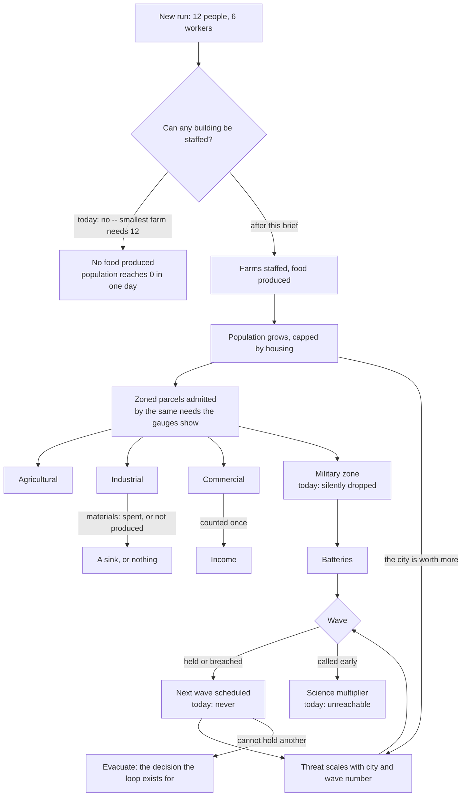

## prod_021_a_run_that_is_more_than_one_wave - A run that is more than one wave
> Date: 2026-09-01
> Status: Proposed
> Related request: `req_030_the_loops_that_never_close_a_run_of_one_wave_a_city_that_starves_on_day_one_and_resources_nothing_consumes`
> Related backlog: `item_082_a_run_that_keeps_going_the_next_wave_a_threat_that_scales_and_a_wave_the_player_can_call`, `item_083_a_starting_city_that_can_staff_a_building_and_feed_itself`, `item_084_resources_that_something_spends_counted_once`, `item_085_a_military_zone_that_builds_something`
> Related task: `task_032_close_the_loops_a_run_of_several_waves_a_city_that_survives_its_first_day_and_resources_that_are_spent`
> Related architecture: (none yet)
> Reminder: Update status, linked refs, scope, decisions, success signals, and open questions when you edit this doc.
> Indicators reviewed: 2026-09-01 10:34:33

# Overview
The survival direction was delivered in seven slices and each of them passed. Put together they do not make a run. The first wave ends and no second one is ever scheduled, so the verdict banner is where the game stops. The threat is the same six hundred hit points whatever the city has become, so growing costs nothing. A wave cannot be called early, so the one decision the science economy prices does not exist. Underneath, a new city cannot staff a single building -- the smallest farm the rules permit needs twelve workers and a starting city has six -- so it starves to zero inside one simulated day. Industry fills a stock nothing spends. Commerce is paid three times for one calculation. A military zone, painted with the brush the wave slice added for exactly this purpose, never builds anything. This brief is not new direction: it is the connective work that turns seven working slices into the loop they were each a part of.

# Goals
- A run is a sequence of waves that gets harder, which is the only thing that makes evacuating a decision.
- A city that grows is a city that is worth more to a kaiju, so expansion is priced rather than free.
- The first minutes of a run are survivable, and the starter kit is the reason rather than the obstacle.
- Every resource the city produces is spent by something, or is not produced.
- One notion of need: what the gauges show is what the rules use.
- Defence can be built the way the brief says it is built -- by urbanising -- through every route the interface offers.

# Non-goals
- New resources, new building kinds, or new districts.
- Kaiju varieties, abilities or resistances.
- The legibility of a wave in progress, which is its own request.
- Reworking prestige, the upgrade web, or what science buys.
- Difficulty settings or an easy mode -- the first wave being survivable is a balance question, not an option.
- Multi-island progression beyond the evacuation that already exists.

# Scope and guardrails
- In: the wave schedule and the threat, the viability of the opening, the resource stocks and what
  spends them, and the zone limits that decide what may be built.
- Out: anything that adds a system. Every defect here is a rule that exists and does not connect to
  the rule beside it, and the fix is the connection.
- Guardrail: measure before changing. Every number in this brief came from executing the real
  simulation modules headlessly, not from reading them, and the same method is what should settle
  the choices it leaves open.

# Key product decisions
- Materials get a sink or stop being produced. Carrying a resource nobody spends is not one of the
  options, and inventing a consumer to justify the stock is the other thing to avoid.
- The threat is derived from the city rather than fixed, because a threat that ignores growth makes
  growth free and makes evacuating arbitrary.
- The opening is survivable as a balance decision, not as a difficulty setting.
- Whether a painted military zone builds is a product answer this brief has to give. Today it is
  answered by a limit of zero, silently and by accident.
- One notion of need. A gauge the rules do not consult is the complaint the survival direction was
  written to fix, and it has reappeared inside it.

# Success signals
- A run plays through several waves, each harder than the last, and ends by a decision rather than
  by a banner the game never leaves.
- A fresh city can staff a building and feed itself through its first simulated day.
- No resource is produced that nothing consumes.
- A player deciding what to build next can read the gauges and be right.

# References
- Product back-reference: `req_030_the_loops_that_never_close_a_run_of_one_wave_a_city_that_starves_on_day_one_and_resources_nothing_consumes`
- Task back-reference: `task_032_close_the_loops_a_run_of_several_waves_a_city_that_survives_its_first_day_and_resources_that_are_spent`
