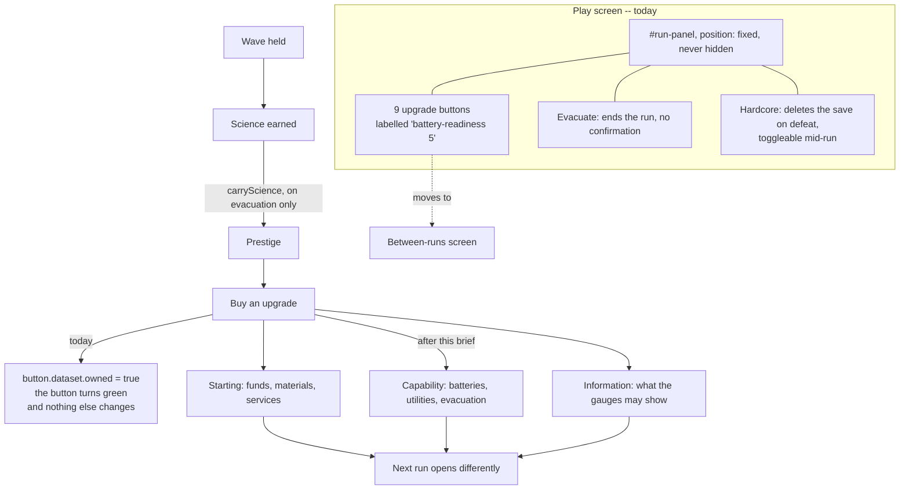

## prod_022_a_purchase_screen_is_not_a_play_screen - A purchase screen is not a play screen
> Date: 2026-09-01
> Status: Settled
> Related request: `req_031_a_panel_that_sells_nothing_nine_upgrades_with_no_effect_permanently_on_the_play_screen`
> Related backlog: `item_086_upgrades_that_do_something_or_upgrades_that_are_not_offered`
> Related task: `task_033_make_the_prestige_web_real_and_take_it_off_the_play_screen`
> Related architecture: (none yet)
> Reminder: Update status, linked refs, scope, decisions, success signals, and open questions when you edit this doc.
> Indicators reviewed: 2026-09-01 14:26:06

# Overview
The run slice put a prestige web on the play screen: nine buttons, labelled with their own source identifiers and a price, fixed in the corner for the whole game. None of the nine does anything. Their identifiers appear twice each in the codebase -- once in the list that declares them, once in the test over that list -- and the only thing owning one changes is the colour of the button. Beside them sit a checkbox that decides whether a defeat deletes the save and a button that ends the run, both one unconfirmed click away, both permanent. The interface slice immediately before this one had just decided that no permanent readout may be added without another being folded away. This brief is that rule applied to the panel that broke it, and the honest treatment of a web that sells nine things and delivers none: make them real, or stop offering them.

# Goals
- Every purchasable thing changes the game, or is not purchasable.
- Prestige is spent where prestige is earned: between runs, not over the city.
- The play screen carries what the player needs while playing and nothing else.
- A control that ends a run or deletes a save is not something a stray click can reach.
- A player who reads the interface as a promise is not being misled.

# Non-goals
- New prestige branches, new currencies, or a larger web -- shrinking it is an acceptable outcome.
- Rebalancing prestige costs beyond what making an upgrade real requires.
- Reworking science, evacuation, or how a run ends.
- A general settings or menu framework.
- Cosmetic restyling of the panel for its own sake.

# Scope and guardrails
- In: what each prestige node does, where the web is displayed, what stays permanently on the play
  screen, and the two destructive controls beside it.
- Out: new branches, new currency, a larger web, or a general menu framework. Shrinking the web is
  an acceptable outcome and often the right one.
- Guardrail: a test that cannot fail is worse than no test. The branch-label assertion is replaced,
  not supplemented.

# Key product decisions
- A node that changes nothing is not purchasable. Four upgrades that work beat nine that do not,
  and removing one is a legitimate answer to making it real.
- Prestige is spent where it is earned. It cannot even change during a run, so a purchase screen
  belongs between runs.
- The interface slice's rule stands and applies to the panel that broke it: nothing becomes
  permanent without something being folded away.
- A control that ends a run or deletes a save is confirmed, or is not reachable by a stray click.

# Success signals
- Every purchasable node changes an observable outcome, proven by a test that fails when the effect
  is removed.
- The play screen carries what a player uses while playing, and the count of permanent elements
  goes down rather than up.
- No destructive control is one unconfirmed click away.

# References
- Product back-reference: `item_086_upgrades_that_do_something_or_upgrades_that_are_not_offered`
- Task back-reference: `task_033_make_the_prestige_web_real_and_take_it_off_the_play_screen`
