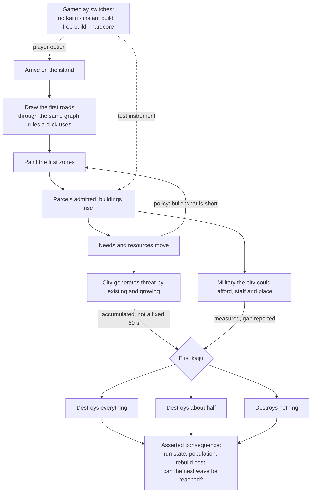

## prod_023_a_game_that_plays_itself_once_before_anyone_believes_it - A game that plays itself, once, before anyone believes it
> Date: 2026-09-01
> Status: Settled
> Related request: `req_032_a_run_played_end_to_end_a_headless_playthrough_a_threat_the_city_generates_and_the_gameplay_switches_that_make_both_testable`
> Related backlog: `item_088_a_harness_that_plays_a_run_from_arrival_to_the_first_kaiju`
> Related task: `task_034_play_a_run_end_to_end_price_the_threat_the_city_makes_and_give_the_settings_a_gameplay_section`
> Related architecture: (none yet)
> Reminder: Update status, linked refs, scope, decisions, success signals, and open questions when you edit this doc.
> Indicators reviewed: 2026-09-01 14:54:14

# Overview
Three requests' worth of defects share one cause: nothing has ever played this game from beginning to end. Every acceptance criterion was checked inside the slice that introduced it, and the failures all live between slices -- a wave that ends too early, a city that starves before the wave arrives, a currency that buys nothing. None of them needs a clever test to find. They need a harness that arrives on the island, draws roads, paints zones, waits for buildings, reads the gauges, builds what they ask for, and meets the first kaiju. This brief is that harness, the two balance questions it makes answerable -- how fast a city brings the wave on itself, and whether the military it can afford is a match for what arrives -- and the gameplay switches that are both a player's options and the harness's instruments: no kaiju, instant construction, free building.

# Goals
- A run is played end to end by something that fails loudly, not by a person noticing.
- The gauges are exercised as instructions, not just displayed -- a harness that follows them proves they can be followed.
- A wave arrives because of what the city did, not because sixty seconds passed.
- The military a city can afford is measured against the kaiju it faces, rather than balanced by feel.
- A player can turn the monster off and build a city, and say so is a mode rather than a bug.
- The switches a tester wants and the options a player wants are the same switches.

# Non-goals
- Replacing the browser interaction suite, which checks that a click draws a road and stays the local gate for rendering.
- A second balance harness beside the one the legibility request rewrites -- there is one, and it is extended.
- New difficulty tiers, campaign structure, or scenario scripting beyond what the harness needs.
- Rendering, animation or anything the player looks at, which the legibility request owns.
- Rebalancing combat duration, which is the legibility request's slice; this brief measures the gap and reports it.
- Turning the gameplay switches into an achievement, scoring or difficulty-modifier system.
- Science scaling. `baseScience: 10 * runState.wave` was written for a game with one wave, and the
  loop-closure request gives it several. A linear ramp is probably fine, and the harness this brief
  builds is what should say so -- a deliberate deferral with a measurement attached, not an oversight.

# Scope and guardrails
- In: a headless playthrough over the real simulation, the rule that decides when a wave arrives,
  the measurement of military capacity against threat, and a Gameplay section in the settings menu.
- Out: fixing the defects the harness finds -- they belong to the requests that own them -- and
  retuning combat, which is the legibility request's. This brief makes the numbers exist.
- Guardrail: one balance harness. The legibility request rewrites `scripts/balance.mjs` onto the
  real simulation; whichever lands first builds it and the other extends it.
- Guardrail: no test-only shortcut past a decision the player has to make. A harness with its own
  copy of a rule proves nothing, which is exactly how the current harness came to prove nothing.

# Key product decisions
- The harness may be written before the fixes rather than after. A harness written after proves the
  fixes; a harness written before proves the harness, and then fails on each known defect in turn.
- Following the gauges is a test, not a convenience. If the needs cannot be followed to a surviving
  city, that is reported -- not tuned away by adjusting the policy until it passes.
- Wave arrival is earned by the city, not scheduled. Sprawl and consolidation have to cost
  differently or neither is a choice.
- The military gap is measured and reported here, and closed elsewhere. Measuring and retuning in
  the same slice is how a number gets fitted to the answer someone already wanted.
- Pacifist is a mode, not a debug flag. What stops accruing without waves is stated in the
  interface rather than left silently inert.

# Success signals
- A run plays end to end in the ordinary test gate and fails loudly at the first step that stops
  being possible.
- The three shapes of a first wave each have an asserted future.
- Two cities played differently bring their waves at different times.
- The military-versus-threat gap is a number in a closeout rather than an opinion.
- A player can switch the kaiju off and keep building.

# References
- Product back-reference: `item_088_a_harness_that_plays_a_run_from_arrival_to_the_first_kaiju`
- Task back-reference: `task_034_play_a_run_end_to_end_price_the_threat_the_city_makes_and_give_the_settings_a_gameplay_section`
