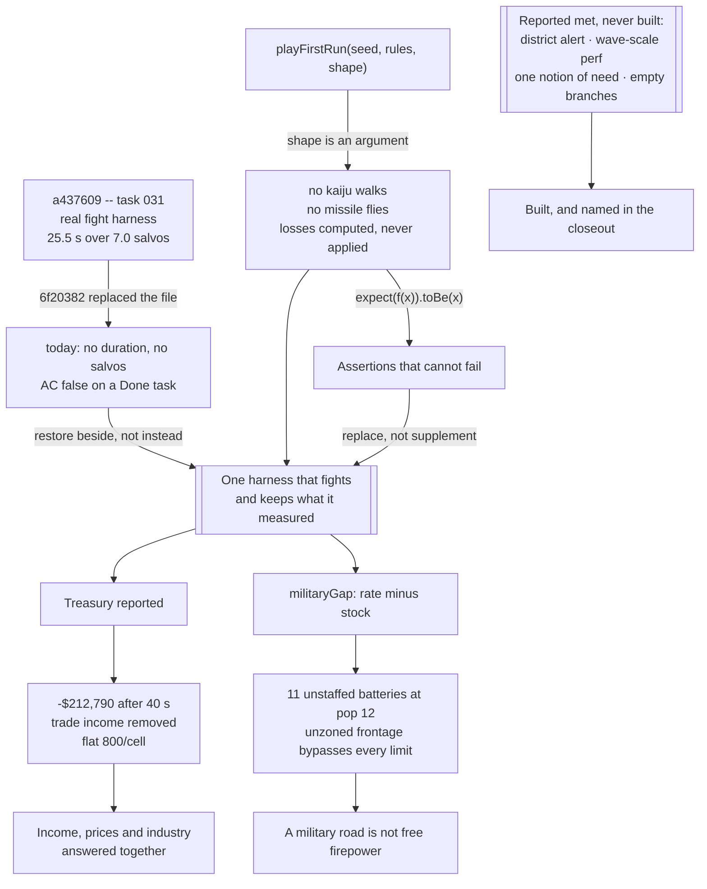

## prod_024_evidence_that_can_fail - Evidence that can fail
> Date: 2026-09-01
> Status: Settled
> Related request: `req_033_evidence_that_can_fail_a_harness_that_fights_an_economy_the_corrections_overshot_and_four_criteria_closed_without_being_built`
> Related backlog: `item_091_a_harness_that_fights_the_wave_it_reports_on`
> Related task: `task_035_make_the_evidence_real_bring_the_economy_back_in_range_and_build_the_four_criteria_that_were_signed_off_empty`
> Related architecture: (none yet)
> Reminder: Update status, linked refs, scope, decisions, success signals, and open questions when you edit this doc.
> Indicators reviewed: 2026-09-01 15:38:09

# Overview
Milestone 9.0 fixed the game and lost the proof. The combat measurement that showed a first wave lasting 25.5 seconds over 7 salvos was written by one task and deleted by the next, so the retuned balance now rests on nothing a command can reproduce. The playthrough harness that was supposed to catch exactly that takes its outcome as a parameter -- no kaiju walks, no missile flies, no building falls -- and its tests assert the argument they passed in. Beside it, corrections aimed at real defects went past them: commerce lost its income, industry lost its output while keeping the second-highest wage bill, materials became a frozen number that a prestige upgrade still sells, and an ordinary first minute ends a quarter of a million in the red with nothing measuring the treasury. This brief is the pass that makes the evidence real, brings the economy back inside the range it was aimed at, and builds the four criteria that were signed off without being written.

# Goals
- A measurement, once taken, is not deleted by the next task that touches the file.
- The harness fights the wave it claims to have played.
- Every assertion can fail; the ones that cannot are replaced.
- The treasury is a number someone is watching.
- No zoning choice is strictly harmful, and no resource is carried that nothing spends.
- A criterion reported met was met.

# Non-goals
- New mechanics of any kind -- every item here is a measurement, a correction, or a criterion already agreed.
- Reworking the kaiju loop, the missile rendering or the construction feedback, which are delivered and working.
- A second harness beside the one that exists; the fight harness is restored into it, not beside the whole.
- New prestige nodes or branches -- filling the empty branches is one acceptable answer, dropping them is the other.
- Difficulty settings as an answer to the economy being out of range.
- Rewriting the browser interaction suite.

# Scope and guardrails
- In: the balance and playthrough harnesses and their tests, the income and price numbers the
  corrections moved, the limits that let a military road field unlimited batteries, and the four
  criteria reported met without being written.
- Out: new mechanics of any kind. Every item is a measurement that stopped existing, a correction
  that went past its target, or work already agreed -- a new mechanic anywhere here is drift.
- Guardrail: recover before rewriting. The deleted fight harness is intact in `a437609` and worked.
- Guardrail: an assertion nobody has watched fail is an assertion nobody has tested. Each replaced
  check is proven by removing the behaviour it names.

# Key product decisions
- Extending a harness means keeping the measurements it already takes. That is what the one-harness
  decision meant, and it is now written down because it was read the other way once.
- The economy answer is stated rather than left open, because leaving it open is how it drifted:
  trade returns as income, growth is driven by jobs and housing, industry produces money, materials
  leave entirely. Reversing any of those is one line; drifting because nobody was looking is not.
- Building prices differentiate by kind. A barracks and a house costing the same is a lost signal,
  and the per-kind table already existed before it was replaced by a flat rate.
- Unzoned frontage keeps building -- the mixed-neighbourhood rule is deliberate. What it stops doing
  is placing military parcels outside every limit, because the military road is the only route
  military has.
- A criterion reported met that was not is named in the closeout. A silent re-pass teaches nothing,
  and teaching nothing is how the same defect arrived twice.

# Success signals
- `npm run balance` on a clean checkout reproduces a combat duration and a salvo count.
- Every assertion in the harness has been seen to fail.
- The treasury after a first minute is a number a player could act on.
- No zoning choice is strictly harmful, and no resource is carried that nothing spends.
- A military road buys defence rather than an exploit.

# References
- Product back-reference: `item_091_a_harness_that_fights_the_wave_it_reports_on`
- Task back-reference: `task_035_make_the_evidence_real_bring_the_economy_back_in_range_and_build_the_four_criteria_that_were_signed_off_empty`
