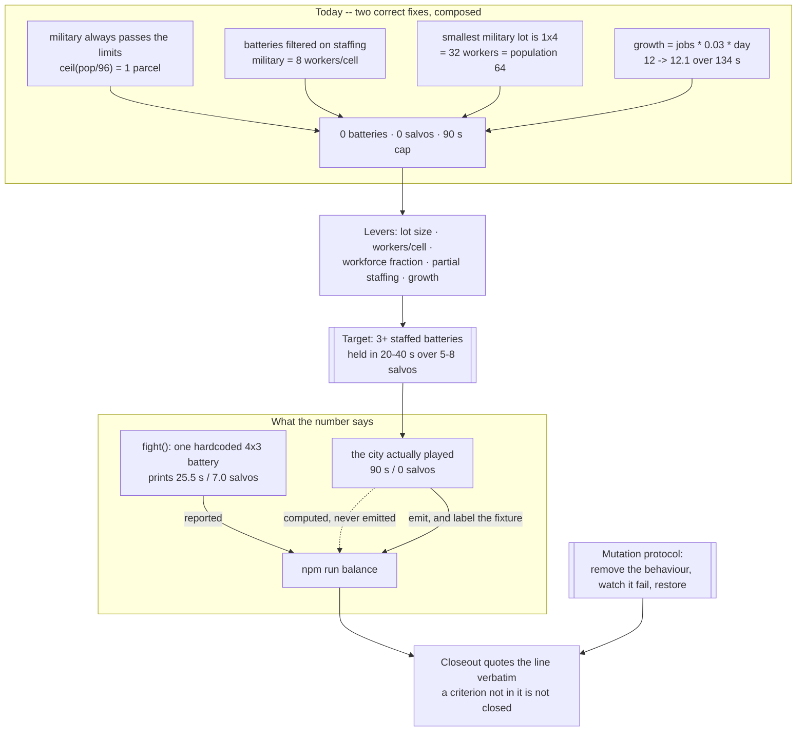

## prod_025_a_first_wave_a_city_can_answer - A first wave a city can answer
> Date: 2026-09-01
> Status: Settled
> Related request: `req_034_a_first_wave_a_city_can_answer_a_defence_that_can_be_fielded_a_harness_that_reports_the_city_it_played_and_checks_that_fail`
> Related backlog: `item_095_a_defence_that_can_actually_be_fielded_and_a_city_that_grows_enough_to_staff_it`
> Related task: `task_036_make_the_first_wave_answerable_report_the_city_that_was_played_and_prove_the_checks_by_breaking_them`
> Related architecture: (none yet)
> Reminder: Update status, linked refs, scope, decisions, success signals, and open questions when you edit this doc.
> Indicators reviewed: 2026-09-01 16:29:39

# Overview
Three correction passes have each fixed what they looked at and missed what happens between two fixes. The latest closed the military exploit twice over -- limits on the road path, staffing on the batteries -- and the two together mean no city can field a single battery before population 64, while the city the harness plays sits at 12.1 and never grows. It fires nothing. The number that says otherwise, 25.5 seconds over 7 salvos, comes from a hardcoded fixture beside the real run, whose own 90 seconds and 0 salvos are computed and never printed. This brief makes the first wave answerable, makes the harness report the city it played rather than the one that flatters it, and replaces the checks that cannot fail with checks that have been watched failing. Every criterion in it is a number a command prints.

# Goals
- A city that builds a military district can defend its first wave.
- A city grows, because every other number in this game is measured on one that does not.
- The harness reports the run it played, and says so when a figure is a fixture.
- Every assertion has been seen to fail.
- One definition per quantity, everywhere.
- A criterion is closed when a command prints the number, not when someone believes it.

# Non-goals
- New mechanics. The one borderline lever -- a partly staffed battery firing at reduced damage -- is offered, not required.
- Reworking the kaiju loop, missile rendering or construction feedback, which are delivered and working.
- Retuning the kaiju's hit points, reload or damage per cell, which are already inside their target; this brief changes what the city can bring, not what it faces.
- New resources, new prestige branches, or a difficulty setting as an answer to a balance problem.
- A second harness. The fixture in `scripts/balance.mjs` is either retired or labelled, never grown.
- Rewriting the browser interaction suite.

# Scope and guardrails
- In: whether a first wave can be answered at all, what `npm run balance` reports, whether the
  assertions can fail, and the services, trade and alert leftovers.
- Out: what the wave brings -- kaiju hit points, reload and damage per cell are inside their target
  and are not touched. This brief changes what the city can bring.
- Guardrail: every criterion is a number a command prints. A criterion whose number is not in the
  final `npm run balance` line is not closed.
- Guardrail: a figure that does not come from the city that was played is labelled as a fixture
  wherever it is printed and wherever it is recorded.
- Guardrail: one definition per quantity. Three copies of the building price exist today; a second
  copy is a defect on sight, not a style preference.

# Key product decisions
- The outcome is fixed, the levers are not. Minimum military lot size, workers per cell, the
  workforce fraction, partial staffing and the growth rate are all available; which ones move is the
  implementer's call, recorded with its numbers.
- Population growth is named as the likely real answer, because every balance figure in this game is
  currently measured on a city of twelve people that does not change.
- Assertions are proven by breaking what they name. Writing an assertion is not testing it, and four
  assertions that cannot fail are in the repository right now to prove the point.
- Services follow materials. The precedent is one field away and one commit old: removed from the
  resources, the saves, the terms, the ledger and the prestige web.
- The two trade formulas are a deletion, not a design question. The ledger displays what the
  treasury receives.

# Success signals
- `npm run balance` prints a line in which every acceptance target can be read.
- A city that zoned a military district holds its first wave.
- No figure in a closeout comes from anywhere but a command run on the committed branch.
- `grep -rn alert src` returns something.

# References
- Product back-reference: `item_095_a_defence_that_can_actually_be_fielded_and_a_city_that_grows_enough_to_staff_it`
- Task back-reference: `task_036_make_the_first_wave_answerable_report_the_city_that_was_played_and_prove_the_checks_by_breaking_them`
