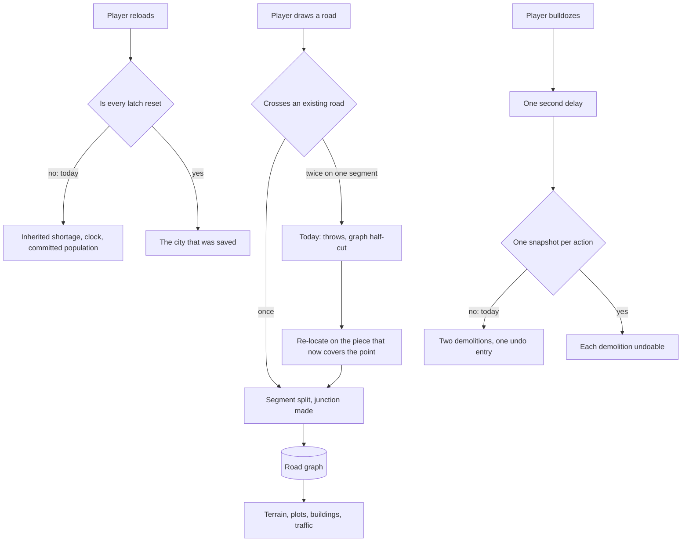

## prod_026_a_city_that_survives_the_roads_you_draw_on_it - A city that survives the roads you draw on it
> Date: 2026-09-03
> Status: Settled
> Related request: `req_035_fix_the_correctness_defects_the_0_4_0_review_found`
> Related backlog: `item_099_cut_a_segment_as_many_times_as_one_road_crosses_it`
> Related task: `task_037_orchestrate_the_0_4_0_correctness_fixes`
> Related architecture: (none yet)
> Reminder: Update status, linked refs, scope, decisions, success signals, and open questions when you edit this doc.
> Indicators reviewed: 2026-09-03 13:13:53

# Overview
The city keeps its shape through a second crossing, a reload, and an undo.

# Goals
- A drawn road either lands whole or changes nothing.
- A reloaded city carries no state from the run before it.
- An undo returns exactly the action the player just took.
- Production and the building agree on whether a lot is staffed.

# Non-goals
- Exact Bezier intersection solving in place of the sampled crossing search.
- Rebalancing the economy, which req_036 owns.
- Splitting any module, which req_039 owns.
- Reducing per-frame cost, which req_037 owns.

# Scope and guardrails
- In: Correctness defects in the road graph, the economy, the heightmap and the demolition path.
- A regression test for each, written so it fails without the fix.
- Out: Balance tuning, per-frame cost and module structure, which req_036, req_037 and req_039 own.
- Exact Bezier intersection solving in place of the sampled crossing search.

# Key product decisions
- A road either lands whole or changes nothing: no path may mutate the graph and then report failure.
- A crossing is re-located geometrically after a split, never carried across it arithmetically -- the halves are resampled on purpose.
- A derived value stays derived: the utility mask is re-laid from the item list rather than subtracted from.
- Per ADR 030, the one-line fixes whose reasoning fits at the declaration are one slice, not nine chains.

# Success signals
- A road crossing another twice splits it twice, and the drawn road appears.
- A reloaded city reports no shortage, clock or committed population from the run before.
- Two bulldozes within a second are two undo entries.
- Production and the building agree on every lot's staffing.

# Open questions
- Findings behind item_102, item_103, item_104 and item_105 were reported by review agents and are NOT reproduced. Write the failing test first; if it passes, the finding was wrong and the item closes as no-change rather than being implemented anyway.
- item_107: returning a read-only view from node()/allNodes() may touch too many callers to be worth it. If so, is documenting the invariant at the declaration an acceptable close, or does the item stay open?
- item_101 changes what a load resets. Confirm no saved city in the wild depends on a latch surviving a reload before landing it.

# References
- Product back-reference: `item_099_cut_a_segment_as_many_times_as_one_road_crosses_it`
- Task back-reference: `task_037_orchestrate_the_0_4_0_correctness_fixes`
