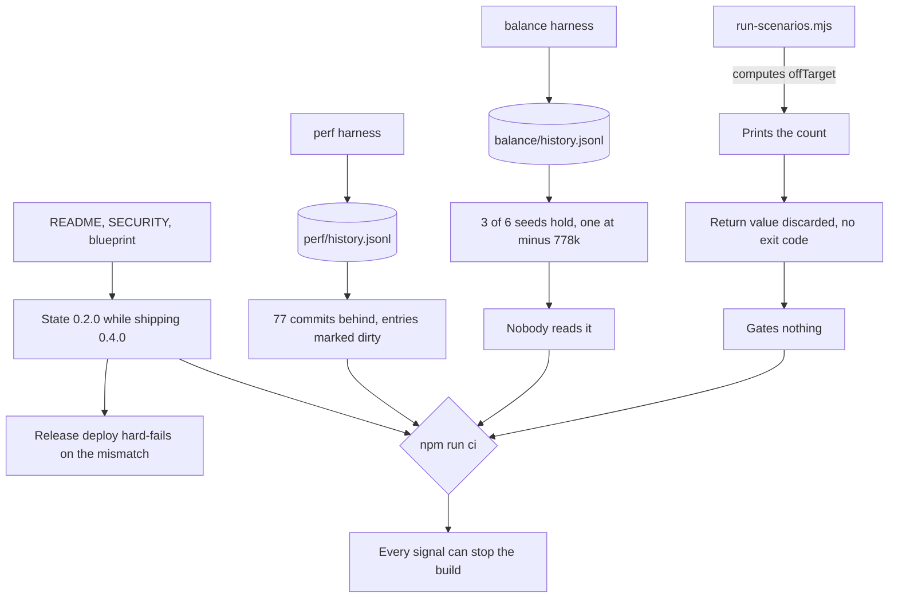

## prod_027_evidence_that_stops_the_build - Evidence that stops the build
> Date: 2026-09-03
> Status: Proposed
> Related request: `req_036_make_the_verification_gates_able_to_fail`
> Related backlog: item_108_let_the_scenario_harness_exit_non_zero, item_109_bring_the_first_run_back_inside_its_declared_band, item_110_refuse_a_performance_measurement_from_a_dirty_tree, item_111_fail_the_gate_when_a_shipped_document_misstates_the_version, item_112_run_the_ci_gate_once_per_push_and_from_a_clean_clone, item_132_stop_a_city_with_no_utilities_dying_outright
> Related task: `task_038_orchestrate_the_verification_gates`
> Related architecture: (none yet)
> Reminder: Update status, linked refs, scope, decisions, success signals, and open questions when you edit this doc.

# Overview
Every harness that produces a signal can fail the gate that reads it.

# Goals
- A harness that finds a problem stops the build.
- The recorded evidence matches the commit that is shipping.
- A shipped document cannot contradict package.json.
- The gate a contributor is told to run works from a clean clone.

# Non-goals
- Moving the browser interaction or visual suites into GitHub Actions; CONTRIBUTING.md:48 settles that.
- Adding new measurement harnesses.
- Fixing the frame cost itself, which req_037 owns.
- Hardening the deploy workflow, which req_038 owns.

# Scope and guardrails
- In: The exit code of the scenario harness, the balance band, the freshness of the performance record.
- A scripted version check across the documents that state a version.
- The CI trigger, concurrency and clean-clone reproducibility.
- Out: Moving the browser interaction or visual suites into GitHub Actions; CONTRIBUTING.md:48 settles that with a GPU argument that still holds.
- Adding new measurement harnesses.

# Key product decisions
- A harness that produces a signal must be able to fail the gate that reads it.
- A gate is wired in only once it passes: a permanently red gate is not a gate.
- A non-reproducible measurement is worse than an absent one, so a dirty tree may not write the record.
- A document stating a version is checked by a script, not by remembering.

# Success signals
- A wave outside the band exits non-zero and names the seed.
- No seed ends an order of magnitude outside the others.
- The performance record describes a commit that is shipping.
- npm ci then npm run ci passes on a fresh clone, once.

# Open questions
- item_109: the combat band is met by every wave that actually happens (salvos 6, 7, 7; combat 21.5 to 25.25 s in the last recorded run). The failure is that three of six seeds never reach the population bar within the hour, and one bleeds 778k while doing it. So this is a growth and spend problem, not a tuning problem -- do not touch the band until the growth failure is explained.
- item_109 may be a duplicate of req_035 item_102. If landing the workforce authority brings the band back on its own, does item_109 close as resolved-by or stay open for the remaining seeds?
- item_112 moves logics-manager into devDependencies. Confirm the pinned 2.23.0 is the intended version to carry in the manifest rather than tracking a range.

# References
- Product back-reference: `req_036_make_the_verification_gates_able_to_fail`
- Task back-reference: `task_038_orchestrate_the_verification_gates`
