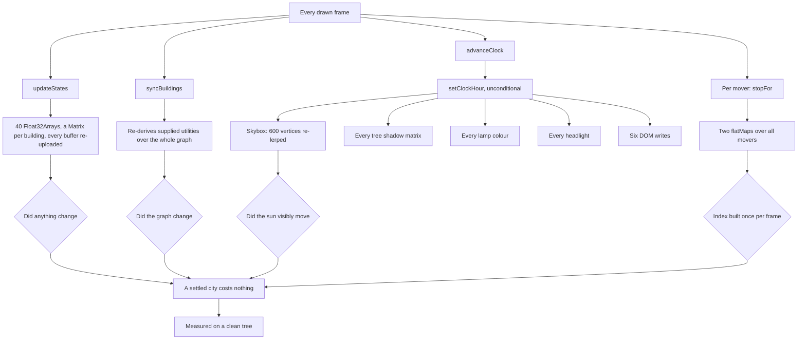

## prod_028_a_city_that_costs_what_it_is_changing - A city that costs what it is changing
> Date: 2026-09-03
> Status: Proposed
> Related request: `req_037_stop_paying_every_frame_for_a_city_that_is_not_changing`
> Related backlog: `item_113_gate_the_building_state_upload_on_a_change_signature`, `item_114_derive_the_supplied_utility_set_only_when_it_can_have_changed`, `item_115_fan_the_sun_out_once_per_visible_step`, `item_116_build_the_yield_and_crossing_occupancy_once_per_frame`, `item_117_re_resolve_a_mover_s_segment_after_a_rebuild`, `item_118_show_the_frame_cost_came_down`
> Related task: `task_039_orchestrate_the_per_frame_cost_work`
> Related architecture: (none yet)
> Reminder: Update status, linked refs, scope, decisions, success signals, and open questions when you edit this doc.

# Overview
Per-frame work is proportional to what moved, not to what exists.

# Goals
- A settled city redraws for free.
- The sun costs one fan-out per visible step.
- Yielding is derived once per frame.
- The improvement is measured, not asserted.

# Non-goals
- Level-of-detail systems beyond the three thresholds at src/render/detail.ts:14.
- Spatial indexing for the road graph.
- Splitting traffic.ts or buildings.ts, which req_039 owns.
- Changing what the simulation computes.

# Scope and guardrails
- In: The per-frame cost of drawing a city nobody is editing.
- The sun fan-out, the yield scans and the state upload.
- A measured before and after on a clean tree.
- Out: Changing what the simulation computes or what anything looks like.
- Level-of-detail work beyond the three thresholds already at src/render/detail.ts:14.
- Splitting the render modules, which req_039 owns.

# Key product decisions
- Per-frame work is proportional to what changed, not to what exists.
- The signature pattern already in the renderer (decorKey) is the model to follow, not a new mechanism.
- The traffic hot path stays allocation-free, as it already is.
- No improvement is claimed without a clean-tree measurement against a recorded baseline.

# Success signals
- A settled city performs no instance upload between frames.
- A construction stage still updates within a frame of changing.
- Yielding derives its index once per frame, not once per mover.
- A recorded measurement shows the change, including any metric that did not improve.

# Open questions
- item_116: what was the discarded ringEntryRadius for? Computed and dropped at both places that decide whether to yield (traffic.ts:1061 and :1131), which reads as a dropped guard rather than dead code. Needs archaeology in git history before either using or deleting it -- and if it was a real guard, the yielding behaviour has been wrong, which is a defect for req_035 rather than a cleanup here.
- How much of a per-frame saving justifies the added signature complexity? No threshold is set, so item_118's measurement is the arbiter and a null result is a legitimate outcome.

# References
- Product back-reference: `req_037_stop_paying_every_frame_for_a_city_that_is_not_changing`
- Task back-reference: `task_039_orchestrate_the_per_frame_cost_work`
