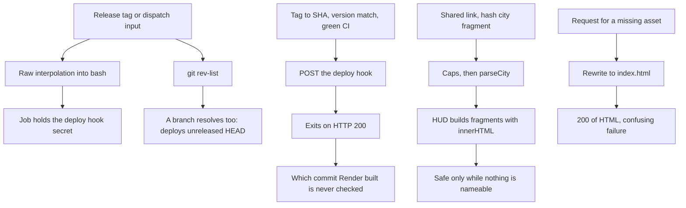

## prod_029_a_release_that_proves_it_shipped_and_a_link_that_cannot_write_to_the_page - A release that proves it shipped, and a link that cannot write to the page
> Date: 2026-09-03
> Status: Proposed
> Related request: `req_038_harden_the_release_path_and_the_shared_link_surface`
> Related backlog: item_119_take_the_release_tag_out_of_the_shell_and_refuse_a_branch, item_120_establish_whether_the_deploy_hook_honours_the_commit_then_verify_the_outcome, item_121_render_a_loaded_city_as_text_and_say_so_in_the_threat_model, item_122_let_a_missing_asset_be_missing, item_123_derive_the_asset_version_instead_of_maintaining_two_by_hand, item_134_configure_the_release_contract_and_record_what_shipped, item_136_decide_whether_the_fifteen_commits_past_0_4_0_are_a_release
> Related task: `task_040_orchestrate_the_release_and_client_hardening`
> Related architecture: (none yet)
> Reminder: Update status, linked refs, scope, decisions, success signals, and open questions when you edit this doc.
> Indicators reviewed: 2026-09-03 11:51:00

# Overview
The deploy path verifies its own outcome and the client renders untrusted cities as text.

# Goals
- A tag cannot inject shell or name a branch.
- A deploy reports what it actually deployed.
- A shared city is rendered as text, always.
- A missing file is diagnosable.

# Non-goals
- Link shortening, galleries, cloud saves or accounts, which docs/shared-link-threat-model.md:25 puts out of scope.
- Replacing Render or adding a server.
- Dropping the immutable cache on the building assets, which is correct as it stands.
- Changing parseCity's validation.

# Scope and guardrails
- In: The deploy job's handling of the tag and of its own outcome.
- How a value from a loaded city reaches the DOM, and the policy behind it.
- The static host's rewrite and the asset version constants.
- Out: Link shortening, galleries, cloud saves or accounts, which the threat model puts out of scope.
- Replacing Render or adding a server, which ADR 004 settles.
- Dropping the immutable cache on the building assets, which the version query parameter already makes correct.

# Key product decisions
- A deploy that cannot be verified is a deploy that is not verified: establish what the hook honours before trusting the checks upstream of it.
- A tag reaches the shell through env, never through template interpolation, in a job that holds a secret.
- A value from a loaded city is rendered as text, always -- fixed while it is still free, before naming makes it a vector.
- The threat model covers rendering, not only parsing.

# Success signals
- A dispatch naming a branch is refused before anything deploys.
- A deploy of the wrong commit fails the job, or the limit is documented where a reader will find it.
- No city-derived value reaches the DOM through innerHTML.
- A missing asset returns 404 rather than 200 HTML.

# Open questions
- item_120 is closed as a question and proven against the live service: all three deploy_hook deploys landed exactly on the v0.2.0, v0.3.0 and v0.4.0 tag commits with autoDeploy off, so ?ref= is honoured on this static site. Production is b7f551cf, exactly v0.4.0. The remaining work is polling the outcome, because the same history holds two build_failed deploys -- a release reported successful while its build failed has already happened here.
- item_121: will a CSP break the inline style block or the four-line inline script in index.html? Untested. The policy may need a hash or nonce, or the style may need extracting -- but the policy is not to be dropped to avoid the question.
- item_122: is there any intended future client-side routing? Removing the SPA rewrite is only free if the answer is no.

# References
- Product back-reference: `req_038_harden_the_release_path_and_the_shared_link_surface`
- Task back-reference: `task_040_orchestrate_the_release_and_client_hardening`
