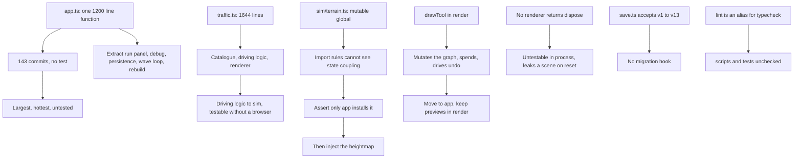

## prod_030_a_codebase_whose_seams_are_where_the_tests_can_reach - A codebase whose seams are where the tests can reach
> Date: 2026-09-03
> Status: Settled
> Related request: `req_039_give_the_code_its_seams_back`
> Related backlog: `item_124_take_the_isolated_pieces_out_of_startapp`
> Related task: `task_041_orchestrate_the_structural_work`
> Related architecture: adr_006_move_the_driving_logic_to_sim_when_its_tests_exist_not_before
> Reminder: Update status, linked refs, scope, decisions, success signals, and open questions when you edit this doc.
> Indicators reviewed: 2026-09-04 16:05:27

# Overview
The modules that change most often become the ones a test can hold.

# Goals
- The highest-churn code is testable.
- Couplings are visible to a test or injected away.
- The save format can migrate.
- The conventions in use are written down.

# Non-goals
- An engine facade, ECS, state framework or dependency-injection layer; LOGICS.md forbids these without a measured need and an architecture decision.
- Changing any behaviour: this chain is structural and every existing test must stay green unchanged.
- Rewriting the render pipeline.
- Starting before req_035 through req_038 are done.

# Scope and guardrails
- In: Module boundaries in app and render, and the couplings no architecture rule can see.
- A teardown contract, a save migration hook, and real linting.
- Writing down the conventions the code already follows.
- Out: An engine facade, ECS, state framework or DI layer; LOGICS.md forbids these without a measured need and an ADR.
- Any behaviour change: every existing test must stay green unedited.
- Starting before req_035 through req_038 are done.

# Key product decisions
- Structure work comes last: app.ts carries 143 commits, and refactoring it early turns every fix in the other chains into a conflict.
- A coupling no test can see is either injected away or asserted against; the three-line assertion lands first because it stops the spread today.
- A seam is proven before it is cut -- the traffic split follows functions that are already exported and unit-tested.
- An existing test needing an edit is a signal to stop and reconsider the seam, not to edit the test.

# Success signals
- The driving logic has unit tests that run without a browser.
- A call to setTerrain outside app fails the architecture test.
- A create-dispose-create cycle leaks nothing.
- npm run lint runs a real linter over src, scripts and tests.

# Open questions
- item_125 is no longer an open question: adr_006 splits it into three steps and gates the third on an observable condition -- the driving logic moves to sim if and only if headless tests for it exist and pass. Verified that nothing blocks it: Mover carries one Babylon field, Ride is platform-neutral, and the two render imports are three constants and a pure predicate. An implementer may act on the gate without asking.
- item_129 is decided by the project's own document, not open: docs/shared-link-threat-model.md:20 states that only the shared payload is quantised and local saves keep full precision. Zones.toJSON writing back key x KEY_STEP contradicts that control, so it is a defect. save.test.ts:61 passes only because it re-quantises to compare.
- item_130: which linter? Biome is the suggestion -- one dependency for lint and format -- but ESLint plus Prettier is the conventional pair. Not decided.
- item_126 and item_127 may warrant ADRs rather than only backlog items. The runner may decide: raise one if the change alters what a layer may depend on, otherwise the backlog item is the record. Recorded as arbitration in task_041.

# References
- Product back-reference: `item_124_take_the_isolated_pieces_out_of_startapp`
- Task back-reference: `task_041_orchestrate_the_structural_work`
