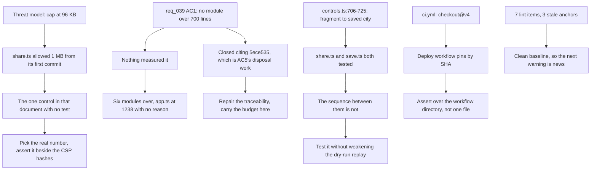

## prod_031_gates_that_check_what_they_claim - Gates that check what they claim
> Date: 2026-09-04
> Status: Settled
> Related request: `req_040_close_the_gaps_the_0_4_0_corpus_review_found_in_the_gates_that_were_meant_to_catch_them`
> Related backlog: `item_136_make_the_shared_link_decompression_cap_the_number_the_threat_model_states`
> Related task: `task_042_orchestrate_the_review_findings_work`
> Related architecture: (none yet)
> Reminder: Update status, linked refs, scope, decisions, success signals, and open questions when you edit this doc.
> Indicators reviewed: 2026-09-04 17:03:45

# Overview
An assurance is only as strong as the thing that fails when it stops being true.

The 0.4.0 corpus review found the product sound and its assurances slightly overstated. A threat model names a decompression cap the code has never enforced, a closed request asserts a module size budget nothing measures and cites the wrong commit as proof, and the sequence that turns an untrusted shared link into a saved city has no test. None of this is a live defect. All of it is a gate that reads as stronger than it is, which is the one thing this repo's architecture tests were built to prevent.

# Goals
- Every documented security control is enforced by something that fails when it stops being true.
- A closed acceptance criterion is one a reader can verify from its own proof.
- The trust boundary between a shared link and a saved city is covered end to end.
- Static analysis and the Logics audit are both clean, so a new warning means something new.

# Non-goals
- Putting the browser interaction suite, the visual check or the perf run back on the push trigger; req_006 AC2 settled that against operator quota.
- Reopening parseCity's validation or the immutable building cache headers, which req_038 recorded as correct as they stand.
- Rewriting the streaming decompression mechanism, which is correct; only its limit is wrong.
- Finishing the decomposition of startApp as a goal in itself, rather than recording or meeting a size budget.

# Scope and guardrails
- In: the documented controls, acceptance proofs, module budget and trust-boundary coverage the 0.4.0 review found unenforced.
- Out: any new assurance the operator's CI quota cannot pay for, and any gate whose cost was already weighed and declined.
- A gate that cannot fail is worse than no gate: it spends the reader's trust without earning it.

# Key product decisions
- Where a document and the code disagree, decide which one is the control before changing either. The document is not automatically right.
- An assurance is kept where it would be undone -- a test beside the constant, a reason at the declaration -- not in prose that drifts away from it.
- ADR 030 still applies: fixes whose record is the change itself are gathered in one slice rather than given chains of their own.

# Success signals
- Every control in docs/shared-link-threat-model.md has something that fails when it stops being true.
- A reader can verify each closed acceptance criterion from the proof it cites, without reading the neighbouring criteria.
- A crafted shared link is refused by a test, not only by inspection.
- biome lint and logics-manager audit are clean, so the next warning is news.

# References
- Product back-reference: `item_136_make_the_shared_link_decompression_cap_the_number_the_threat_model_states`
- Task back-reference: `task_042_orchestrate_the_review_findings_work`
