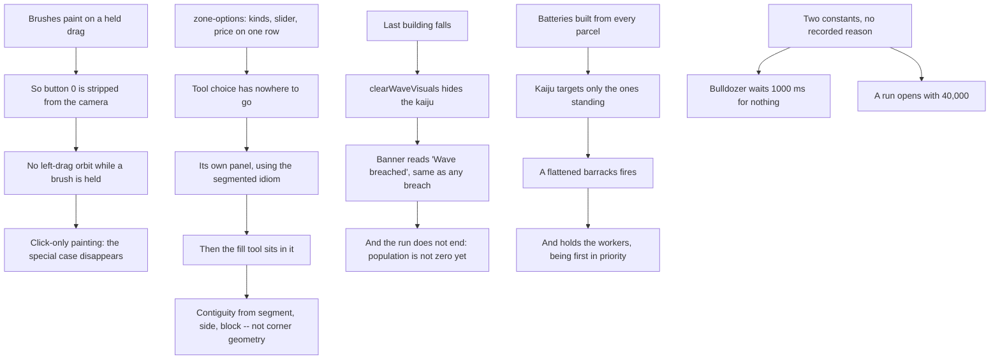

## prod_032_tools_that_stay_out_of_the_way_and_a_wave_whose_aftermath_the_player_can_read - Tools that stay out of the way, and a wave whose aftermath the player can read
> Date: 2026-09-04
> Status: Proposed
> Related request: `req_041_what_playing_0_4_0_turned_up_in_the_zoning_tools_the_brush_surface_and_the_wave_s_aftermath`
> Related backlog: `item_143_zone_a_contiguous_run_of_lots_from_one_click`, `item_144_put_the_zoning_tool_choice_in_its_own_panel`, `item_145_make_the_brushes_click_only_and_give_the_left_drag_back_to_the_camera`, `item_146_open_the_zone_brush_at_the_minimum_of_its_own_slider`, `item_147_make_evacuating_leave_the_island`, `item_148_say_that_the_city_was_levelled_and_decide_what_happens_to_the_kaiju`, `item_149_stop_a_barracks_in_rubble_from_firing_and_from_holding_its_workers`, `item_150_drop_the_second_the_bulldozer_waits_for_nothing`, `item_151_open_a_run_with_a_treasury_that_can_build_a_city`
> Related task: `task_043_orchestrate_the_zoning_brush_surface_and_wave_aftermath_work`
> Related architecture: (none yet)
> Reminder: Update status, linked refs, scope, decisions, success signals, and open questions when you edit this doc.

# Overview
A tool the player has to work around, and a wave that stops explaining itself.

Nine things came out of playing 0.4.0, and they fall into three groups. The zoning surface asks the player to brush over a shape the roads already define, hides the choice of tool among that tool's own settings, and takes the left drag off the camera for as long as a brush is selected. The wave stops explaining itself once buildings start falling: a levelled city gives the same three-word banner as a glancing breach, and the barracks that was flattened keeps firing while starving the survivors of workers. And two bare constants nobody wrote a reason for shape how the game feels before any of that -- a bulldozer that waits a second for nothing, and an opening treasury that decides what the player can build at all.

# Goals
- What the player sees after a wave matches what the run state actually is.
- A building that is rubble is rubble to every system that reads it -- targeting, firepower and workforce alike.
- Zoning a shape the roads already define costs one click.
- A deliberate exit from a run completes in one decision.
- A tool's controls never stand between the player and the camera.
- A constant that shapes how the game feels carries the reason it was chosen.

# Non-goals
- Reworking the wave's difficulty curve; the balance band moves only as a consequence of the rubble fix, and is recorded when it does.
- The tree spray brush's own default radius, which has the same shape as the zone brush's but is not what was asked for.
- Changing how science converts to prestige, which already works.
- Making the kaiju retreat, patrol or behave differently once it runs out of targets, beyond deciding what the player is shown.
- Redesigning the toolbar or the action dock beyond giving the zoning tool choice its own place.
- Removing middle- and right-drag camera control, which already works.

# Scope and guardrails
- In: the zoning tool surface, the pointer contract the brushes hold, what the player is told once buildings start falling, and the two constants that shape the opening of a run.
- Out: the wave difficulty curve, which moves only as a consequence of the rubble and treasury fixes and is recorded when it does.
- A tool's own controls never take an input away from the camera. If a tool needs the left drag, that is a reason to change the tool.

# Key product decisions
- A destroyed building is destroyed to every system that reads it. Targeting already knows; firepower and workforce did not.
- Contiguity for zoning is decided against the structure the lots already carry -- segment, side, block -- not against corner geometry, because geometric contiguity would zone a whole connected city from one click.
- A constant that shapes how the game feels carries its reason at the declaration, per the `ponytail:` convention in CONTRIBUTING.md. Both constants in this chain arrived without one.
- The balance band is re-measured once, for the two slices that move it together, rather than designed around.

# Success signals
- A levelled city and a glancing breach do not read the same way.
- A flattened barracks fires nothing and holds no one.
- A district the roads already define is zoned in one click, and the left drag turns the camera whatever tool is held.
- npm run scenarios reports a band, and its reason is recorded when it moves.

# References
- Product back-reference: `req_041_what_playing_0_4_0_turned_up_in_the_zoning_tools_the_brush_surface_and_the_wave_s_aftermath`
- Task back-reference: `task_043_orchestrate_the_zoning_brush_surface_and_wave_aftermath_work`
