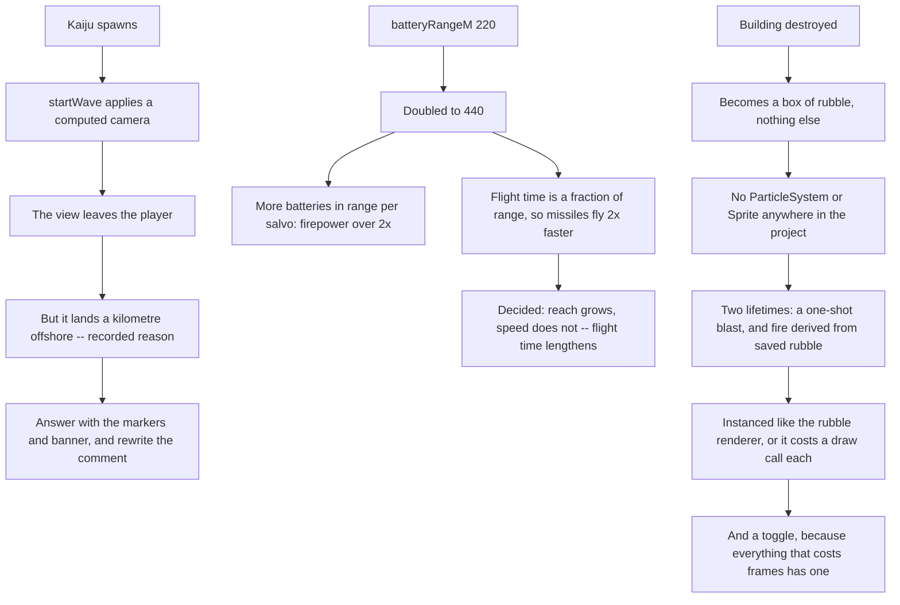

## prod_033_a_wave_you_watch_on_your_own_terms - A wave you watch on your own terms
> Date: 2026-09-04
> Status: Settled
> Related request: `req_042_let_the_player_keep_the_camera_let_the_batteries_reach_and_show_a_destroyed_building_burning`
> Related backlog: `item_152_stop_a_spawning_kaiju_from_taking_the_camera`
> Related task: `task_044_orchestrate_the_camera_battery_reach_and_destruction_effects_work`
> Related architecture: (none yet)
> Reminder: Update status, linked refs, scope, decisions, success signals, and open questions when you edit this doc.
> Indicators reviewed: 2026-09-04 22:12:15

# Overview
The wave takes the player's view, the batteries cannot reach, and nothing burns.

Playing 0.4.0, the wave takes things from the player and gives little back. It seizes the camera the moment a kaiju spawns, which fights the promise that any pan hands control straight back. The batteries it asks the player to build cannot reach far enough to matter. And a building being destroyed -- the whole point of the wave -- is a mesh that changes into a box of rubble, with no explosion and nothing burning. Two smaller things sit alongside: a camera setting filed under World, and an FPS counter that pushes the Wave panel down the screen instead of sitting beside it.

# Goals
- The player chooses where to look, and the game tells them where to look instead of moving them.
- A defence the player paid for reaches the thing it is defending against.
- Destruction reads as destruction, at a cost the frame budget can pay.
- Anything that costs frames can be turned off, and a setting is filed where its subject lives.

# Non-goals
- Retuning the wave difficulty curve; the balance band moves as a consequence of the range change and is recorded when it does.
- Reworking the right-hand column's stacking contract, which already solved the overlap problem and must keep working.
- A general particle framework; the two effects this chain needs, built the way the rubble renderer is built.
- Removing the landing markers or the wave banner, which are how the player is told a wave has started.

# Scope and guardrails
- In: what a wave does to the camera, how far a battery reaches, what is drawn when a building is destroyed, and where two HUD controls live.
- Out: the wave difficulty curve, which moves as a consequence of the range change and is recorded when it does.
- The player's view is theirs. Tell them where to look; do not move them there.
- An effect that costs frames answers to the machinery already in place -- the detail culler, the frame cap, a settings toggle and a dispose -- or it does not ship.

# Key product decisions
- A duration expressed as a fraction of a distance is not a speed. Doubling the battery range doubled missile speed as a side effect; the decision taken is that reach grows and speed does not, so the flight time lengthens with the range and the formula stops dividing by it.
- The explosion and the rubble fire are two effects, not one: an event with its own clock, and a state derived from rubble that has to survive a save and a reload.
- New visual effects are built the way the rubble renderer is built -- instanced, one draw call for all of them -- because docs/performance.md measured that objects drawn one at a time are what costs.
- The right-hand column's flow contract stays: hidden panels take no room, and no panel regains a top of its own.
- When a behaviour changes, the comment that recorded the old behaviour is rewritten, not left standing. The camera jump's reason is part of the deliverable that removes the jump.

# Success signals
- A wave starts and the camera has not moved, and the player still knows where the kaiju landed.
- A barracks defends the city it stands in.
- A building destroyed explodes, its rubble burns, and npm run perf does not report a new per-building cost.
- Both effects can be switched off, and off means nothing is drawn or stepped.

# References
- Product back-reference: `item_152_stop_a_spawning_kaiju_from_taking_the_camera`
- Task back-reference: `task_044_orchestrate_the_camera_battery_reach_and_destruction_effects_work`
