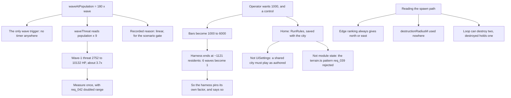

## prod_034_a_wave_the_player_sets_the_terms_of - A wave the player sets the terms of
> Date: 2026-09-04
> Status: Proposed
> Related request: `req_043_let_the_player_set_the_bar_a_kaiju_comes_for_and_fix_what_reading_the_spawn_path_turned_up`
> Related backlog: `item_158_make_the_residents_bar_a_run_rule_defaulting_to_1000`, `item_159_keep_the_scenario_gate_measuring_six_waves_once_the_bar_moves`, `item_160_let_a_kaiju_land_on_any_edge_of_the_map`, `item_161_settle_the_two_loose_ends_in_the_assault_code`
> Related task: `task_045_orchestrate_the_residents_bar_and_spawn_path_work`
> Related architecture: (none yet)
> Reminder: Update status, linked refs, scope, decisions, success signals, and open questions when you edit this doc.

# Overview
One hardcoded number decides when the island notices you, and it is load-bearing three ways.

The bar a city has to cross before a kaiju comes for it is 180 residents per wave, hardcoded, and the operator wants 1000 and a control to change it. That single number is load-bearing in three directions at once: it is the only wave trigger in the game, it feeds the threat formula so a taller bar also means a bigger monster, and the reason it is 180 is written in the code and points at the scenario gate. Reading the spawn path end to end to answer that also turned up three smaller things -- a kaiju that can only ever land on two of four edges, a constant that does nothing, and a function whose return type cannot carry what its loop can produce.

# Goals
- The player sets when the island notices them, and that choice travels with their city.
- A number the simulation reads is passed to it, not left in module state for a setter to forget.
- The scenario gate keeps measuring six waves, and any value it pins for itself is written down.
- The whole map is a possible landing.

# Non-goals
- Reworking the threat formula, the approach geometry or the attack cycle; the bar moves, and what that does to the threat is measured rather than compensated for.
- Replacing the deterministic seed hash with real randomness -- the scenario harness depends on reproducibility.
- Making the coast ring follow the real coastline, which is a separate question the widened edges only make more visible.
- A migration hook for the save format; a defaulted rule needs none, and SAVE_VERSION stays where it is.

# Scope and guardrails
- In: the wave trigger and who sets it, where that value lives, what it does to the balance gate, and the three defects reading the spawn path turned up.
- Out: the threat formula, the approach geometry and the attack cycle -- the bar moves and the consequences are measured, not compensated for.
- A number the simulation reads is passed to it. Module state that a setter must remember is the src/sim/terrain.ts pattern, and req_039 recorded why no architecture rule can see it.
- A gameplay value the player sets travels inside the save, because a shared city must play the way its author built it.

# Key product decisions
- The bar's linear shape stays; only its factor becomes a rule. The shape was chosen for the scenario gate and that reasoning still holds.
- The scenario harness pins the factor it needs and says so where it sets it. A harness quietly running different numbers from the game is only safe when the difference is written down.
- Raising the bar also raises the threat, because waveThreat reads population. That is a consequence to measure once -- alongside req_042's battery range -- not to tune away.
- Widening the landing edges keeps the deterministic seed hash. Reproducibility is what the gate is built on; variety is what was missing.

# Success signals
- A player can set the bar, and their city plays at the bar its author chose.
- npm run scenarios still fights six waves per seed, and the value it pins is discoverable.
- All four edges occur across a range of seeds, and the same seed still lands in the same place.
- Nothing in WAVE_STARTING_VALUES is unused.

# References
- Product back-reference: `req_043_let_the_player_set_the_bar_a_kaiju_comes_for_and_fix_what_reading_the_spawn_path_turned_up`
- Task back-reference: `task_045_orchestrate_the_residents_bar_and_spawn_path_work`
