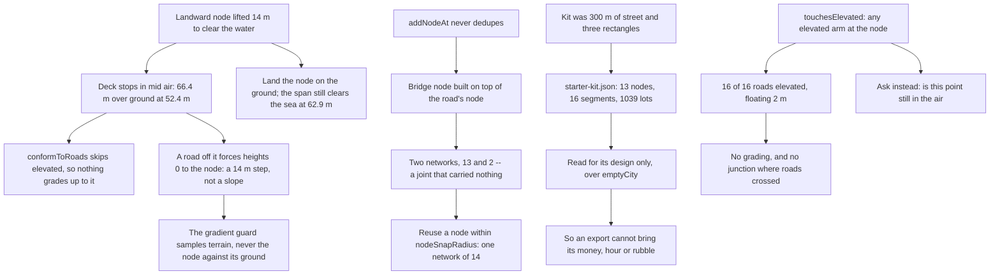

## prod_035_an_island_that_hands_the_player_a_road_and_a_bridge_that_knows_when_it_has_landed - An island that hands the player a road, and a bridge that knows when it has landed
> Date: 2026-09-04
> Status: Settled
> Related request: `req_044_land_the_bridge_open_a_run_on_a_designed_island_and_stop_the_elevation_where_a_bridge_lands`
> Related backlog: `item_162_land_the_deck_on_the_ground_and_join_what_reaches_it`
> Related task: `task_046_record_the_bridge_landing_the_starter_island_and_the_elevation_rule`
> Related architecture: (none yet)
> Reminder: Update status, linked refs, scope, decisions, success signals, and open questions when you edit this doc.
> Indicators reviewed: 2026-09-04 21:22:34

# Overview
A deck that stopped in the air, and a rule that turned every road drawn from it into a bridge.

A run used to open on 300 m of street in an empty field, 2.9 km from a bridge whose deck stopped fourteen metres in the air over solid ground. Drawing a road off that deck produced a fourteen-metre step the gradient guard could not see, and -- because elevation propagated from any node carrying an elevated arm -- a bridge, and then another bridge, and then a whole town floating two metres over terrain that was never cut for it. The bridge now lands, the run opens on a town designed by playing rather than written as coordinates, and a bridge stops being a bridge where it comes down.

# Goals
- The player is handed a road worth extending, arriving from somewhere.
- The layout is edited by playing the game, not by editing source.
- What a road becomes is decided by where it is, not by what it happens to touch.
- A joint that looks joined carries traffic.

# Non-goals
- Replay: a save that records an elevated segment is honoured as written. Only drawing changed.
- The kaiju's landing edges and the camera it seizes, which req_042 and req_043 already carry.
- Moving the utilities into the asset; they are a playability rule, not a layout.
- The 60 m magnet that snaps to a bridge end, which still helps a road connect there.

# Scope and guardrails
- In: where the bridge meets the island, what a run opens on, and what makes a drawn road elevated.
- Out: replay. A save that records an elevated segment is honoured as written; only drawing changed.
- A joint that looks joined must carry traffic. Two nodes at one position is a bug, not a detail.
- Content the operator can author by playing beats content written as coordinates, provided the game reads only what it needs from it.

# Key product decisions
- What a road becomes is decided by where it is, not by what it happens to touch. Elevation stops at the clearance, because at the clearance there is nothing left to pass under.
- An exported city dropped in as the starter island is read for its design alone. Session state is ignored structurally rather than cleaned, so no future export can smuggle a treasury or a field of rubble into a fresh run.
- Utilities stay in code and are derived from the layout's own geometry: they are a rule about playability, not part of a design, and a run must not open on a lesson it fails.
- One implementation decides elevation for both the commit and the preview. Two copies of a predicate that must agree is a preview that can lie.

# Success signals
- A road drawn off the landfall starts on the ground and stays a road, however far it is extended.
- A fresh island opens on the operator's layout, and a new export replaces it with no code change.
- A bridge still aloft still extends as a bridge.
- Removing the elevation rule fails a test.

# References
- Product back-reference: `item_162_land_the_deck_on_the_ground_and_join_what_reaches_it`
- Task back-reference: `task_046_record_the_bridge_landing_the_starter_island_and_the_elevation_rule`
