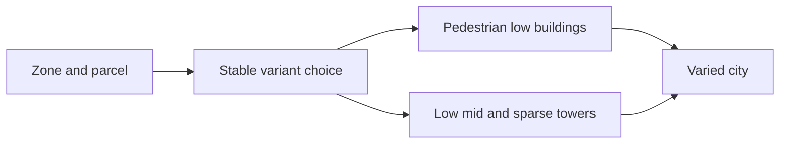

## prod_036_a_varied_residential_and_commercial_skyline - A varied residential and commercial skyline
> Date: 2026-09-07
> Status: Settled
> Related request: `req_049_residential_and_commercial_variety_with_a_mixed_skyline`
> Related backlog: `item_174_author_and_integrate_residential_commercial_variants_and_four_towers`
> Related task: `task_051_deliver_residential_commercial_variety_and_skyline`
> Related architecture: (none yet)
> Reminder: Update status, linked refs, scope, decisions, success signals, and open questions when you edit this doc.
> Indicators reviewed: 2026-09-07 11:32:52

# Overview
Recognisable homes, shops and offices with sparse authored towers, stable per parcel.

# Goals
- Distinct zone identity and mixed building heights.

# Non-goals
- Economic rebalance, new density controls, changes to other asset families.

# Scope and guardrails
- In: distinct residential/commercial variants, sparse towers and consistent roof/height rendering.
- Out: economic rebalance, player density settings and changes to unrelated models.

# Key product decisions
- Choose appearance from stable parcel position and size; keep it consistent across rebuilds and save reloads.
- Pedestrian frontage always stays low; towers occur only on large zone-compatible footprints.

# Success signals
- A mixed city shows distinct housing and commercial silhouettes with a minority of tall landmarks.
- GLB geometry, runtime model selection, close/distant/mobile captures and interaction checks agree.

# References
- Product back-reference: `item_174_author_and_integrate_residential_commercial_variants_and_four_towers`
- Task back-reference: `task_051_deliver_residential_commercial_variety_and_skyline`
