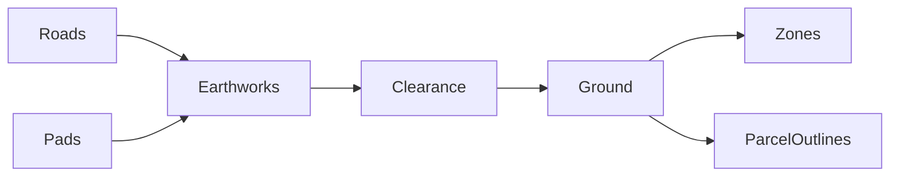

## prod_037_continuous_roads_and_legible_terrain_zoning - Continuous roads and legible terrain zoning
> Date: 2026-09-07
> Status: Settled
> Related request: `req_050_keep_roads_and_zone_overlays_clear_of_terrain`
> Related backlog: `item_175_correct_road_terrain_support_and_drape_zoning_over_final_ground`
> Related task: `task_052_fix_terrain_crossing_roads_and_zones`
> Related architecture: (none yet)
> Reminder: Update status, linked refs, scope, decisions, success signals, and open questions when you edit this doc.
> Indicators reviewed: 2026-09-07 12:20:59

# Overview
Road earthworks and zone overlays agree with the rendered terrain.

# Goals
- Visible continuous streets and zone cells on slopes.

# Non-goals
- Global terrain flattening, save schema changes or economic rebalance.

# Scope and guardrails
- In: road and sidewalk terrain clearance, zoning fills and parcel outlines over final earthworks.
- Out: global flattening, new road types, save migrations and economic changes.

# Key product decisions
- Protect the coarse terrain vertices supporting pavement after building pads are stamped.
- Project ground overlays onto the final terrain triangles while retaining zoning semantics.

# Success signals
- Sloping streets, sidewalks and junctions stay clear after building construction, removal and save reload.
- Zone fills and parcel outlines remain continuous over final ground, including after hidden edits.
- Geometry regressions, project CI and browser interaction checks pass.

# References
- Product back-reference: `item_175_correct_road_terrain_support_and_drape_zoning_over_final_ground`
- Task back-reference: `task_052_fix_terrain_crossing_roads_and_zones`

# Surface relationship

